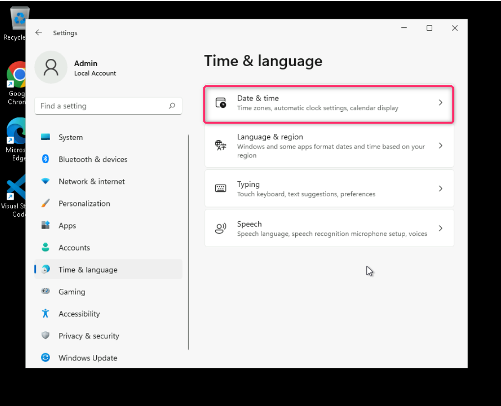
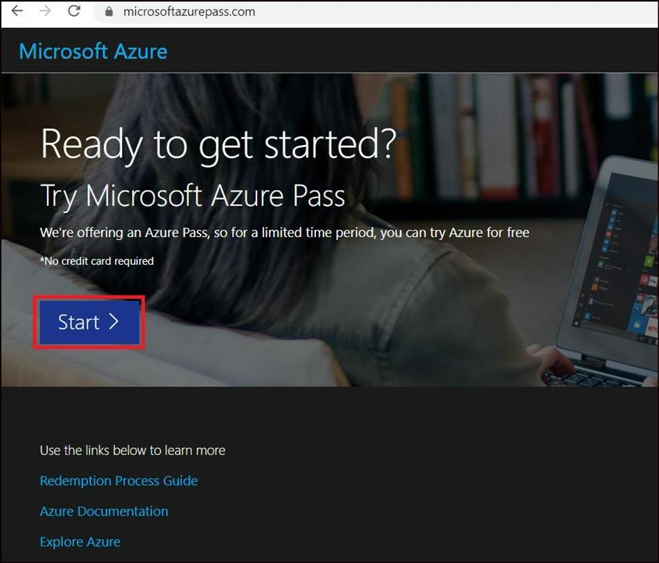
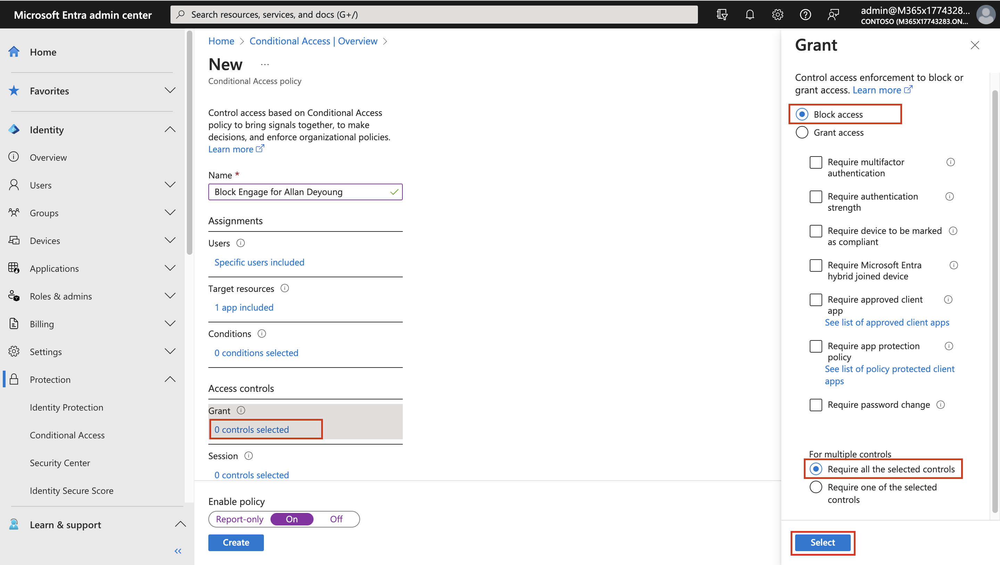
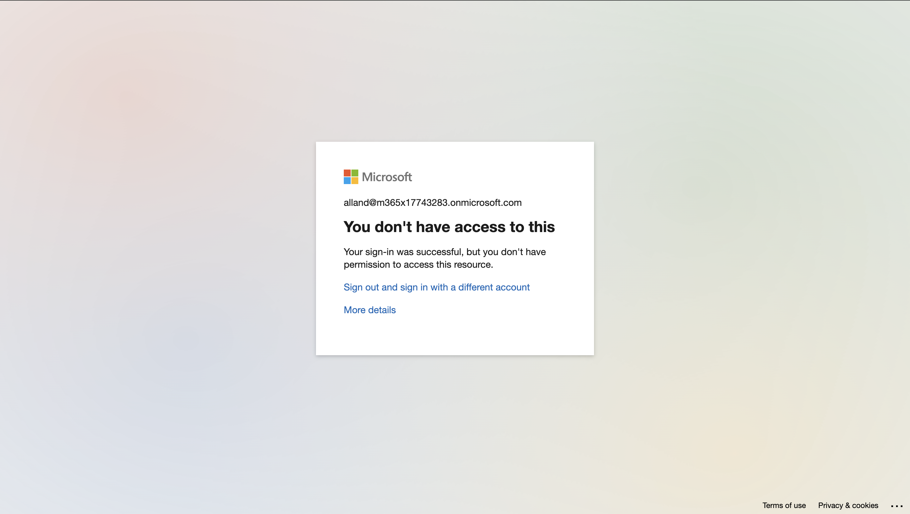
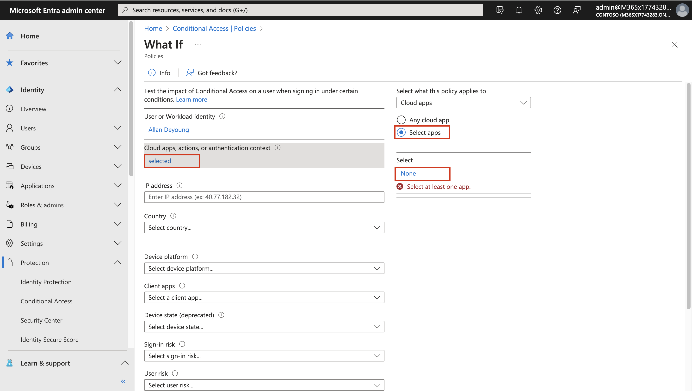
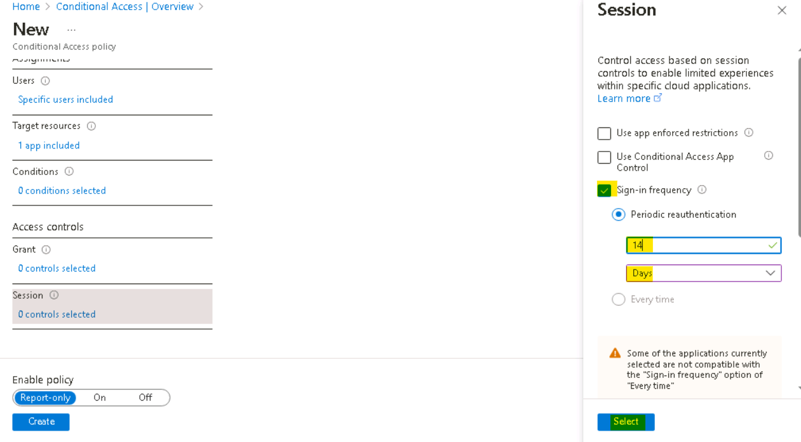

## Lab 01 - Securing identities with Microsoft Entra ID

## Task 0: Sync Host environment time

1.  Login to the Lab Virtual Machine using the credentials provided on
    the Home tab of the Lab interface.

2.  In your VM, navigate and click in the **Search bar**, type
    **Settings** and then click on **Settings** under **Best match**.
    

2.  On Settings window, navigate and click on **Time & language**.

3.  On **Time & language** page, navigate and click on **Date & time**.

4.  Scroll down and navigate to **Additional settings** section, then
    click on **Syn now** button.

5.  Close the **Settings** window.

## Task 1: Redeeming Azure pass and implementing Multifactor authentication

1.  In your lab VM, open Microsoft Edge and
    enter [**http://www.microsoftazurepass.com**](urn:gd:lg:a:send-vm-keys)

 

2.  On **Ready to get started?** page, click on the **Start** button.

**Note**: Do not use your Company/Work Account to login to redeem the
Azure Pass, another Azure Pass will not be issued.

4.  In the **Sign in** window, enter the **Office 365 Tenant ID** -
    <admin@WWLxxxx.onmicrosoft.com and click on the **Next** button.

5.  Enter Office **365 Tenant Password** and click on the **Sign in**
    button.

6.  On **Stayed signed in?** dialog box, click on **Yes** button.

7.  On **The following Microsoft Account will be used for Azure pass**
    page, click on **Confirm Microsoft Account** button.

 

8.  Enter the Promocode provided in the lab environment in the **Enter
    Promo code** field, then enter the characters under the **Enter the
    characters you see** field and click on the **Submit** button.

9.  **We are processing your request** page will appear, it may take few
    seconds to process the redemption.

10. Enter correct details in **Your Profile** page, tick all the check
    boxes, and then click on **Sign up** button.

 

 

10. On **Protect your account** dialog box, click on the **Next**
    button.

    

11. Then, on **More information required** dialog box, click on
    the **Next** button.

 

12. If prompted, then enter the password and click on the **Sign in**
    button.

    

11. In your mobile, install the **Microsoft Authenticator App**. Then,
    go back to Microsoft Azure port. In the Azure portal, **Microsoft
    Authenticator -** **Start by getting the app** window, navigate and
    click on the **Next** button.

1.  

12. In **Microsoft Authenticator –** **Set up your account** window,
    click on the **Next** button.

2.  

13. **Scan the QR code** using the **Authenticator app** installed in
    your mobile phone and click on the **Next** button.

3.  

14. Enter the number in your mobile authenticator app and select
    **Yes**. In **testvm1**, click on the **Next** button.

4.  

15. Click on the **Next** button.

5.  

16. Click on the **Done** button.

17. Enter the number again in your mobile authenticator app and select
    **Yes**..

6.  

7.  

8.  

18. In the **Stay signed in?** window, click on the **Yes** button.

    

## Exercise 2 – Set a conditional access policy to block a user from accessing Viva Engage

### Task 1 – Confirm Allan Deyoung has access to Engage

1.  Launch a new InPrivate browser window in your lab VM.

9.  Navigate to +++**https://www.office.com+++**.

10. When prompted, log in as **Allan Deyoung**:

 Username – +++**alland@+++Paste the Tenant name from the Resources
 tab**

 Password – Paste the User Password from the Resources tab.

11. Click on **Explore App** and then click on the **Engage** icon to
    see that it loads correctly.

12. Click on **Log in with Microsoft account**.

    

13. The portal should load successfully.

    

### Task 2 – Create a conditional access policy

Microsoft Entra conditional access is an advanced feature of Microsoft
Entra ID that allows you to specify detailed policies that control who
can access your resources. Using Conditional Access, you can protect
your applications by limiting users’ access based on things like groups,
device type, location, and role.

1.  Browse to **+++https://entra.microsoft.com/+++** and sign in using
    the **Office 365 tenant credentials**.

14. On the lefthand menu, under Identity, expand Protection, and then
    select **Conditional access**. On the **Overview (Preview)**,
    click **+ Create new policy**.

15. On the **New Conditional Access Policy** page, provide the below
    details

    - Name – +++**Block Engage for Allan Deyoung+++**

    - Under **Users**, select **0 users and groups selected/Specific
      users included**. Then under **Include**, choose **Select users
      and groups**. Select the check box near **Users and groups**. Then
      under **Select**, choose **0 users and groups selected**.

- Scroll down on the **Select users and groups** page, select **Allan
  Deyoung**. Choose **Select**.

- Under **Target Resources**, select **No target resources selected**.
  Then under **Include**, choose **Select apps**. Under select, choose
  **None**. In the side pane, search for and select **Viva Engage** by
  selecting the check box near the app. Then choose **Select**.

- Under **Access controls**, within the **Grant** section, select **0
  controls selected**. In the Grant pane, select **Block access** |
  **Required all the selected controls** and then choose **Select**.

- Enable policy – **On**. Click on **Create**.

**Note** - This policy is being configured for the exercise only and is
being used to quickly demonstrate a conditional access policy.

16. Keep the page open we will return to this page in **Task 4**.

### Task 3 – Test the conditional access policy

You should test your conditional access policies to ensure they working
as expected.

1.  Close the InPrivate Window or Log out completely.

2.  Launch a new InPrivate browser window in your lab VM.

17. Navigate to +++**https://www.office.com+++**.

18. When prompted, log in as **Allan Deyoung**:

 Username – +++**alland@+++Paste the Tenant name from the Resources
 tab**

 Password – Paste the User Password from the Resources tab.

19. Click on **Explore App** and then click on the **Engage** icon to
    see that it loads correctly.

20. Verify you are prevented from accessing **Viva Engage**.

**Note** - If you are signed in, close the tab, wait 1 minute, and then
retry. If you are auto-logged into Engage as Allan, then you will need
to manually log out. Your credentials / access were cached. Once you log
out and sign-in, your Engage session should deny access. To disable the
policy, follow the given steps.

21. Close the tab and return to the Conditional Access page.

22. Select the **Block Engage for Allan Deyoung** policy.

23. Under **Enable policy**, select **Off** and then select **Save**.

### Task 4 – Use ‘What if’ to test conditional access policies

1.  Browse to **+++https://entra.microsoft.com/+++** and sign in using
    the **Office 365 tenant credentials**.

2.  On the lefthand menu, under Identity, expand Protection, and then
    select **Conditional access.** In the navigation pane,
    select **Policies**. Select **What If**.

24. Under **User or Workload identity**, select **No user or service
    principal selected**. Under **Select identity type**, select
    **User**, and then choose **No user selected**.

25. Choose **Allan Deyoung** as the user. Then choose **Select**.

26. Under **Cloud apps, actions, or authentication context**,
    select **Any cloud app**. Under **Select what this policy applies
    to**, choose **Select apps** and then **None** under **Select**.

27. In the select pane, choose **Viva Engage**. And then choose
    **Select**.

28. Select **What if**.

29. You will be provided with a report at the bottom of the tile
    for **Policies that will apply** and **Policies that will not
    apply**.

This allows you to test the policies and their effectiveness before
enabling the policies.

### Task 5 – Configure sign in frequency controls using a conditional access policy

As part of your company’s larger security configuration, you must test a
conditional access policy that can be used to control sign in frequency.

1.  Browse to **+++https://entra.microsoft.com/+++** and sign in using
    the **Office 365 tenant credentials**.

30. On the lefthand menu, under Identity, expand Protection, and then
    select **Conditional access**. On the **Overview (Preview)**,
    click **+ Create new policy**.

31. On the **New Conditional Access Policy** page, provide the below
    details.

    - Name – +++**Sign in frequency+++**

    - Under **Users**, select **0 users and groups selected/Specific
      users included**. Then under **Include**, choose **Select users
      and groups**. Select the check box near **Users and groups**. Then
      under **Select**, choose **0 users and groups selected**.

- Scroll down on the **Select users and groups** page, select **Joni
  Sherman**. Choose **Select**.

- Under **Target Resources**, select **No target resources selected**.
  Then under **Include**, choose **Select apps**. Under select, choose
  **None**. In the side pane, search for and select **Office 365** by
  selecting the check box near the app. Then choose **Select**.

- Under **Access controls**, within the **Sessions** section, select **0
  controls selected**. In the **Grant** pane, select **Sign-in
  frequency,** in the value box, enter **14**. Select the units menu,
  select **Days**, and then choose **Select.**

- Enable policy – **On**. Click on **Create**.

## Summary:

In this lab we enabled user risk policy, created a conditional access
policy to block a user from accessing a cloud app, and explored the
Identity Secure Score.
