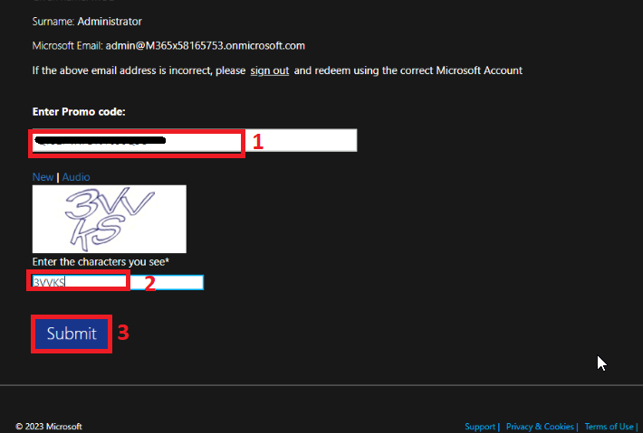
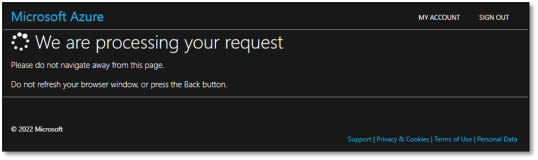
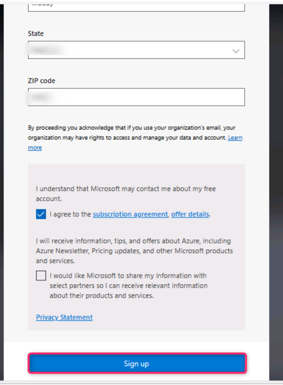
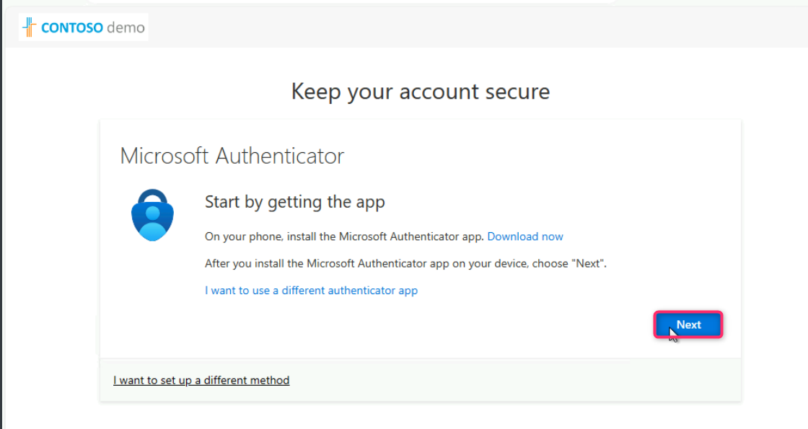
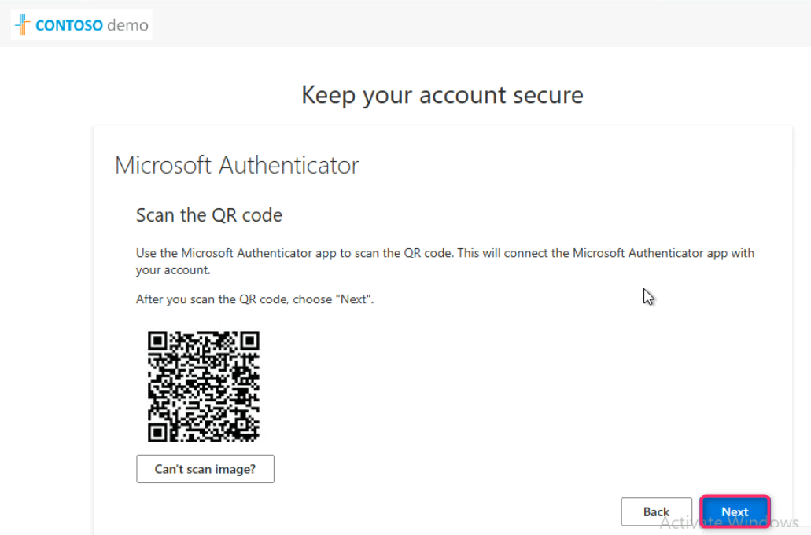
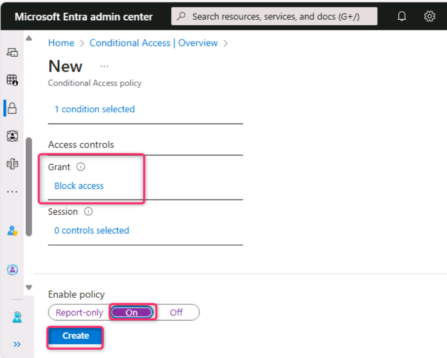

# **Lab 01 - Securing identities with Microsoft Entra ID**

## Task 0: Sync Host environment time

1.  Login to the Lab Virtual Machine using the credentials provided on
    the Home tab of the Lab interface.

2.  In your VM, navigate and click in the **Search bar**, type
    `Settings` and then click on **Settings** under **Best match**.
    
    

3.  On Settings window, navigate and click on **Time & language**.

    

4.  On **Time & language** page, navigate and click on **Date & time**.

    

5.  Scroll down and navigate to **Additional settings** section, then
    click on **Syn now** button.

    

6.  Close the **Settings** window.

    

## Task 1: Redeeming Azure pass and implementing Multifactor authentication

1.  In your lab VM, open Microsoft Edge and
    enter `http://www.microsoftazurepass.com`

     

2.  On **Ready to get started?** page, click on the **Start** button.

    

> **Note**: Do not use your Company/Work Account to login to redeem the
Azure Pass, another Azure Pass will not be issued.

> **Note**: In case, you are directed to the page - The following Microsoft Account will be used for Azure Pass page, then ignore steps #3 to #5

3.  **Sign in** with the username given in the
**Home/Resources** tab of your Lab environment. and click on the **Next** button.

    

4.  Enter **Office 365 Tenant Password** and click on the **Sign in**
    button.

    

5.  On **Stayed signed in?** dialog box, click on **Yes** button.

    

6.  On **The following Microsoft Account will be used for Azure pass**
    page, click on **Confirm Microsoft Account** button.

     

7.  Enter the Promocode provided in the lab environment in the **Enter
    Promo code** field, then enter the characters under the **Enter the
    characters you see** field and click on the **Submit** button.

    

8.  **We are processing your request** page will appear, it may take few
    seconds to process the redemption.

    

9. Enter correct details in **Your Profile** page, tick all the check
    boxes, and then click on **Sign up** button.

     

     
 
     
   
11. On **Protect your account** dialog box, click on the **Next**
    button.

    

12. Then, on **More information required** dialog box, click on
    the **Next** button.

     

13. If prompted, then enter the password and click on the **Sign in**
    button.

    

14. In your mobile, install the **Microsoft Authenticator App**. Then,
    go back to Microsoft Azure port. In the Azure portal, **Microsoft
    Authenticator -** **Start by getting the app** window, navigate and
    click on the **Next** button.

    

15. In **Microsoft Authenticator –** **Set up your account** window,
    click on the **Next** button.
    
    

16. **Scan the QR code** using the **Authenticator app** installed in
    your mobile phone and click on the **Next** button.

    

17. Enter the number in your mobile authenticator app and select
    **Yes**. In **testvm1**, click on the **Next** button.

    

18. Click on the **Next** button.

19. Click on the **Done** button.

    

20. Enter the number again in your mobile authenticator app and select
    **Yes**..
  
    

21. In the **Stay signed in?** window, click on the **Yes** button.
    
    

22. Navigate to Microsoft Azure Portal.

   

## Exercise 2 – Set a conditional access policy to block a user from accessing Sway

Microsoft Entra conditional access is an advanced feature of Microsoft
Entra ID that allows you to specify detailed policies that control who
can access your resources. Using Conditional Access, you can protect
your applications by limiting users’ access based on things like groups,
device type, location, and role.

**Information**: Sway is a new app from Microsoft Office that makes it
easy to create and share interactive reports, personal stories,
presentations, and more.

**Note**: This feature is the part of Microsoft Entra P1 License.

1. Click on the following Microsoft Entra admin center link: `https://entra.microsoft.com/` and sign in using
    the **Office 365 tenant credentials**.
  
2. In the **Microsoft Entra admin center** page, navigate and click on
**Identity**, click on **Users**, then click on **All users**.

    

3. Click on **Allan Deyoung**.

    

4. Click on Reset password.

    

5. Then, click on the Reset password button as shown in the below image.

    

6. Note down the temporary password.

    

7. Open a new browser and enter the following URL:
`https://sway.cloud.microsoft/`

    

8. Sign in using Allan credentials as shown in the below images.

    

    

9. In **Update your password** dialog box, update the password.

    

10. You will be directed to **Sway** website.

    

11. You have successfully logged in Sway website using Allan credentials,
now log out from the Sway website.

**Note**: Sign out from Sway website.

    

12. Go back to **Microsoft Entra Admin Center**. Click on **Protection** and
then click on **Conditional Access**.

    

13. In the **Conditional Access** page, click on **+ Create new policy**.

    

14. In the **Name** field, enter `Blocking Access to Sway`

    

15. Navigate and click on **Specific users included** link, then choose the
radio button of **Select users and groups**, tick on the **Users and
groups** checkbox.

    

16. In **Select users and groups** pane that appear on the right side, navigate
to the search field, then enter the name `Allan`  Select the checkbox
and click on the **Select** button.

    

17. Allan user is successfully selected. Now, under **Target resources**,
click on **No target resources selected** link.

    

18. Navigate and click on **Select resources** radio button, then click on
**None** link as shown in the below image.

    

19. In the **Select **pane that appears on the right side, type `Sway` and
then select it.

    

20. Navigate to **Conditions** section, click on **0 conditions selected**
link.

    

21. Navigate to **Insider risk** section and click on **Not configured**
link.

    

22. In the **Insider risk** pane, under **Configure**, select **Yes**.
Select **Moderate** check box and then click on **Done** button.

    

23. In the **Grant** section click on **0 controls selected** link. In the
**Grant** pane, navigate and select **Block access** radio button, then
click on the **Select** button.

    

24. Navigate to **Enable policy** section and select **On** toggle button.
Then, click on **Create** button.

    

25. You will see the message that the **Blocking Access to Sway**
Conditional Access policy is successfully created.

    

26. Wait for 5-10 minutes for the policy to be implemented. Then, open a new
browser and enter the following URL: `https://sway.cloud.microsoft/`

27. Login to the Sway website.

    

28. Sign in using Allan credentials.

    

    

29. In the **Stay signed in?** dialog box, click on the **Yes** button.

    

30. You will observe that the access to the website is blocked.

    

## Summary:

In this lab we enabled user risk policy, created a conditional access
policy to block a user from accessing a cloud app, and explored the
Identity Secure Score.
