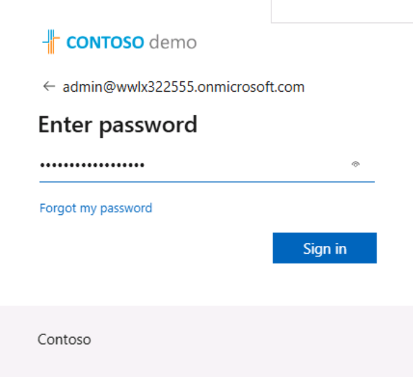
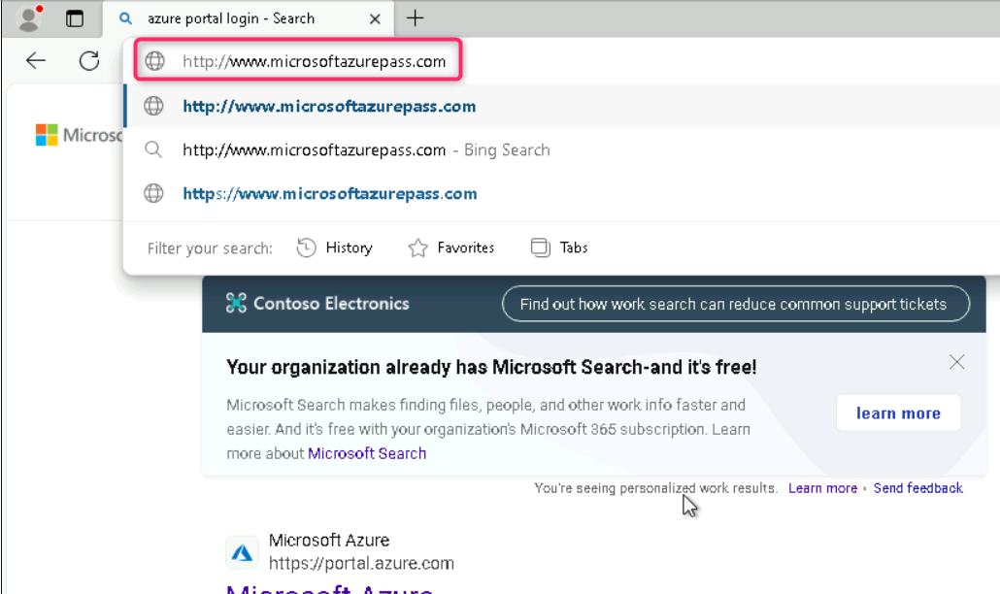
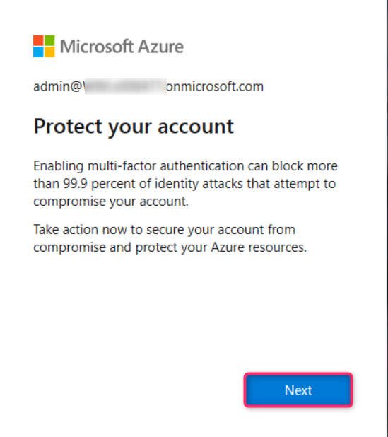
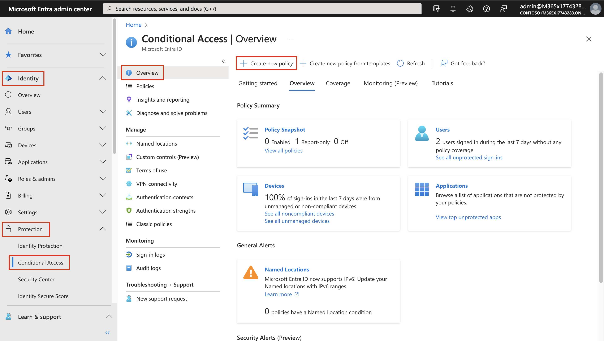
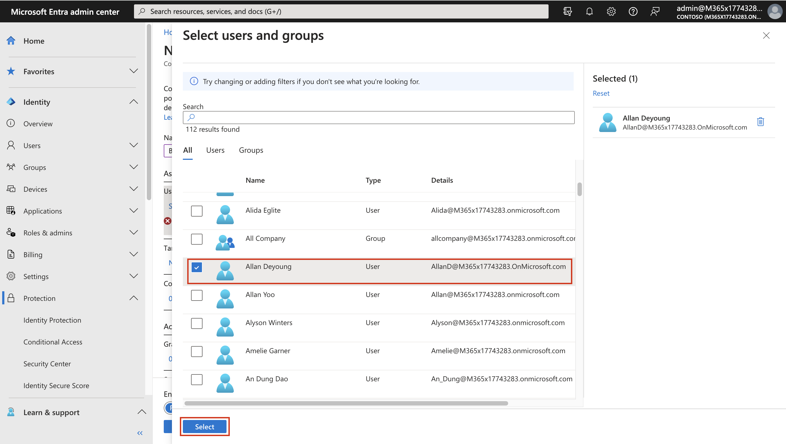
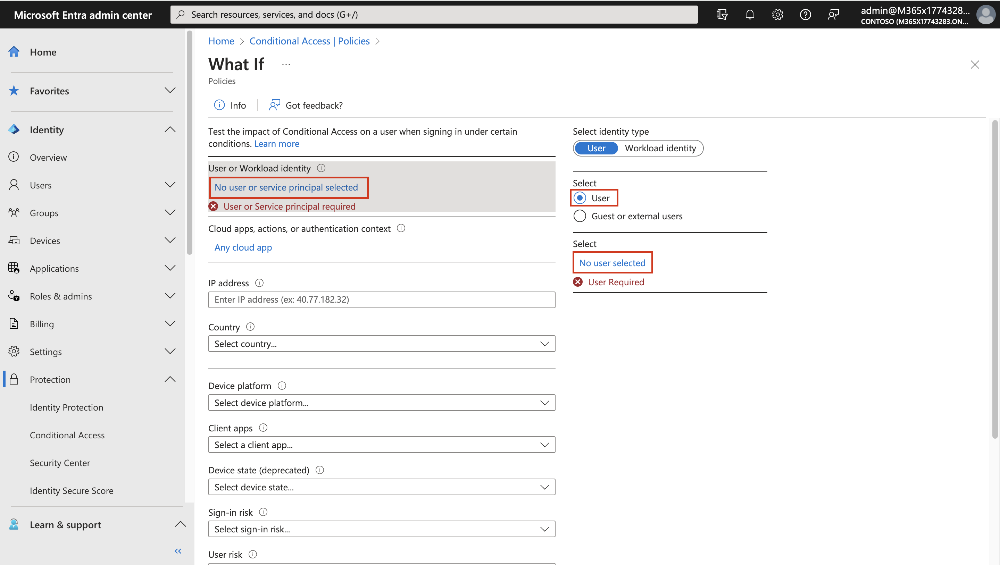
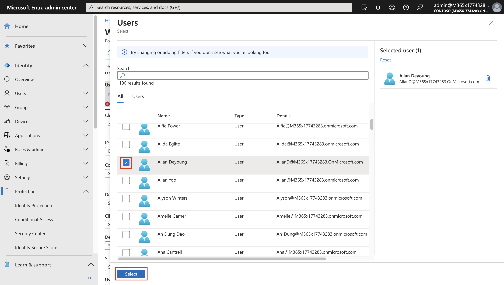
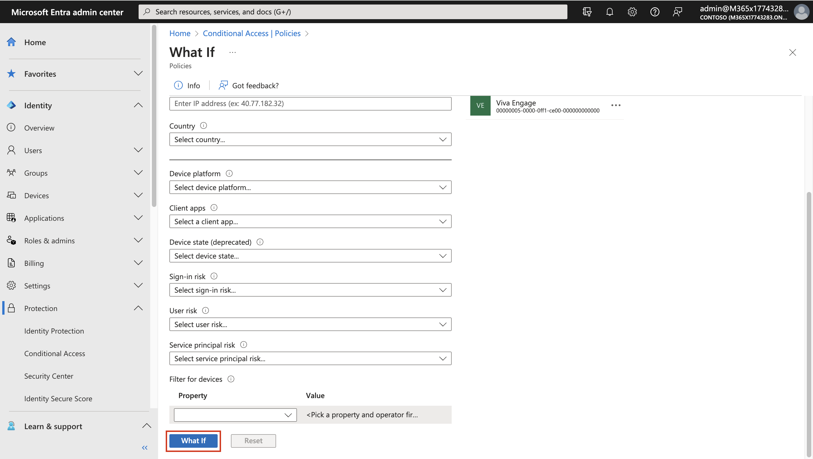
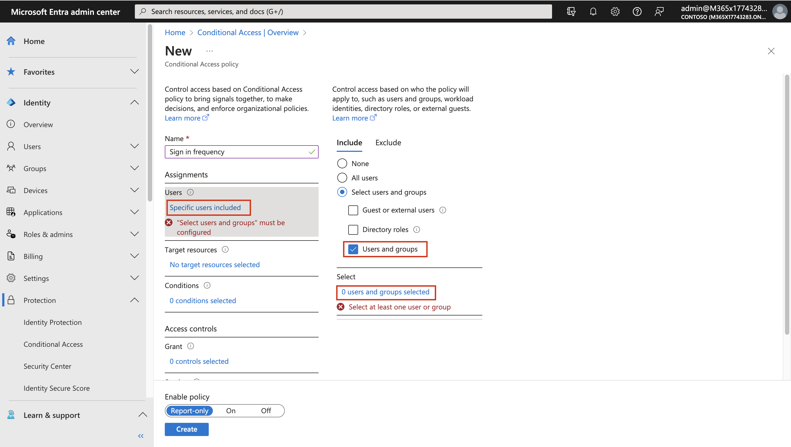
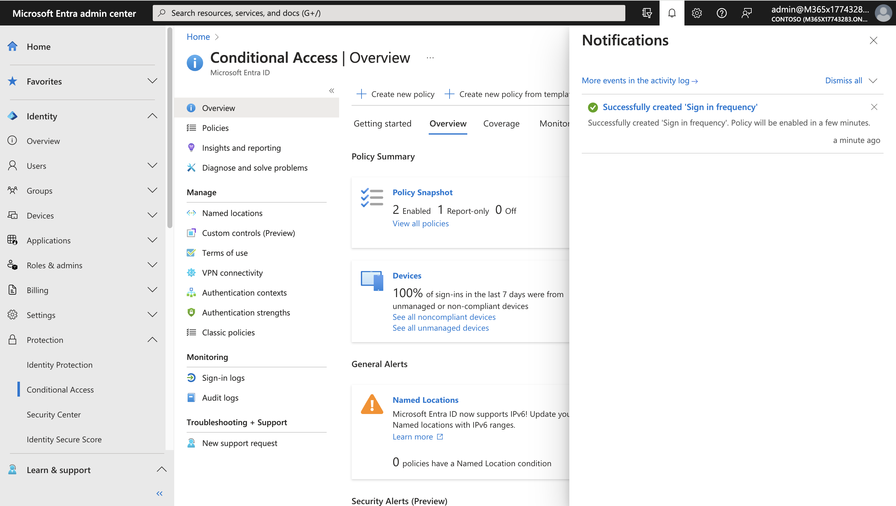

# Lab 1 - Configuring Hybrid Identity with Microsoft Entra ID, Password Hash Sync, and Multi-Factor Authentication

## Objective:

In this lab we will first redeem a pass for an Azure subscription.

When Entra ID tenants are created, they receive a onmicrosoft.com tenant
domain. In the real suppose you have just purchased a new domain that
resides in Microsoft Azure but not in Adatum's on-premises environment.
In this lab we will manually create the necessary DNS records required
by this new custom domain and then integrate a single AD forest using
Password Hash Sync (PHS). We will also enable MFS and add basic
conditional access policy.

## Exercise 1 – Prerequisites

### Task 1 – Redeem the Azure Pass

1.  Log into the **LON-CL1** with the credentials provided in the
    Resources tab of your lab.

2.  **Note the Tenant Credentials** and the **PromoCode** provided on
    the resources tab of your lab environment.

3.  Open a browser on the Lab VM in **incognito/InPrivate** mode and
    navigate to: **+++http://www.microsoftazurepass.com/+++**. Click
    the **Start** button.

> **Note**: Do not use your Company/Work Account to
> login to redeem the Azure Pass, another Azure Pass will not be
> issued.

4.  Enter the **Office 365 tenant credentials** given on the Resources
    page of your lab environment and select "**Sign In**".

5.  Click "**Confirm Microsoft Account**" if the email address is
    correct.

6.  Paste the promo code given on the **Resources** page of your lab
    environment in the **Enter Promo code box,** enter the captcha and
    select **Submit** button.

7.  If asked login with your tenant credentials again. It may take few
    seconds to process the redemption.

8.  Enter the mandatory profile information. Select the check box – **I
    agree to the subscription agreement, offer details.**, and then
    select **Sign up**.

9.  On the feedback page, click on **Submit**.

10. It would automatically redirect you to the **Azure Portal** and now
    you are ready to use Azure services.

11. Click on **Subscriptions** to verify that your new subscription is
    listed in the list of active subscriptions.

## Exercise 2 – Integrate a single AD forest using Password Hash Sync (PHS)

### Task 1 – Install Azure AD Connect 

**Password Hash Sync (PHS) **

Password hash synchronization is one of the sign-in methods used to
accomplish hybrid identity. Azure AD Connect synchronizes a hash, of the
hash, of a user's password from an on-premises Active Directory instance
to a cloud-based Microsoft Entra instance. 

Password hash synchronization is an extension to the directory
synchronization feature implemented by Azure AD Connect sync. You can
use this feature to sign in to Azure AD services like Microsoft 365. You
sign in to the service by using the same password you use to sign in to
your on-premises Active Directory instance. 

Password hash synchronization helps by reducing the number of passwords,
your users need to maintain to just one. Password hash synchronization
can: 

- Improve the productivity of your users.

- Reduce your helpdesk costs.

1.  Switch to the **LON-DC1** machine in the lab environment.

2.  Sign in with the username and the password given in the resources
    tab of your environment.

<!-- -->

12. Open a browser and navigate to
    **+++https://entra.microsoft.com/+++** and login using the admin
    tenant credentials.

13. In the **Microsoft Entra admin center** navigate to **Identity**
    then expand **Users**, click **All Users** then click on **New
    User** then click on **Create new user**.

14. Enter the following information under **Basics**: 

- **User principal name**: **+++meconnect+++**

- **Display name**: **+++MEConnect+++**

- **First name**: Blank 

- **Last name**: Blank 

- **Password**: uncheck Auto-generate password and provide
  **+++Pa\$\$.w0rd@MS01+++**

15. Under **Properties**, scroll down and select **United States** as
    **Usage location**.

16. Under the **Assignment** tab, select **Add role**.

17. Select **Global Administrator** and click **Select**.

18. Then select **Review + Create**.

19. Note the **User principal name** and **Password**, and then select
    **Create**.

20. Open an In Private / Incognito session in your browser and login to
    **+++https://entra.microsoft.com/+++** as the user you created i.e.
    **meconnect** with the password **+++Pa\$\$.w0rd@MS01+++** that you
    noted down in the previous step.

21. When prompted, update the password to **+++Pa\$\$.w0rd@123+++**.
    Then select **Sign in**.

22. Open a browser and navigate to the URL —
    **+++https://www.microsoft.com/en-us/download/details.aspx?id=47594+++**

23. Click **Download** and then select **Open file**.

24. Once installed, the **Microsoft Azure AD Connect** configuration
    will start. select the **Terms & Conditions** check box and click
    **Continue**.

 

25. On the **Express Settings** page click **Customize**. 

26. On the Install required components page click **Install**. 

27. At the **User sign-in** page, choose **Password Hash
    Synchronization** as the **Sign On method** and click **Next**. We
    will use the MEConnect user we had created in the **Azure portal**
    to continue the installation process of **ADConnect**.

28. In the Username enter **+++meconnect@+++** and paste Tenant name and
    for the password enter **+++Pa\$\$.w0rd@123+++**. Then select
    **Next**.

29. If you get a prompt that the content is blocked by Internet Explorer
    Enhanced Security Configuration, select **Add**.

30. On the Trusted sites prompt, again select **Add** and then
    **Close**. Do these for all the required sites.

31. If asked, provide the tenant credentials again.

    

32. On the connect your directories page click **Add directory**. 

33.  On the **AD Forest account** window click **Create new account**
    and enter the login credentials of your VM, i.e. the domain name and
    the password and select **Next**.

    

34. Back on the **Connect your directories** page click on **Next.**

    

35. On the Azure AD sign in configuration page select the check box for
    **Continue without matching all UPN suffixes to verified domains**
    check box and click **Next**. 

  

36. On the **Domain and OU filtering** page select the Sync **selected
    domains and OUs** radio button and only select the **IT** OU and
    then click on **Next**

    

37. On the **Uniquely identify your users**, leave the default values
    and click on **Next**.

38. On the **Filter users and devices**, leave the default values and
    click on **Next**.

39. On the **Optional features**, leave the default values and click on
    **Next**.

40. On the **Ready to configure** page, click on the **Install** button.

41. Once the installation is complete, select **Exit**. 

### Task 2 – Verify users are created and synchronization is occurring with Microsoft Entra ID

We will now verify that the users that we had in our on-premises
directory have been synchronized and now exist in Microsoft Entra ID
tenant. To verify users are synchronized do the following. 

1.  Switch back to the browser with the **Microsoft Entra admin center**
    opened, then select **Identity**, expand **Users**, select **All
    users**.

2.  If required click on the Refresh button and verify that you see the
    new users in our tenant, the **On-premises synced** enabled. 

    

3.  From the list of users, select the user **Abbi Skinner**, then click
    on **Edit properties**

    

4.  Select the **Settings** tab, then from the drop-down choose **United
    states** for Usage location and then click on the **Save** button.

    

    

5.  Repeat the same steps to verify the Usage location for the below
    users.

    - Beth Burke

    - Huong Tang

    - Logan Boyle

**Note** - Usage location is necessary while
assigning a License, the License assignment will fail for a user who
does not have a Usage location.

## Exercise 3 – Create Groups and assign Licenses from Microsoft Entra admin center- Full Exercise replaced

### Task 1 - Create Groups and assign Licenses

1.  Open the Edge browser and login to the **Microsoft Entra admin
    center +++https://entra.microsoft.com+++**.

<!-- -->

42. If prompted for credentials enter your **Office365 Tenant
    Credentials** provided on the **resources** tab of the lab Interface
    as show in the Image.

43. Select **Identity** expand the **Groups**, select **All groups**
    then click on **New group**.

44. The **New Group** pane will appear, provide the below details.

    - Group type – **Microsoft 365**

    - Group name – **+++Sales101+++**

    - Group email address – **+++Sales+++**

    - Group Description – **+++Group for users in Sales department+++**

    - Microsoft Entra roles can be assigned to the group – **Yes**

    - Scroll down and click on link – **No members selected**

> 

- On the Add members tab, add **Abbi Skinner** and **Huong Tang** and
  click on **Select**.

>  alt="A screenshot of a computer Description automatically generated" />

- Click on **Create**.

45. You will get a prompt as shown in below image, click **Yes**.

46. Your group is created, and you will get a successful notification.

47. Repeat the steps 3-5 to create another group with below details

- Group type – **Microsoft 365**

- Group name – **+++Research101+++**

- Group email address – **+++Research101+++**

- Group Description – **+++Group for users in Research department+++**

- Microsoft Entra roles can be assigned to the group – **Yes**

- Members – **Beth Burke** and **Logan Boyle**

48. Once both the **Groups** have been created, click on the **Refresh**
    button and the Group list should appear as shown in the below image.

49. While in the **Microsoft Entra admin center**, click on **… Show
    more**.

50. Expand **Billing** then click on **Licenses**, then select **All
    Products**.

51. Click on the **Microsoft 365 E5** license, you will notice that
    **20/20** licenses have been assigned, we will release few licenses
    to be used for the upcoming steps.

    

52. From the list of users select the below users and then click on
    Remove license

    1.  Lee Gu

    2.  Nestor Wilke

    3.  Patti Fernandez

    4.  Pradeep Gupta

        

53. When prompted to Remove license click on the **Yes** button.

    

    

54. Close the **Microsoft 365 E5** blade and then refresh the page, now
    the available number should be **4.**

    

55. Select **Microsoft 365 E5** and **Office 365 E5** licenses and then
    click on **+ Assign**.

56. On the **Assign license** window, on the **Users and groups** tab,
    select on **Add users and groups**.

57. Under Groups tab, select the groups **Sales101** and
    **Research101**, then click on **Select**.

58. Click on **Review + assign**.

59. Click on **Assign**.

60. You should get the notification as shown in below image.

61. Both the Groups have the license assigned.

### Task 2 – Add a Guest account and create an External Collaborators group.

1.  Open the Edge browser and login to the **Microsoft Entra admin
    center +++https://entra.microsoft.com+++**.

<!-- -->

62. If prompted for credentials enter your **Office365 Tenant
    Credentials** provided on the **resources** tab of the lab Interface
    as show in the Image.

63. Select **Identity** expand **Users**, select **All Users**, the from
    the **New user** drop-down menu select **Invite external user**.

    

64. On the Invite external user page, provide the below details

    - Email – your personal outlook email address or create a new
      outlook email for testing.

    - Display name – **+++External User+++**

    - Message – **+++Invite to my Org+++**

65. Click on **Next: Properties \>**

    

66. On the **Properties** tab, set the Usage location to **United
    States** and then click on **Review + invite** button.

    

67. On the **Review + invite** tab, click on the **Invite** button.

    

    

68. Open an InPrivate window and open the Outlook for the external
    account on which the invite was sent.

    

69. Click on the **Accept invitation** link.

70. Click on the **Accept** button to grant permission.

    

71. You should successfully be logged into My Apps portal for the
    Microsoft Entra Tenant.

    

72. Switch back to the tab with **Microsoft Entra admin center** portal
    logged with Tenant admin.

73. Select **Identity** expand the **Groups**, select **All groups**
    then click on **New group**.

74. Create the group with below details.

- Group type – **Security**

- Group name – **+++External Collaborators+++**

- Group Description – **+++Group of External Users+++**

- Microsoft Entra roles can be assigned to the group – **Yes**

  

- Scroll down and add the Invited user account – External User and then
  click on **Select** button.

  

75. Click on **Create** button

    

76. Click on the Yes button when prompted.

    

    

## Exercise 4 – Enabling Microsoft Entra ID per-user Multifactor Authentication

To secure user sign-in events in **Microsoft Entra ID**, you can require
multi-factor authentication (MFA). We can enable each account for
per-user Multi-Factor Authentication. When users are enabled
individually, they perform multi-factor authentication each time they
sign in (with some exceptions, such as when they sign in from trusted IP
addresses or when the remember MFA on trusted devices feature is turned
on).

1.  Open the Edge browser and login to the Microsoft Entra admin center
    **+++https://entra.microsoft.com+++**.

<!-- -->

77. If prompted for credentials enter your **Office365 Tenant
    Credentials** provided on the **resources** tab of the lab Interface
    as show in the Image.

78. In the **Microsoft Entra admin center** navigate
    to **Identity** then expand Users, click **All** **Users** then
    click on the ellipses **…** then select **Per-user MFA**.

79. Select the users **Abbi Skinner** and **Beth Burke** and click
    on **Enable**.

80. On the Message About enabling multi-factor auth, click on **enable
    multi-factor auth**.

81. Click on the **Close** button on the confirmation message.

82. Open a browser in InPrivate/incognito mode and login to **My Apps
    portal** **+++https://myapps.microsoft.com+++**.

83. Enter the credentials for **Beth Burke** account

- Username – **+++Beth@+++** paste the **Tenant name** from the
  Resources tab.

- Password – **+++Pa55w.rd+++**

84. You will be prompted to More information is required, click
    on **Next**

    .

85. On the **Start by getting the app** page, click on **Next**

86. Install the **Microsoft Authenticator App** on your phone from the
    play store or app store as appropriate.

87. On the **Set up your account page**, select **Next.**

88. On the **Scan the QR code** page, scan the QR image to add the
    account on your Microsoft Authenticator App on your phone.

89. Now, select **Next**.

90. When prompted, approve the notification on your phone. Once you see
    that the notification is approved, select **Next**.

91. Click on **Done**

92. You should be logged in to the **My Apps Portal**

93. You have completed this task, please proceed ahead with the next
    task.

## Exercise 5 – Enabling Conditional Access for the Research Group

Conditional Access policies at their simplest are if-then statements, if
a user wants to access a resource, then they must complete an action.

We will set a Conditional Access policy to require MFA for Research
Group only when the Access **Microsoft Forms**

1.  Open the Edge browser and login to the **Microsoft Entra admin
    center +++https://entra.microsoft.com+++**.

<!-- -->

94. In the **Microsoft Entra admin center**, expand **Protection** and
    select **Conditional Access**. Click on **Create new policy**.

95. On the **New Conditional Access Policy** page, provide the below
    details

    - Name – **+++CA for Microsoft Forms+++**

    - Under **Users**, select **Specific users included**. Then under
      **Include**, choose **Select users and groups**. Select the check
      box near **Users and groups**. Then under **Select**, choose **0
      users and groups selected**.

- Scroll down on the **Select users and groups** page, select
  **Research101**. Choose **Select**.

- Under **Target Resources**, select **No target resources selected**.
  Then under **Include**, choose **Select apps**. Under select, choose
  **None**. In the side pane, search for and select **Microsoft Forms**
  by selecting the check box near the app. Then choose **Select**.

- Similarly select **Access Controls** \> **Grant** \> **0 controls
  selected** \> **Grant access** \> **Require multi-factor
  authentication** \> **Select**.

- Enable policy – **Report-only**

- Click on **Create**

96. You should get the notification as shown in below image.

**NOTE** - Report-only mode is a new Conditional Access policy state
that allows administrators to evaluate the impact of Conditional Access
policies before enabling them in their environment. With the release of
report-only mode:

- Conditional Access policies can be enabled in report-only mode.

- During sign-in, policies in report-only mode are evaluated but not
  enforced.

- Results are logged in the Conditional Access and Report-only tabs of
  the Sign-in log details.

- Customers with an Azure Monitor subscription can monitor the impact of
  their Conditional Access policies using the Conditional Access
  insights workbook.​

97. Now open a browser in InPrivate/incognito mode and login to **MyApps
    portal** – **+++https://myapps.microsoft.com+++**.

98. Login using **Logan Boyle’s** credentials you will be signed in
    without any additional information required prompt

- Username – **+++Logan@+++** paste the **Tenant name** from the
  Resources tab.

- Password – **+++Pa55w.rd+++**

99. Click on Forms to access **Microsoft Forms**.

100. Select **Create new**.

101. Switch back to the **Microsoft Entra admin center** and set the
     Conditional access policy to **On** and **Save** it.

     

102. Now log off on the InPrivate tab and login to **MyApps portal**
     – **+++https://myapps.microsoft.com+++**.

103. Login using **Logan Boyle’s** credentials you will be signed in
     without any additional information required prompt

- Username – **+++Logan@+++** paste the **Tenant name** from the
  Resources tab.

- Password – **+++Pa55w.rd+++**

104. Click on Forms to access **Microsoft Forms**.

105. You will notice that the Conditional Access policy requires you to
     perform MFA in order to access Forms.

106. Click on **Next** and complete the MFA process to gain access to
     Forms.

107. You would be required to go through the Microsoft Authenticator
     process, once completed you will be logged in Microsoft Forms
     successfully as shown in below images

108. You should be able to login successfully

     

     

## Summary:

In this lab we assigned the required licenses and created the required
records using the provided public domain. We enabled MFA for our users
and assigned a basic conditional access policy to a group of users in
our organization.
