# **Lab 2 – Configuring and Implementing Sensitivity Labels for Information Protection**

# Objective

In this lab you will assume the role of Patti Fernandez, a System
Administrator for Contoso Ltd. Your organization is based in
Rednitzhembach, Germany and is currently implementing a sensitivity plan
to ensure that all employee documents in the HR department have been
marked with a sensitivity label as part of your organizations
information protection policies.

## Exercise 1 – Enabling support for sensitivity labels

In this task, you will install the MSOnline module and the SharePoint
Online PowerShell module and enable support for sensitivity labels on
your tenant.

1.  Click on the windows icon, type **Widows PowerShell**, then right click on **Windows PowerShell (Admin)** and run as administrator.

    

2.  Confirm the **User Account Control** window with **Yes** and press
    Enter.

3.  Enter the following cmdlet to install the latest Microsoft Online
    PowerShell module version:

    `Install-Module -Name MSOnline`

    

4.  Confirm the NuGet security dialog and the Untrusted repository
    security dialog with Y for Yes and press Enter. This may take a
    while to complete processing.

    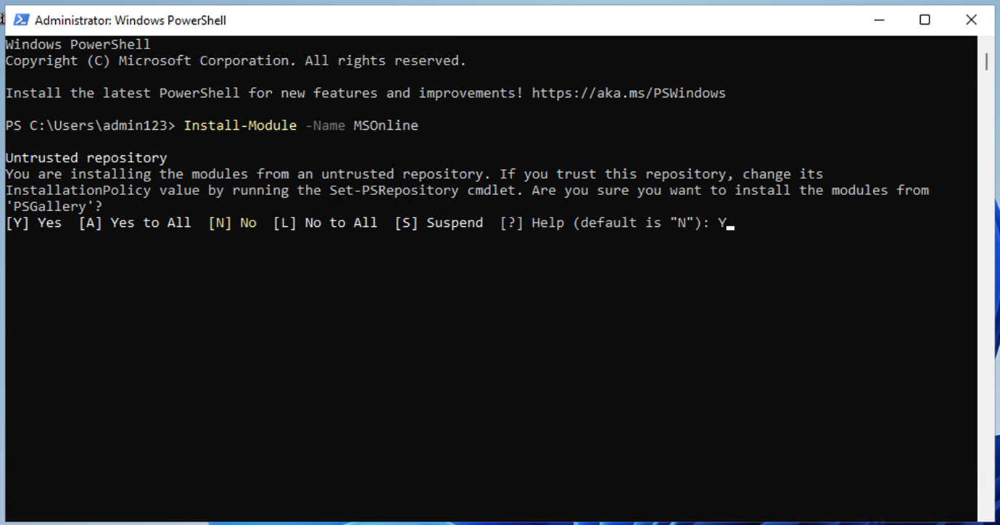

5.  Enter the following cmdlet to install the latest SharePoint Online
    PowerShell module version:

    `Install-Module -Name Microsoft.Online.SharePoint.PowerShell`

    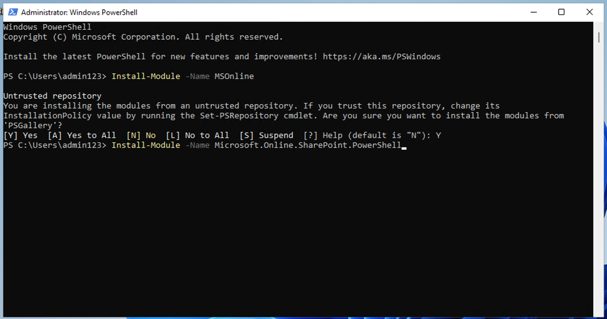

6.  Confirm the Untrusted repository security dialog with **Y** for Yes
    and press Enter.

    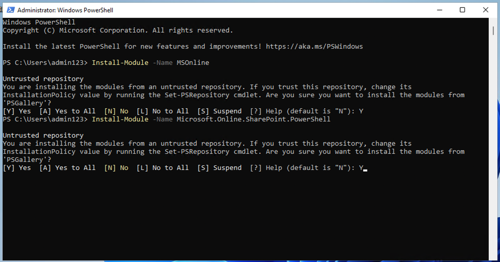

7.  Enter the following cmdlet to connect to the Microsoft Online
    service:

    `Connect-MsolService`

    

8.  In the **Sign in to your account** form, log in as **Patti
    Fernandez** using the username `PattiF@` paste the Office 365 Tenant name
    and the User Password given on your resources tab.

    

9.  After signing in, go the **PowerShell window**.

10. Enter the following cmdlet to get the domain:

    **$domain = get-msoldomain**

    

11. Enter the following cmdlet to create the SharePoint admin url:

    `$adminurl = "https://" + $domain.Name.split('.')[0] + "-admin.sharepoint.com" `

    

12. Enter the following cmdlet to sign in to the SharePoint Online admin
    center:

    `Connect-SPOService -url $adminurl`

    

13. In the **Sign in to your account** form, log in as **MOD
    Administrator** using the credentials provided in the resources tab
    of your lab environment.

14. After signing in, select the PowerShell window.

15. Enter the following cmdlet to enable support for sensitivity labels:

    `Set-SPOTenant -EnableAIPIntegration $true`

    

16. Confirm the changes with **Y** for Yes and press Enter.

    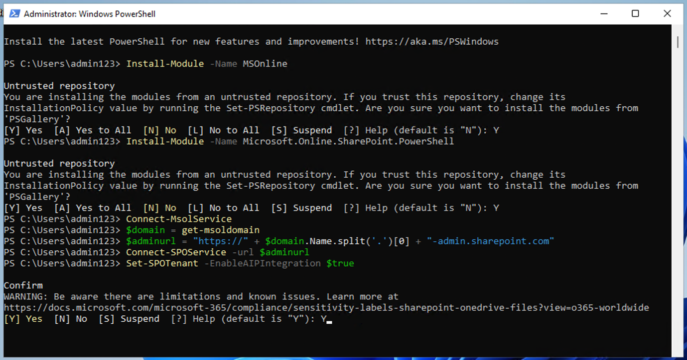

17. Close the **PowerShell** window.

You have successfully enabled support for sensitivity labels with Teams
and SharePoint sites.

## Exercise 2 – Creating Sensitivity Labels

In this task, your HR department has requested a sensitivity label to
apply to HR employee documents. You will create a sensitivity label for
Internal documents and a sublabel for the HR department.

> **Note** - This Feature is available with Microsoft 365 E3 License.

1.	Navigate to `https://admin.microsoft.com` and then enter Admin tenant Id into the field and then click on the **Next** button.

    

2.	Enter the tenant password in the field and then click on the **Sign In** button.

    

3.	Stay signed in window will pop up, click on the **Yes** button.

    

4.	From the Left navigation bar, select the **Users** and then click on the **Active User**.

    

5.	From the top Search bar, search for the `Patti Fernandez`. Select the Patti Fernandez user.

    

6.	Scroll down the Patti Fernandez User page and then select Manage roles.

    

7.	Select the Admin center access and then scroll down.

    

8.	Scroll down and select the Show all by category and then select, Compliance Administrator and Security Administrator. After select these click on the Save button.

    
 

1.  In **Microsoft Edge** navigate to
    `https://purview.microsoft.com` and log in as **Patti
    Fernandez** using the username `PattiF@`  paste the Office 365 tenant name 
    and the User Password given on your resources tab.  

2. On **Welcome to the new Microsoft Purview** portal, select the checkbox of agreement and then click on **Get started** button as shown in the below image.

    .

3.  In the Microsoft Purview portal, on the left navigation pane, select
    **Solutions** \ **Information Protection**.

    

4.  From the sub-navigation select **Sensitivity** **Labels** \
    **Create Labels**.

    

5.  The **New sensitivity label** wizard will start. On the **Label**
    **details** page for the **Name**, **Description for
    admins** and **Description for users**, enter the following
    information:

    - Name: `Internal`

    - Display name: `Internal`

    - Description for users: `Internal sensitivity label`

    - Description for admins: `Internal sensitivity
      label for Contoso.`

    

6.  Select **Next**.

    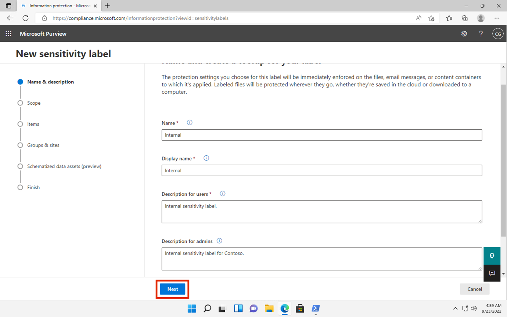

7.  On the **Define the scope for this label** page, select the
    option **Items** which protects emails, files.
    Uncheck the box near **Meetings**.

    

8.  Select **Next**.

    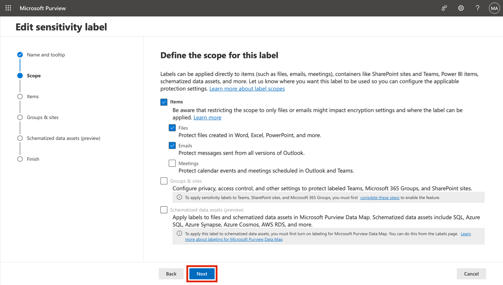

9.  On the **Choose protection settings for labeled items** page,
    select **Next**.

    

10. On the **Auto-labeling** for files and emails page, select **Next**.

    

11. On the **Define protection settings for groups and sites** page,
    select **Next**.

    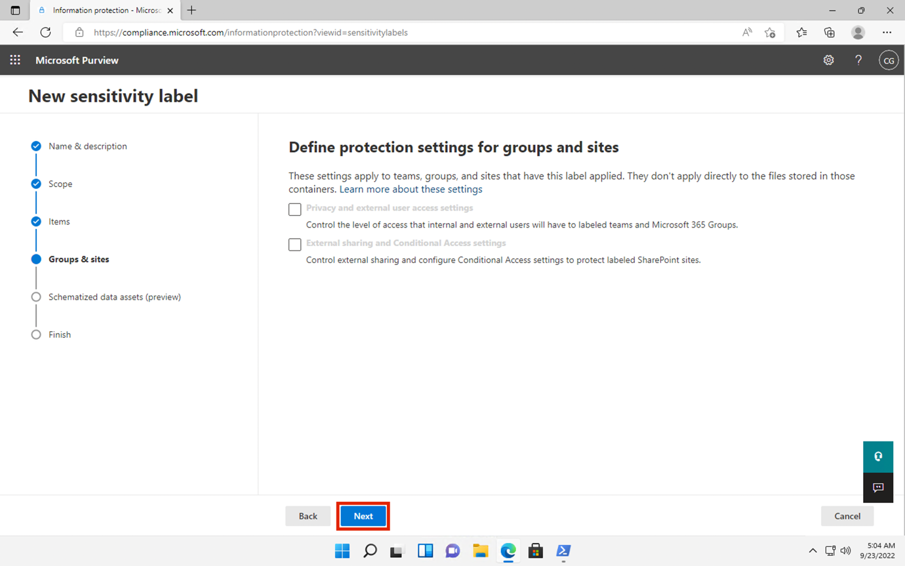

12. On the **Auto-labeling for schematized data** **assets
    (preview)** page, select **Next**.

    

13. On the **Review your settings and finish** page, select **Create
    label**.

    

14. The label will be created and when complete a message will
    display: **Your sensitivity label was created**

15. Select **Don’t create a policy yet** and then select **Done**.

    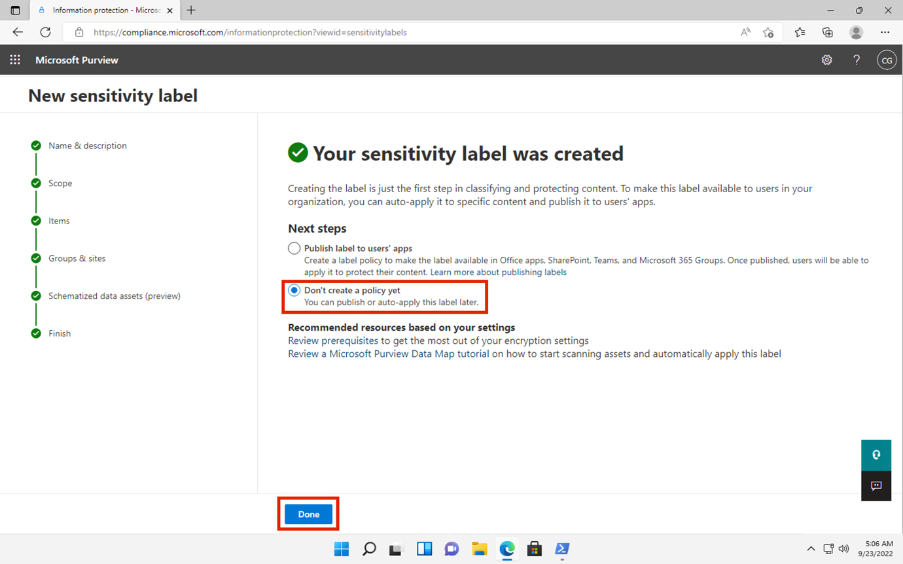

16. -	On the **Information Protection** page, Select **Sensitivity labels**. In the Sensitivity label select vertical (…) of Internal label and select **Create sublabel**.

    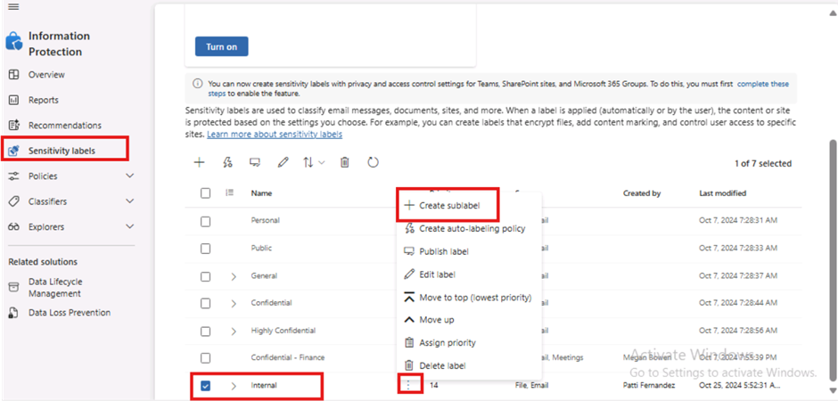

18. The **New sensitivity label** wizard will start. On the **Label
    details** page, enter the following information:

    - Name: `Employee data (HR)`

    - Display name: `Employee data (HR)`

    - Description for users: `This HR
      label is the default label for all specified documents in the HR Department.`

    - Description for admins: `This label is created in consultation with Ms.Jones (Head of HR
      department). Contact her, when you want to change
      settings of the label.`

    

19. Select **Next**.

    

20. On the **Define the scope for this label** page, select the
    option **Items** which protects emails, files, and Meetings.
    Select **Next**.

    

21. On the **Choose protection settings for labeled items** page, select
    the **Control Access** option. Select **Next**.

    

22. On **Access control** page, leave all the fields in the default state. 

    

    

24. Scroll down and click on **Assign permissions** link.

    

25. On the **Assign permissions** pane, select the **+ Add any
    authenticated users**.

    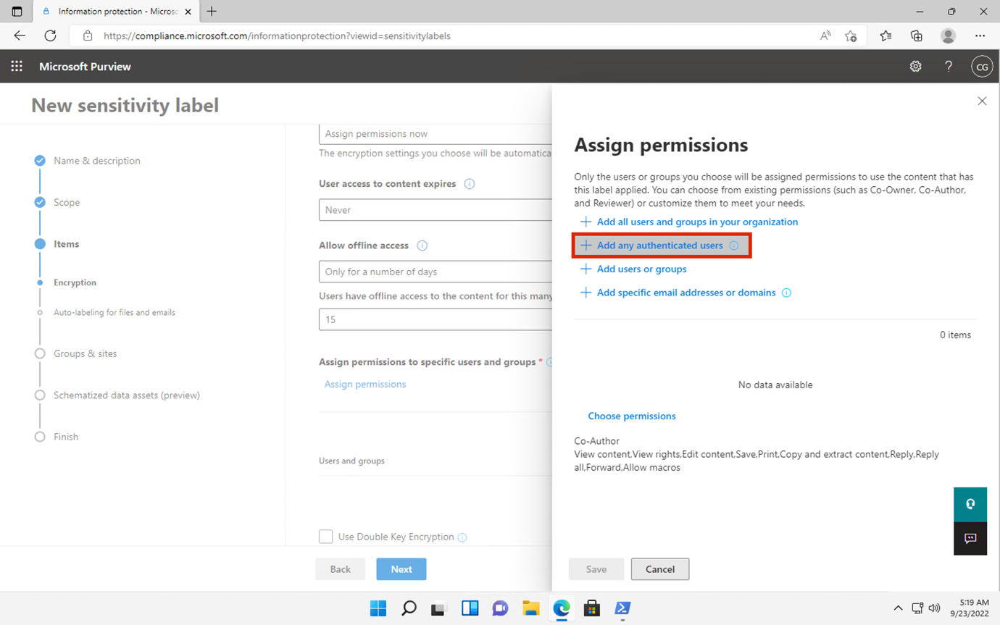

26. Select **Save**.

    

27. On the **Access Control** page, select **Next**.

    

28. On the **Auto-labeling for files and emails** page, select **Next**.

    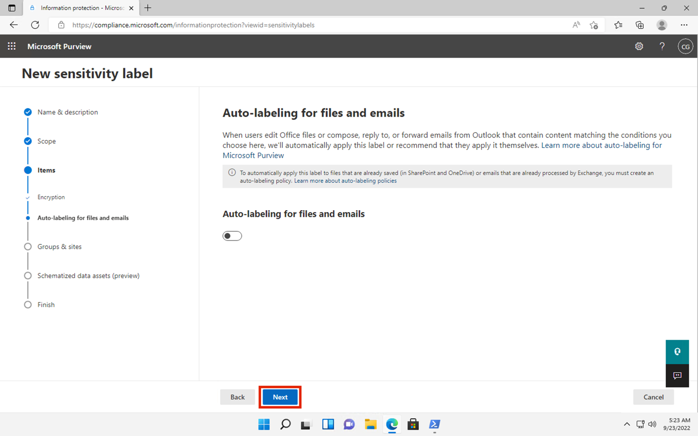

29. On the **Define protection settings for groups and sites** page,
    select **Next**.

    

30. On the **Auto-labeling for schematized data assests
    (preview)** page, select **Next**.

    

31. On the **Review your settings and finish** page, select **Create
    label**.

    

32. The label will be created and when complete a message will
    display **Your sensitivity label was created**.

33. Select **Don’t create a policy yet** and then select **Done**.

    

34. Keep the tab open to continue to the next task.

You have successfully created a sensitivity label for your organizations
internal policies and a sensitivity sublabel for the Human Resources
(HR) department.

## Exercise 3 – Publishing Sensitivity Labels

You will now publish the Internal and HR sensitivity label so that the
published sensitivity labels will be available for the HR users to apply
to their HR documents.

1.  From the sub-navigation select **Sensitivity Labels** \ **Publish**
    **Labels**, which is represented by a computer-shaped icon  as shown in the below image.

    

6.  The publish sensitivity labels wizard will start.

7.  On the **Choose sensitivity labels to publish** page, select
    the **Choose sensitivity labels to publish** link.

    

8.  A side bar called **Sensitivity labels to publish** will appear on
    the right.

9.  Select the **Internal** and **Internal/Employee Data
    (HR)** checkboxes.

    

10. Select **Add**.

    

11. On the **Choose sensitivity labels to publish** page,
    select **Next**.

    

12. On **Assign admin units** page, click on the **Next** button.

    

13. On the **Publish to users and groups page**, select **Next**.

    

14. On the **Policy settings** page, select **Next**.

    

15. On the **Apply a default label to documents** page, select **Next**.

    

16. On the **Apply a default label to emails** page, select **Next**.

17. On the **Default settings for meetings and calendar events**,
    select **Next**.

18. On the **Default settings for Fabric and Power BI content page**,
    select **Next**.

19. On the **Name your policy** page, enter the following information:

    - Name: `Internal HR employee data`

    - Enter a description for your sensitivity label
      policy: `This HR label is to be applied to internal HR
      employee data.`

    

20. Select **Next**.

    

21. On the **Review and finish** page, select **Submit**.

    

22. The policy will be created and when complete a message will
    display **New policy created**.

23. Select **Done and proceed to next task without closing the window**.

    

You have successfully published the Internal and HR sensitivity labels.
Note that it can take up to 24 hours for changes to replicate to all
users and services.

## Summary:

You have successfully created and published an auto apply sensitivity
label for GDPR documents in the region Germany.

Be aware that it can take up to 24 hours for auto applied sensitivity
labels to be applied, this duration will be longer when applied to more
than 25,000 documents (that is, the daily limit).​
