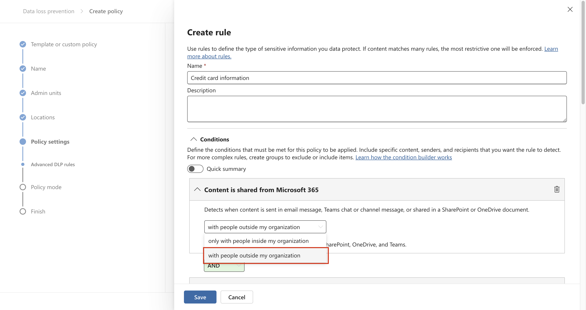
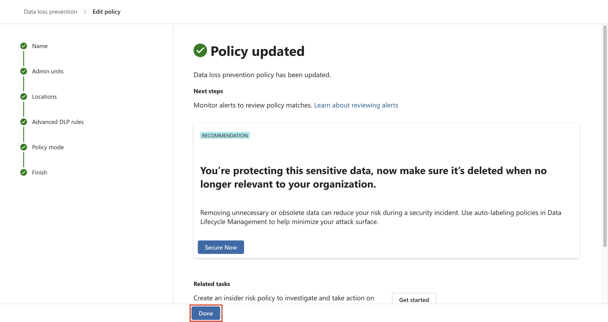
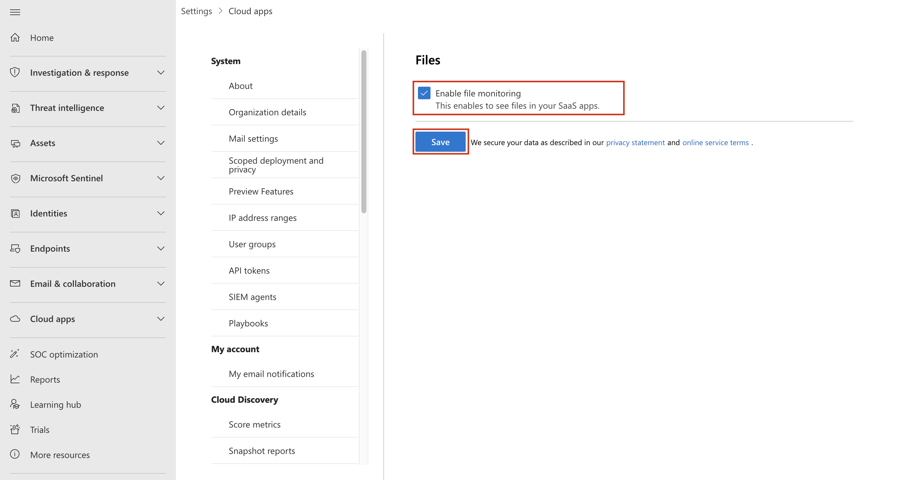
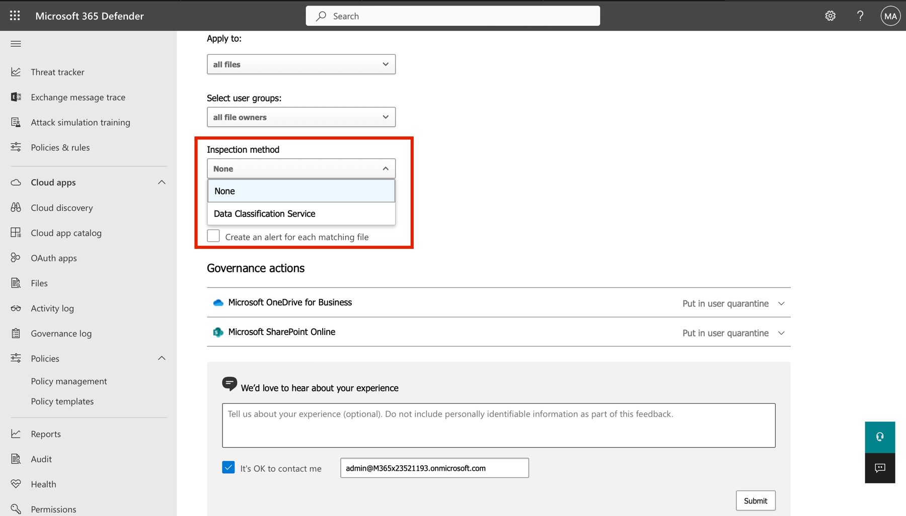
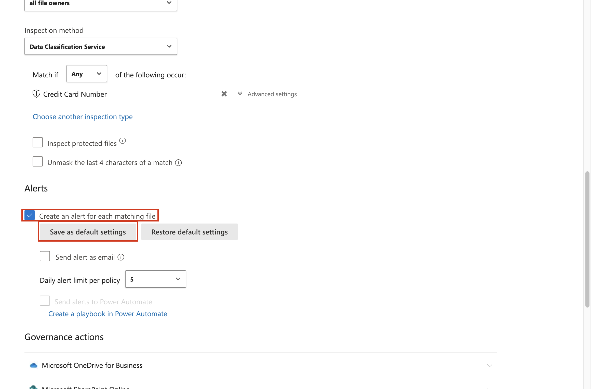
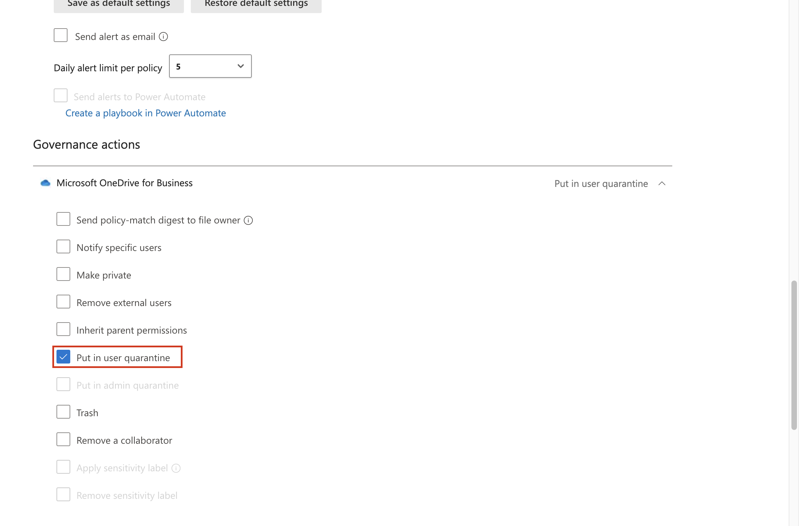
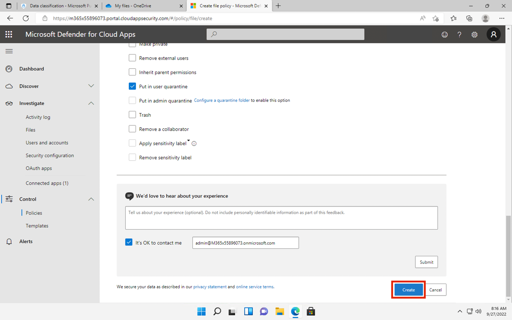

# Lab 4 – Configuring and Implementing Sensitivity Labels for Information Protection

# Objective:

In this lab you will assume the role of Patti
Fernandez, a System Administrator for Contoso Ltd. Your
organization is based in Rednitzhembach, Germany and is currently
implementing a sensitivity plan to ensure that all employee documents in
the HR department have been marked with a sensitivity label as part of
your organizations information protection policies.

## Exercise 1 – Enabling support for sensitivity labels

In this task, you will install the MSOnline module and the SharePoint
Online PowerShell module and enable support for sensitivity labels on
your tenant.

1.  Select the windows symbol in the taskbar with the right mouse button
    and select **Windows PowerShell (Admin)** and run as administrator.

2.  Confirm the **User Account Control** window with **Yes** and press
    Enter.

3.  Enter the following cmdlet to install the latest Microsoft Online
    PowerShell module version:

**+++Install-Module -Name MSOnline+++**

4.  Confirm the NuGet security dialog and the Untrusted repository
    security dialog with Y for Yes and press Enter. This may take a
    while to complete processing.

5.  Enter the following cmdlet to install the latest SharePoint Online
    PowerShell module version:

**+++Install-Module -NameMicrosoft.Online.SharePoint.PowerShell+++**

6.  Confirm the Untrusted repository security dialog with **Y** for Yes
    and press Enter.

7.  Enter the following cmdlet to connect to the Microsoft Online
    service:

**+++Connect-MsolService+++**

8.  In the **Sign in to your account** form, log in as **Patti
    Fernandez** using the username **PattiF@WWLxXXXXXX.onmicrosoft.com**
    and the User Password given on your resources tab.

9.  After signing in, go the **PowerShell window**.

10. Enter the following cmdlet to get the domain:

**+++\\domain = get-msoldomain+++**

11. Enter the following cmdlet to create the SharePoint admin url:

**+++\\adminurl = "https://" +\\domain.Name.split('.')\[0\] +"-admin.sharepoint.com"+++**

12. Enter the following cmdlet to sign in to the SharePoint Online admin
    center:

**+++Connect-SPOService -url \\adminurl+++**

13. In the **Sign in to your account** form, log in as **MOD
    Administrator** using the credentials provided in the resources tab
    of your lab environment.

14. After signing in, select the PowerShell window.

15. Enter the following cmdlet to enable support for sensitivity labels:

**+++Set-SPOTenant -EnableAIPIntegration \$true+++**

16. Confirm the changes with **Y** for Yes and press Enter.

17. Close the **PowerShell** window.

You have successfully enabled support for sensitivity labels with Teams
and SharePoint sites.

## Exercise 2 – Creating Sensitivity Labels

In this task, your HR department has requested a sensitivity label to
apply to HR employee documents. You will create a sensitivity label for
Internal documents and a sublabel for the HR department.

1.  In **Microsoft Edge** navigate to
    **+++**https://purview.microsoft.com**+++** and log in as **Patti
    Fernandez** using the username **PattiF@WWLxXXXXXX.onmicrosoft.com**
    and the User Password given on your resources tab.

2.  

3.  In the Microsoft Purview portal, on the left navigation pane, select
    **Solutions** \> **Information Protection**.

4.  From the sub-navigation select **Sensitivity** **Labels** \>
    **Create Labels**.

5.  The **New sensitivity label** wizard will start. On the **Label**
    **details** page for the **Name**, **Description for
    admins** and **Description for users**, enter the following
    information:

    - Name: **+++Internal+++**

    - Display name: **+++Internal+++**

    - Description for users: **+++Internal sensitivity label+++**

    - Description for admins: **+++Internal sensitivity
      label for Contoso.+++**

6.  Select **Next**.

7.  On the **Define the scope for this label** page, select the
    option **Items** which protects emails, files, and Power BI items.
    Uncheck the box near **Meetings**.

8.  Select **Next**.

9.  On the **Choose protection settings for labeled items** page,
    select **Next**.

10. On the **Auto-labeling** for files and emails page, select **Next**.

11. On the **Define protection settings for groups and sites** page,
    select **Next**.

12. On the **Auto-labeling for schematized data** **assets
    (preview)** page, select **Next**.

13. On the **Review your settings and finish** page, select **Create
    label**.

14. The label will be created and when complete a message will
    display: **Your sensitivity label was created**

15. Select **Don’t create a policy yet** and then select **Done**.

16. On the **Information protection** page, highlight (without
    selecting) the newly created **Internal** label and select the
    vertical **…**.

17. Select the **+ Add sub label** from the drop-down menu.

18. The **New sensitivity label** wizard will start. On the **Label
    details** page, enter the following information:

    - Name: **+++Employee data (HR)** **+++**

    - Display name: **+++Employee data (HR)** **+++**

    - Description for users: **+++This HR
      label is the default label for all specified documents in the
      HR Department.** **+++**

    - Description for admins: **+++This label is created in**
      **consultation with Ms.Jones (Head of HR
      department). Contact her,** **when you want to change
      settings of the label.** **+++**

19. Select **Next**.

20. On the **Define the scope for this label** page, select the
    option **Items** which protects emails, files, and Meetings.
    Select **Next**.

21. On the **Choose protection settings for labeled items** page, select
    the **Control Access** option. Select **Next**.

22. On **Encryption Page**, select **Configure
    encryption** **settings**.

23. Enter the following information into the encryption settings:

    - Assign permissions now or let users decide?: **Assign permissions
      now**

    - User access to content expires: **Never**

    - Allow offline access: **Only for a number of days**

    - Users have offline access to the content for this many
      days: **15**

24. Select the **Assign permissions** link.

25. On the **Assign permissions** pane, select the **+ Add any
    authenticated users**.

26. Select **Save**.

27. On the **Encryption** page, select **Next**.

28. On the **Auto-labeling for files and emails** page, select **Next**.

29. On the **Define protection settings for groups and sites** page,
    select **Next**.

30. On the **Auto-labeling for schematized data assests
    (preview)** page, select **Next**.

31. On the **Review your settings and finish** page, select **Create
    label**.

32. The label will be created and when complete a message will
    display **Your sensitivity label was created**.

33. Select **Don’t create a policy yet** and then select **Done**.

34. Keep the tab open to continue to the next task.

You have successfully created a sensitivity label for your organizations
internal policies and a sensitivity sublabel for the Human Resources
(HR) department.

## Exercise 3 – Publishing Sensitivity Labels

You will now publish the Internal and HR sensitivity label so that the
published sensitivity labels will be available for the HR users to apply
to their HR documents.

1.  In **Microsoft Edge** navigate to
    **+++https://purview.microsoft.com+++** and log in as **Patti
    Fernandez** using the username **PattiF@WWLxXXXXXX.onmicrosoft.com**
    and the User Password given on your resources tab.

2.  In the Microsoft Purview portal, on the left navigation pane, select
    **Solutions** \> **Information Protection**.

3.  

4.  

5.  From the sub-navigation select **Sensitivity Labels** \> **Publish**
    **Labels**.

6.  The publish sensitivity labels wizard will start.

7.  On the **Choose sensitivity labels to publish** page, select
    the **Choose sensitivity labels to publish** link.

8.  A side bar called **Sensitivity labels to publish** will appear on
    the right.

9.  Select the **Internal** and **Internal/Employee Data
    (HR)** checkboxes.

10. Select **Add**.

11. On the **Choose sensitivity labels to publish** page,
    select **Next**.

12. On the **Publish to users and groups page**, select **Next**.

13. On the **Policy settings** page, select **Next**.

14. On the **Apply a default label to documents** page, select **Next**.

15. 

16. On the **Apply a default label to emails** page, select **Next**.

17. On the **Default settings for meetings and calendar events**,
    select **Next**.

18. 

19. On the **Default settings for Fabric and Power BI content page**,
    select **Next**.

20. On the **Name your policy** page, enter the following information:

    - Name: **+++Internal HR employee data+++**

    - Enter a description for your sensitivity label
      policy: **+++This HR label is to be applied to internal HR
      employee data.** **+++**

21. Select **Next**.

22. On the **Review and finish** page, select **Submit**.

23. The policy will be created and when complete a message will
    display **New policy created**.

24. Select **Done and proceed to next task without closing the window**.

You have successfully published the Internal and HR sensitivity labels.
Note that it can take up to 24 hours for changes to replicate to all
users and services.

## Exercise 4 – Working with Sensitivity Labels

In this task, you will create sensitivity labels in Word and Outlook
emails. The document created will be stored in OneDrive and sent to an
HR employee via email.

1.  

2.  Navigate to **+++https://portal.office.com+++** and log in as
    **Patti Fernandez**.

3.  If a **Get your work done with Office 365** message is shown, close
    it.

4.  Select the **Microsoft Word** symbol from the left side pane to open
    Word Online.

5.  Select **New blank document** to create a new document.

6.  If a **Your privacy options** message is shown, close it with
    selecting **Close**.

7.  Enter the following contents into the word document:

**+++Important HR employee document.+++**

8.  Select **Sensitivity** from the top pane to open the dropdown menu.

9.  Select **Internal** \>**Employee data (HR)** to apply the label.

**Note**: Be aware, the script you ran in task 1 of this exercise
activated sensitivity labels in Word for your tenant. It can sometimes
take an hour for that activation to be realized in Microsoft Word
online. If you don't see the Sensitivity label menu in Word, you may
need to return to this lab later or make sure you properly completed
task 1 of this exercise.

10. Select the **Document – Saved** in the upper left of the window,
    enter **HR Document** as the File Name and press **Enter** key.

11. Close the word tab to return to the **Office 365** tab. Select
    the **Outlook** symbol from the left side pane to
    open **Outlook** on the web.

12. If a welcome message is shown, close it with selecting the **X**.

13. In Outlook on the web, select **New message** from the upper left of
    the window.

14. In the **To** field enter the name: **Adele** and select **Adele
    Vance** from the drop-down list.

15. In the subject field, enter: **+++Employee data for HR+++**.

16. Within the email message (the large content panel at the bottom of
    the page), insert the following message:

> **+++Dear** **Ms. Adele,**
>
> **Please find attached the important HR employee document.**
>
> **Kind regards,**
>
> **Patti Fernandez+++**

17. Select the **paperclip symbol** from the bottom menu.

18. 

19. Select the **HR Document.docx** below **Suggested attachments** to
    attach the document.

20. 

21. Select **Send** to send out the email message with attached
    document.

22. Leave the browser window open.

You have successfully created an HR Word document with a sensitivity
label, which was saved onto your OneDrive. You then emailed to document
to an HR staff member where the email was also set with a sensitivity
label.

In the trial account, note that you will be able to send the mail but it
will bounce back and will not be able to reach the receiver from your
current tenant.

## Exercise 5 – Configuring Auto Labelling

n this task, you will create a **Sensitivity Label** that will auto
label documents and emails found to contain information related to
the **European General Data Protection Regulation (GPDR)**.

1.  In **Microsoft Edge**, the Microsoft Purview portal tab should still
    be open.

2.  You should be logged into the portal as **Patti** **Fernandez**.

3.  Under the **Information protection**, select **Label**, highlight
    (without selecting) the existing **Internal** label, and select the
    three dots. Select the **+ Create sublabel** menu item.

4.  The **New sensitivity label** wizard will start. On the **label
    details** page, enter the following information:

    - Name: **+++GDPR Germany+++**

    - Display name: **+++GDPR Germany+++**

    - Description for users: **+++This document or email contains data
      related to the European General Data
      Protection Regulation(GPDR) for the region Germany.** **+++**

    - Description for admins: **+++This label is auto applied
      to German GDPR documents.** **+++**

5.  Select **Next**.

6.  On the **Define the scope for this label** page, select the
    option **Items** which protects Files, Emails, and Meetings items.
    Then select **Next**.

7.  On the **Choose protection settings for labeled items** page,
    select **Next**.

8.  On the **Auto-labeling for files and emails** page, set
    the **Auto-labeling for files and emails** to enabled.

9.  In the **Detect content that matches these conditions** section,
    select **+Add condition** and then select **Content contains**.

10. In **Content contains** section select the **Add** text and then
    select **Sensitive info types**.

11. A **Sensitive info types** panel will be displayed on the right.

12. In the **Search for sensitive info types** search panel, enter the
    following information:

**German**

13. Press the enter button, the results will display sensitivity info
    types related to Germany. Press the **Select all** check box.

14. Select **Add**.

15. Select **Next**.

16. On the **Define protection settings for groups and sites** page,
    select **Next**.

17. 

18. On the **Auto-labeling for schematized data** **assets
    (preview)** page, select **Next**.

19. On the **Auto-labeling for schematized data assets (preview)** page,
    select **Next**.

20. On the **Review your settings and finish** page, select **Create
    label**.

21. The label will be created and when complete a message will
    display: **Your sensitivity label was created**. Then
    select **Done**.

22. From the sub-navigation select **Sensitivity Labels** \> **Publish
    Labels**.

23. 

24. The **Publish sensitivity labels wizard** will start.

25. On the Choose sensitivity labels to publish page, select the Choose
    sensitivity labels to publish link.

26. A side bar called **Sensitivity labels to publish** will appear on
    the right.

27. Select the **Internal** and **Internal/GDPR Germany** checkbox and
    select **Add**.

28. On the **Choose sensitivity labels to publish** page,
    select **Next**.

29. On the **Publish to users and groups** page, select **Next**.

30. On the **Policy settings** page, select **Next**.

31. On the **Apply a default label to documents** page, select **Next**.

32. On the **Apply a default label to emails** page, select **Next**.

33. On the **Default settings for meetings and calendar events**,
    select **Next**.

34. 

35. 

36. 

37. On the **Default settings for Fabric and Power BI content page**,
    select **Next**.

38. On the **Name your policy** page, enter the following information:

    - Name: **+++GDPR Germany policy+++**

    - Enter a description for your sensitivity label
      policy: **+++This auto apply sensitivity labels policy is for the
      GDPR region of** **Germany.** **+++**

39. Select **Next**.

40. On the **Review and finish** page, select **Submit**.

41. The policy will be created and when complete a message will
    display, **New policy created**.

42. Select **Done**.

## Summary:

You have successfully created and published an auto apply sensitivity
label for GDPR documents in the region Germany.

Be aware that it can take up to 24 hours for auto applied sensitivity
labels to be applied, this duration will be longer when applied to more
than 25,000 documents (that is, the daily limit).​
