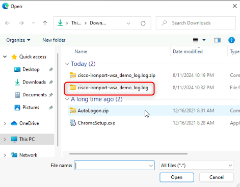

# **Lab 4: Cloud Discovery and Configuration with Microsoft Defender for Cloud Apps**

This guide will walk through the steps to successfully deploy a
Microsoft Defender for Cloud Apps tenant and perform the initial steps
with the system.

## Exercise 1: Configure Cloud App Discovery

Microsoft Defender for Cloud Apps enables organizations to discover and
analyze cloud apps that are in use in their environment. Discover all
the cloud apps in your network, identify all users and IP addresses, and
conduct risk assessment without any agents on endpoint devices. Gain
complete visibility and context for cloud usage and shadow IT to improve
understanding and reduce risk.

The discovery module supports two modes of operation: a manual one-time
upload of logs to receive a snapshot report and a continuous log upload
for ongoing monitoring of the environment.

### Task 1: Create a Cloud Discovery Snapshot Report

To perform a one-time upload of discovery logs, perform the following
steps:

1.  Log in to Microsoft Defender portal using the following URL with Admin credentials: `https://Security.microsoft.com`
    Scroll down and click on **Settings** and then click on **Cloud Apps**.

    

2.  Scroll down to **Information Protection** then click on **Microsoft Information Protection**, then select **Automatically scan new files
    for sensitivity labels from Microsoft Information Protection and content inspection warnings...** Scroll down and click on the Save button.

    

    

    

3. Scroll down and click on the **Grant** button.

   

4. Select the admin account.

   

5. In the **Permission Requested** dialog box, click on the **Accept** button.

   
 
6.  Under **Inspect protected files**, check if **Inspect protected
    files** is active.

    

7.  Now go to **Files** under **Information protection**.

8.  Check the box near **Enable file Monitoring** and click on **Save**.

9.  In the left navigation pane, select **Connected apps**, and click on
    **App Connectors**.

10.  Notice that **Microsoft Office** connected by default.

11.  On the central pane, navigate to **Cloud Discovery,** and click on
    **Snapshot reports**.

12.  On the next page of **Snapshot reports,** Click on **Create snapshot
    report.**

 

13. On **Create new Cloud Discovery snapshot report,** click
    on **Next**.

14. Update the details as below:

    - Report name: `Contoso Snapshot Report`

    - Description: `Contoso Snapshot Report`

    - Source: `Cisco IronPort WSA`

    - Click on `View Log Format`

15. In the **View log format section**, download sample log file and
    save locally. From its saved location, unzip the sample log file.

16. Optionally, choose **Anonymize private information** to encrypt
    usernames in the **Discover dashboard**. Click on **Next**.

17. Click the **Browse button** in the **Upload traffic logs** section
    to select the unzipped sample log file from its saved location and
    then upload it.

18. On the next page, click on **Close**.

19. You will be navigated to a new setting window where the status
    is **Processing**.

20. Once the snapshot is ready, the Status will change
    from **Processing** to **Ready**.
    
**Important Note**: Analysis can take up to 24 hours.

21. Click on the **View sample report** link. Then, review the sample reports.

   
   
