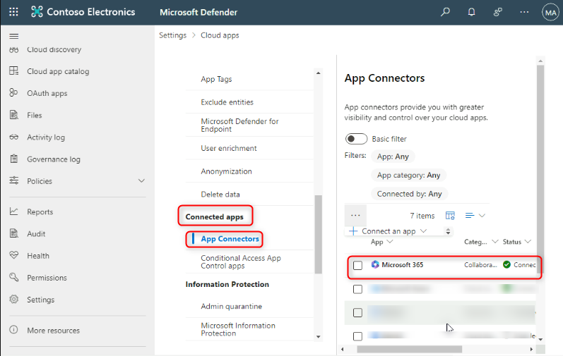
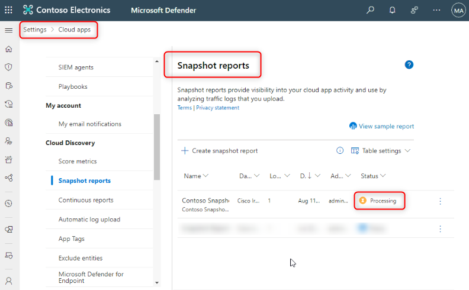
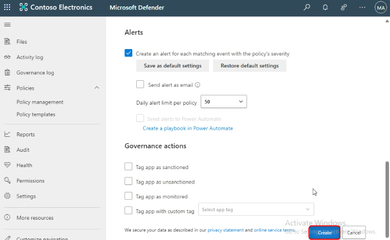

# **Lab 4: Cloud Discovery and Configuration with Microsoft Defender for Cloud Apps**

This guide will walk through the steps to successfully deploy a
Microsoft Defender for Cloud Apps tenant and perform the initial steps
with the system.

## Exercise 1: Configure Cloud App Discovery

Microsoft Defender for Cloud Apps enables organizations to discover and
analyze cloud apps that are in use in their environment. Discover all
the cloud apps in your network, identify all users and IP addresses, and
conduct risk assessment without any agents on endpoint devices. Gain
complete visibility and context for cloud usage and shadow IT to improve
understanding and reduce risk.

The discovery module supports two modes of operation: a manual one-time
upload of logs to receive a snapshot report and a continuous log upload
for ongoing monitoring of the environment. A list of supported firewalls
is
documented [**https://technet.microsoft.com/en-US/library/mt489024(TechNet.10).aspx**](urn:gd:lg:a:send-vm-keys).

### Task 1: Create a Cloud Discovery Snapshot Report*

To perform a one-time upload of discovery logs, perform the following
steps:

1.  In **[Microsoft Defender
    portal](file:///C:\Users\editoruoap\Downloads\Security.microsoft.com),**
    Under the **settings cog**, select the **Settings** page, navigate
    to **Cloud Apps**.

2.  Under  **Information Protection**, scroll down to **Microsoft
    Information Protection and** select **Automatically scan new files
    for sensitivity labels from Microsoft Information Protection and
    content inspection warnings**…

3.  Under **Inspect protected files**, check if **Inspect protected
    files** is active.

4.  Now go to **Files** under **Information protection**.

5.  Check the box near **Enable file Monitoring** and click on **Save**.

6.  In the left navigation pane, select **Connected apps**, and click on
    **App Connectors**.

7.  Notice that **Microsoft Office** connected by default.

8.  On the central pane, navigate to **Cloud Discovery,** and click on
    **Snapshot reports**.

9.  On the next page of **Snapshot reports,** Click on **Create snapshot
    report.**

 

10. On **Create new Cloud Discovery snapshot report,** click
    on **Next**.

11. Update the details as below:

    - Report name: !!**Contoso Snapshot Report**!!

    - Description: !!**Contoso Snapshot Report**!!

    - Source: !!**Cisco IronPort WSA**!!

    - Click on !!**View Log Format**!!

12. In the **View log format section**, download sample log file and
    save locally. From its saved location, unzip the sample log file.

13. Optionally, choose **Anonymize private information** to encrypt
    usernames in the **Discover dashboard**. Click on **Next**.

14. Click the **Browse button** in the **Upload traffic logs** section
    to select the unzipped sample log file from its saved location and
    then upload it.

15. On the next page, click on **Close**.

16. You will be navigated to a new setting window where the status
    is **Processing**.

17. Once the snapshot is ready, the Status will change
    from **Processing** to **Ready**.

### Task 2: Track the Status of the Snapshot Report

1.  Click on **the Settings** icon and navigate to **Cloud Apps**.

2.  Under **Cloud Discovery**, click on **Snapshot report**

3.  You will see the snapshot report being processed.

4.  Once the snapshot is ready, the **Status** will change
    from **Processing** to **Ready**. This will take some time. Please
    proceed with next tasks.

## Exercise 2: Configure Sanctioned Application Connectors

### Task 1: Test Microsoft 365 connection

1.  Navigate to [**Microsoft
    defender**](file:///C:\Users\editoruoap\Downloads\security.microsoft.com)
    home page.

2.  On the Microsoft Defender portal left side navigation pane, click on
    **Settings** cog, and then navigate to **Cloud Apps.**

 

3.  On the **Cloud Apps** page, navigate to **Connected apps** and click
    on **App Connectors.**

4.  We can see **Microsoft 365** is displayed as **Connected.**

5.  To upload files in Microsoft 365, Click on the App launcher on the
    top left corner of the page, and click on the **OneDrive** icon.

 

6.  Upload the following test files to **OneDrive** from C:\Resources,
    and click on **Open.**

    - **Sample CC.docx**

    - **Project Falcon Customer Data.xlsx**

    - **Personal Refund.docx**

**Note**: For newly created tenants, the sync process might take time to
reflect, so continue with the next steps of the training

## Exercise 3: Review Cloud Discovery Snapshot Report

Cloud App Security not only discovers 13,000 cloud applications in use,
but it also provides a risk score by evaluating each discovered service
against more than 60 parameters, evaluating the service provider,
security mechanisms, and compliance certifications. These details help
determine and assess the credibility and reliability of each cloud
service discovered, represented by a risk score. Cloud App Security
gives IT the tools to perform a total risk assessment for each service,
based on a combination of risk score and usage.

### Task 1: Explore Your Organization's Cloud Usage

1.  To review the applications in use,
    navigate !!**<https://Security.microsoft.com!!** to **Cloud
    Apps** **\** **Cloud Discovery \Dashboard**.

2.  Make sure to choose the **Snapshot report** that you've just created
    in Task 2. The additional tabs show information on users and
    devices.

3.  Notice the **Dashboard** in detail and notice all the options
    available.

4.  **Sanctioning and un-sanctioning apps**: Review
    the **Discovered** apps list on the Dashboard, and sanction or
    un-sanction them based on your prior knowledge about these apps
    using the menu on the right:

### Task 2: Exploring Cloud Risk Score

Microsoft Cloud App Security not only discovers more than 13,000 apps
but it also provides an automated risk score for each app, calculated
with more than 60 parameters.

The risk score is generated based on a variety of compliance and
security attributes of the cloud application. Organizations can
customize the risk score based on its business requirements. For
example, the organization may place a higher priority for HIPAA
compliance than FINRA or if the application requires encryption during
transport or if it supports multifactor authentication.

2.  Click on the **settings icon** and navigate to **Cloud Apps**

3.  Under **Cloud Discovery**. Click on **Score Metric**.

 

4.  Notice the **Importance sliders** for the appropriate attributes to
    reflect in the risk score. Sample attributes shown below in the
    below screenshot

### Task 3: Continuous Discovery: App Discovery Policies

1.  Navigate **Policies** and choose **Policy Management** .

2.  Click on **Create Policy** Select the type of policy to create
    - **App Discovery Policy**

3.  From the policy templates choose **New high upload volume app** and
    click on **Apply template.**

4.  Click on **Create**.

