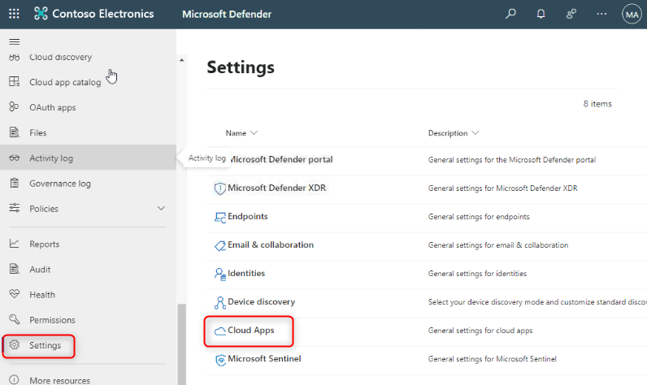
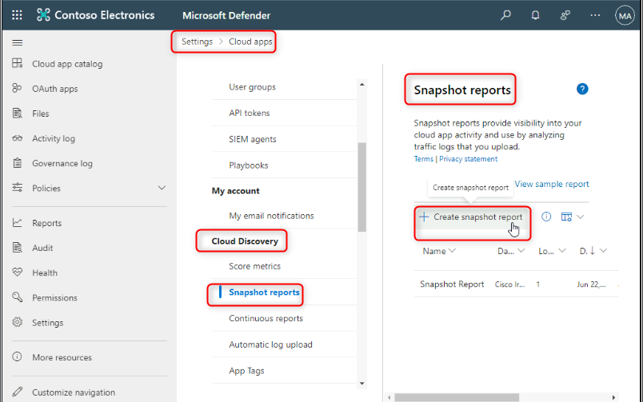
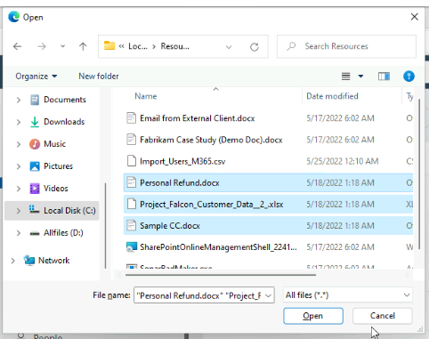
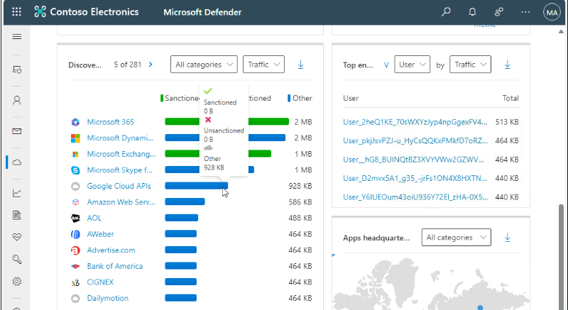
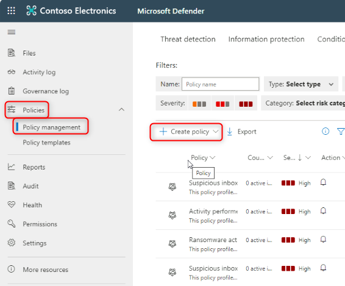
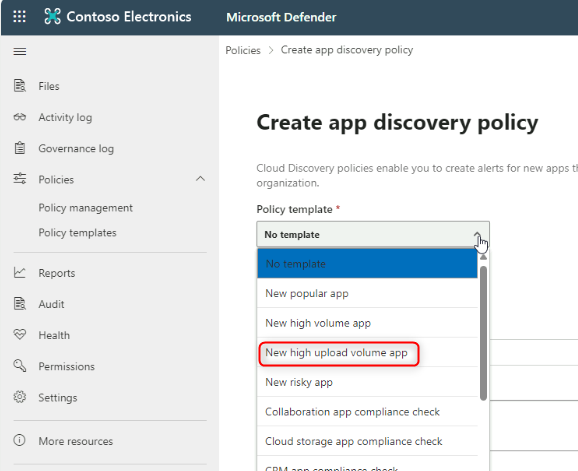

# Lab 4 – Protecting your data with DLP Policies 

## Objective:

You are Patti Fernandez, the newly hired Compliance Administrator for
Contoso Ltd. tasked to configure the company's Microsoft 365 tenant for
data loss prevention. Contoso Ltd. is a company that offers driving
instruction in the United States and you need to make sure that
sensitive customer information does not leave the organization.

## Exercise 1 – Creating DLP Policies

### Task 1 – Creating a DLP policy in test mode

In this exercise, you will create a Data Loss Prevention policy in the
Microsoft Purview portal to protect sensitive data from being shared by
users. The DLP Policy that you create will inform your users if they
want to share content that contains Credit Card information and allow
them to provide a justification for sending this information. The policy
will be implemented in test mode because you do not want the block
action to affect your users yet.

1.  In **Microsoft Edge**, navigate
    to **+++https://purview.microsoft.com+++** and make sure you are
    logged into the **Microsoft Purview** portal as **Patti Fernandez**.

2.  In the **Microsoft Purview** portal, in the left navigation pane,
    select  **Solutions** \> **Data loss prevention**.

3.  Under **Data loss prevention**, select **Policies**, and then
    select **+Create policy** to start the wizard for creating a new
    data loss prevention policy.

4.  On the **Start with a template or create a custom policy** page,
    scroll down and select **Custom** under **Categories** and **Custom
    policy** under **Templates**. By default, both options should
    already be selected , select **Next**.

5.  On the **Name your DLP policy** page,
    type **+++Credit Card DLP Policy+++** in the **Name** field
    and **+++Protect credit card numbers from being shared.+++** in
    the **Description** field. Select **Next**.

6.  On the **Assign admin units** page, select **Next**.

7.  On the **Choose locations to apply the policy** page, make sure that
    the **Teams chat and channel messages** option is enabled and all of
    the other options are disabled and select **Next**.

8.  On the **Define policy settings** page, select **Create or customize
    advanced DLP rules** and select **Next**.

9.  On the **Customize advanced DLP rules** page, select **+ Create
    rule**.

10. On the **Create rule** page, type **+++Credit card
    information+++** in the **Name** field.

11. Under **Conditions** on the **Create rule** page, select **+ Add
    condition** and select **Content is shared from Microsoft 365** from
    the dropdown menu.

12. In the new **Content is shared from Microsoft 365** section, select
    the **with people outside my organization** option.

13. Select **+ Add Condition** and then select **Content contains** from
    the dropdown menu.

14. In the new **Content contains** area, select **Add** and
    select **Sensitive info types** from the dropdown menu.

15. On the **Sensitive info types** page, select **Credit Card
    Number** and select **Add**.

16. On the **Create rule** page, select **+ Add an action** and
    select **Restrict access or encrypt the content in Microsoft 365
    locations**.

17. Check the box in front of **Restrict access or encrypt the content
    in Microsoft 365 locations** and then select **Block only people
    outside your organization**.

18. On the **Create rule** page, in the **User notifications** section,
    select the switch to put it in the **On** position.

19. On the **Create rule** page, in the **User** **overrides** section,
    under the **Allow overrides from M365 services**, check the
    box **Allow overrides from M365 services. Allows users in
    Exchange,** **SharePoint, OneDrive and Teams to override policy
    restrictions.**

**Note**: If you were not able to select the check box of **Allow
overrides from M365 services**, enable the check box of **Notify users
in Office 365 with a policy tip** which can be found on the **Create
rule** page under the **User notification \>\\ \>Microsoft 365
services** section from the previous step. Then select the check box
of **Allow overrides from M365 services. Allows users in Exchange,**
**SharePoint, OneDrive and Teams to override policy restrictions.**

20. Check the box **Require a business justification to override**.

21. In the **Incident reports** section, in the **Use this severity
    level in admin alerts and reports** dropdown, select **Low**.

22. Select **Save**, then select **Next**.

23. On the **Test or turn on the policy** page select **Run the policy
    in simulation mode** and select **Show policy tips while in test**
    **mode**.

24. 

25. Select **Submit** to create the policy.

26. Once the policy is created select **Done**.

You have now created a DLP policy that scans for Credit Card numbers in
Microsoft Teams chats and channels and allows users to provide a
business justification to override the policy.

### Task 2 – Modifying a DLP policy

In this task, you will modify the existing DLP policy you created in the
previous step to also scan e-mails for Credit Card information and
inform users if they want to share this content in an e-mail.

1.  In **Microsoft Edge**, navigate
    to **+++https://purview.microsoft.com+++** and make sure you are
    logged into the **Microsoft Purview** portal as **Patti Fernandez**.

2.  In the **Microsoft Purview** portal, in the left navigation pane,
    select **Solutions** \> **Data loss prevention**.

3.  

4.  

5.  

6.  Under **Data loss prevention**, select **Policies**, and then select
    the policy named **Credit Card DLP Policy** and then select **Edit
    policy**(pencil icon) to open the policy wizard.

7.  

8.  On the **Name your DLP policy** and **Assign admin units** page,
    select **Next**.

9.  On the **Choose locations to apply the policy** page, enable
    the **Exchange email** option and then select **Next** until you
    reach the **Review and** **finish** page. Make sure that the rest of
    the locations are disabled.

10. Select **Submit** to apply the change you made in the policy.

11. Once the policy is updated select **Done**.

You have now modified an existing DLP policy and changed the locations
it scans for content.

### Task 3 – Creating a DLP policy in PowerShell

In this task, you use PowerShell to create a DLP policy to protect the
Contoso EmployeeIDs and prevent them from being shared in Exchange.
Users will be informed that they are attempting to share sensitive data
and are blocked from sending the e-mail if it includes Contoso
EmployeeIDs.

1.  In the start menu, select **Windows PowerShell**.

2.  In the **PowerShell** window, enter

**+++Connect-IPPSSession+++**

and then sign in as **Patti Fernandez.**

Note: If it shows error try running the following commands one by one
first and then execute the step again.

**+++Install-ModuleExchangeOnlineManagement+++**

**+++Import-ModuleExchangeOnlineManagement+++**

3.  Enter the following command into PowerShell to create a DLP policy
    that scans all Exchange mailboxes:

**+++New-DlpCompliancePolicy -Name"EmployeeID DLP Policy" -Comment "This
policy blocks sharing of Employee IDs" -ExchangeLocation All+++**

4.  Enter the following command into PowerShell to add a DLP rule to the
    DLP policy you created in the previous step:

**+++New-DlpComplianceRule -Name"EmployeeID DLP rule" -Policy"EmployeeID
DLP
Policy" -BlockAccess\\true -ContentContainsSensitiveInformation@{Name="Contoso
Employee IDs"}+++**

5.  Use the following command to review the **EmployeeID DLP rule**:

**+++Get-DLPComplianceRule -Identity "EmployeeID DLP rule"+++**

You have now created a DLP Policy that scans for Contoso EmpoloyeeIDs in
Exchange by using PowerShell.

### Task 4 – Activating a policy in test mode

In this task, you will activate the credit card information DLP policy
you created in test mode so it enforces its protective actions.

1.  In **Microsoft Edge**, navigate
    to **+++https://purview.microsoft.com+++** and make sure you are
    logged into the **Microsoft Purview** portal as **Patti Fernandez**.

2.  In the **Microsoft Purview** portal, in the left navigation pane,
    select **Solutions** \> **Data loss prevention**.

3.  Under **Data loss prevention**, select **Policies**, and then select
    the policy named **Credit Card DLP Policy** and then select **Edit
    policy**(pencil icon) to open the policy wizard.

4.  

5.  

6.  

7.  

8.  

9.  Select **Next** until you reach the **Test or turn on the
    policy** page and select **Turn** **the** **policy on immediately**.

10. Select **Next**, then select **Submit** to activate the policy.

11. Once the policy is updated select **Done**.

You have successfully activated the DLP Policy. If the policy detects an
attempt to share credit card information, it will now block the attempt
and allow the users to provide a business justification to override the
block action.

## Exercise 2 – Managing DLP Policies

### Task 1 – Modifying policy priority

After creating two DLP policies, you want to make sure that the more
restrictive policy is processed at a higher priority than the less
restrictive policy. For this reason, you want to move the EmployeeID DLP
Policy into the higher priority.

1.  In **Microsoft Edge**, navigate
    to **+++https://purview.microsoft.com+++** and make sure you are
    logged into the **Microsoft Purview** portal as **Patti Fernandez**.

2.  In the **Microsoft Purview** portal, in the left navigation pane,
    select **Solutions** \> **Data loss prevention**.

3.  Under **Data loss prevention**, select **Policies**, and then select
    the policy named **Credit Card DLP Policy** and then select **Edit
    policy**(pencil icon) to open the policy wizard.

<!-- -->

1.  
2.  
3.  

4.  Select **Move to top**.

5.  In the **Data loss prevention** window, select **Refresh** and
    review the priority in the **Order** column of the policy table.

You successfully modified the priority of your DLP policies. If both
policies match the same content the action of the higher priority policy
will be enforced.

### Task 2 – Enabling file monitoring in Microsoft 365 Defender

You want to use file policies in **Microsoft 365 Defender** to protect
files in your OneDrive and SharePoint Online locations. Before you can
create a file policy, you need to enable file monitoring so Microsoft
365 Defender can scan files in your organization.

1.  

2.  

3.  Open **Microsoft Edge** and navigate
    to **+++https://security.microsoft.com+++** and log into the
    Microsoft 365 Defender portal as **MOD Administrator**.

4.  

5.  In the navigation select **Cloud apps** \> **Files** from the menu.
    Then select **Enable file monitoring**.

6.  

7.  Select the **Enable file monitoring** checkbox and then
    select **Save** if it is not already marked.

You successfully enabled file monitoring in Microsoft Defender for Cloud
Apps and can now scan files for sensitive content using file policies.

### Task 3 – Creating File Policy for Microsoft 365 Defender

In this task, you want to create a file policy in Microsoft 365 Defender
to scan files in OneDrive and SharePoint Online and automatically
quarantine files containing credit card information if they are shared.

1.  Open **Microsoft Edge** and navigate
    to **+++https://security.microsoft.com+++** and log into the
    Microsoft 365 Defender portal as **MOD Administrator**.

2.  In the navigation select **Settings** under **System**, and
    select **Cloud apps** from the menu.

3.  Under **Information Protection** \> **Microsoft Information
    Protection**, make sure **Automatically scan new files for
    sensitivity labels from Microsoft Purview Protection and content
    inspection warnings** is selected, if not select it. Click on
    **Save**.

4.  Under **Inspect protected files**, click on **Grant Permission**.

5.  If asked, Sign in using **MOD Administrator’s** ID and click
    on **Accept** on the next screen.

6.  In the sub navigation, select **Connected apps** \> **App
    Connectors**. Make sure **Microsoft 365** is added.

- 

- If not, select **Connect an app**, and add the app. Under **Select
  Office 365 components**, select all the check boxes and then click
  on **Connect Office 365**.

- Once you see the message **Office 365 was successfully connected**,
  close the box.

7.  In the **Microsoft 365 Defender** portal, in the left navigation
    pane, expand **Policies** and select **Policy management**.

8.  On the **Policies** page, expand **+ Create policy** and then
    select **File policy**.

9.  On the **Create file policy** page,
    type **+++Credit Card Information for** **files+++** in the **Policy
    name** field, and type **+++Protect credit card numbers from being
    shared in files.+++** in the **Description** field.

10. Keep the **Policy Severity** on **Low** (one lighted icon) and make
    sure the **Category** is set to **DLP**. For a file policy, this
    should be the default.

11. In the **Files matching all of the following** area, expand the
    dropdown menu **Public (Internet), External, Public** and
    add **Internal**.

12. Under Apply to in the **Inspection Method** dropdown menu,
    select **Data Classification Service**.

**Note:** If you do not see the **Data Classification Service** in the
drop down yet, select **None** as of now. Once done come back after some
time to **Policies**\>**Policy management** \>**All Policies**\>**Search
for name: Credit card** \>**Select Credit Card Information for files**.

13. Select **Data Classification Service** from the dropdown
    of **Inspection method**.

14. In the **Choose inspection type…** dropdown menu, select **Sensitive
    information type…**.

15. In the **Select a sensitive information type** dialog,
    select **Credit Card Number**, then select **Done** in the upper
    right corner.

16. Under **Alerts**, check the **Create an alert for each matching
    file** checkbox and review your options. Keep the settings at the
    default by selecting **Save as default settings**.

17. In the **Governance actions** section, expand **Microsoft OneDrive
    for Business** and select **Put in user quarantine**.

18. In the **Governance actions** section, expand **Microsoft SharePoint
    Online** and select **Put in user quarantine**.

19. Select **Create** at the bottom of the page.

20. 

21. Select the **Profile picture** of the MOD Admin in the top right and
    select **Sign out** next to the cogwheel, then close the browser.

You have now created a file policy that will continuously scan files
saved in OneDrive and SharePoint for credit card information and
quarantine them if they are shared inside your organization.

## Summary:

In this lab we learned how to create new DLP policies, enabling file
protection and managing the DLP policies. We also learned how to enable
Adoptive Protection which we will explore in lab later on.
