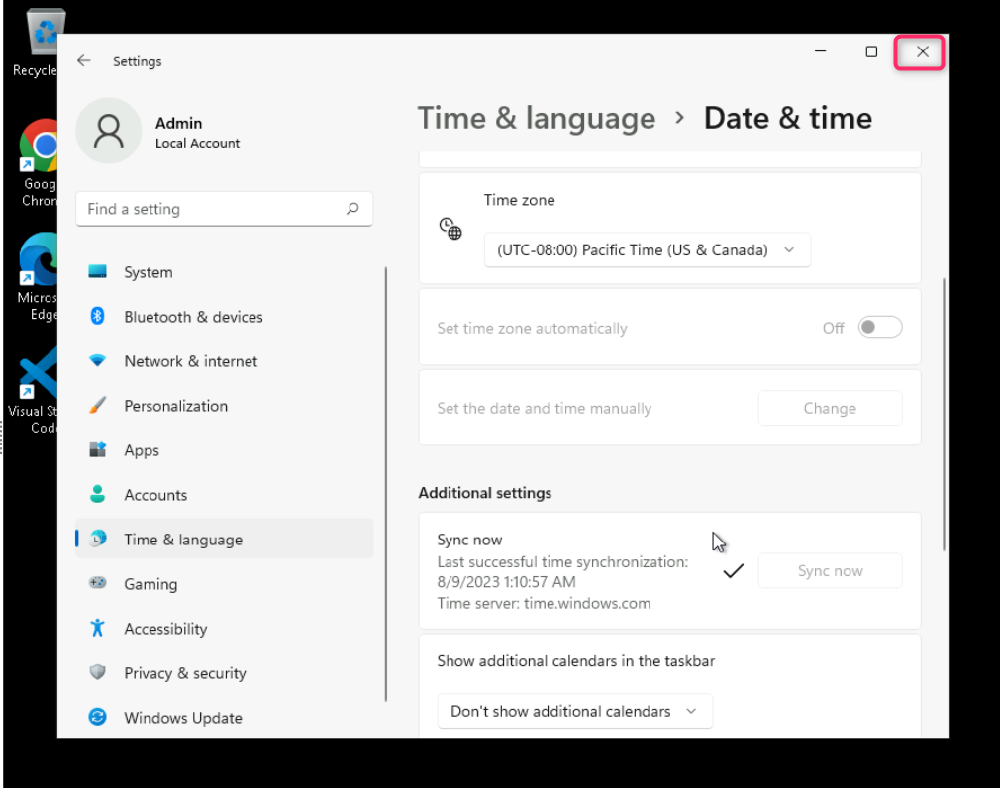
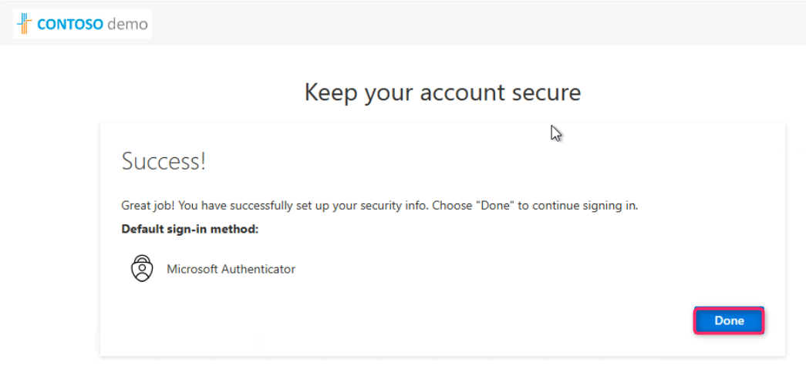
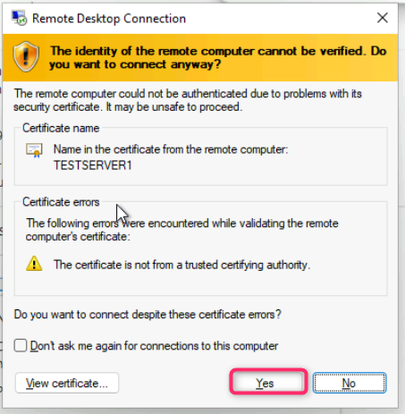
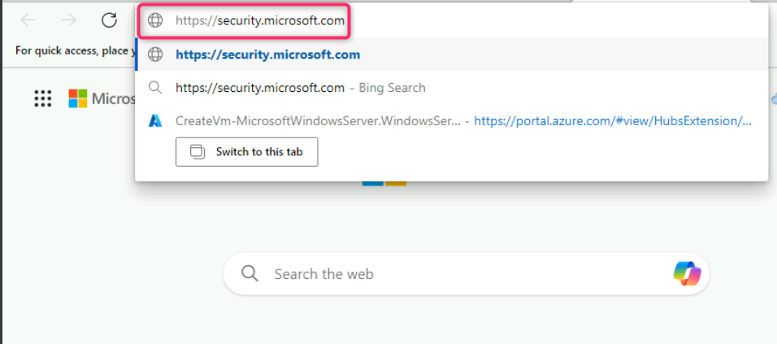
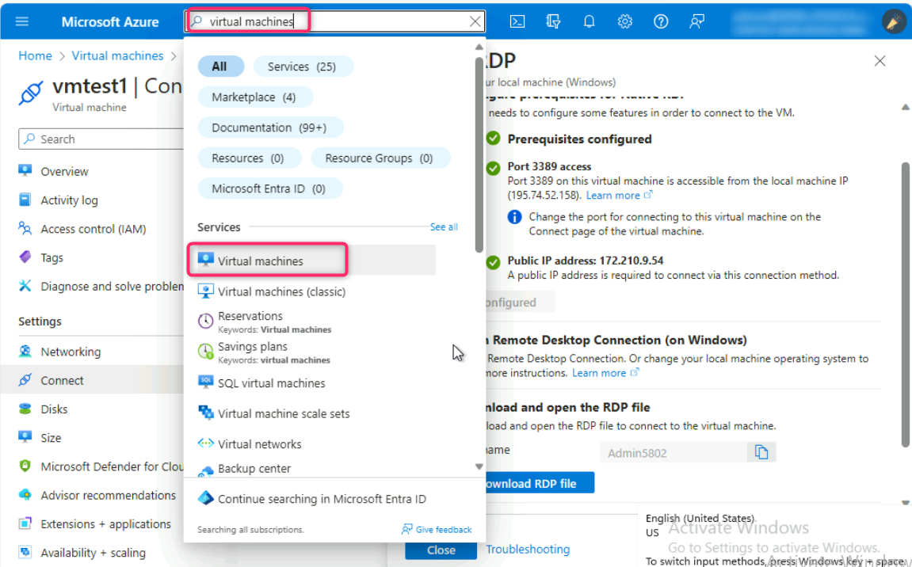
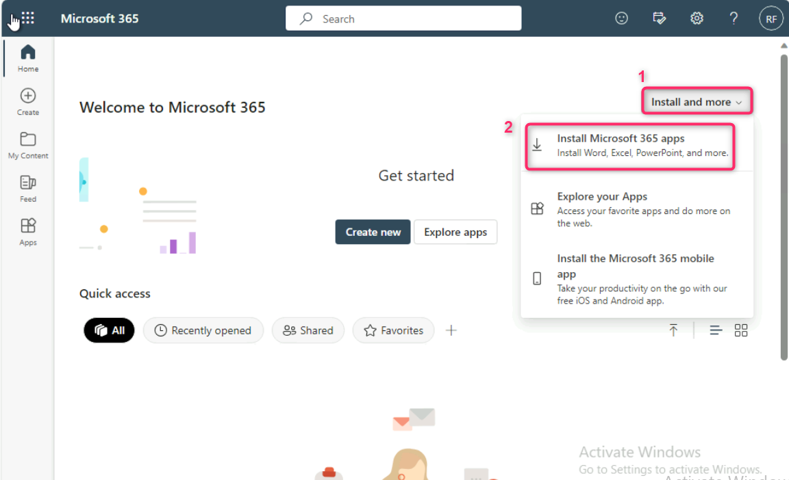

## **Lab 1 - Setting up the Microsoft Defender for Endpoint Environment**

**Introduction**

Unprotected or misconfigured devices can pose a risk to your
organization. Attackers can take advantage and do damage to your devices
or data. Many organizations have suffered reputational and financial
loss at the hands of attackers. To protect your organization, you need
to protect your devices.

Microsoft Defender for Endpoint is an endpoint security solution that
offers vulnerability management, endpoint protection, endpoint detection
and response, mobile threat defense, and managed services in a single,
unified platform. It enables you to prevent, detect, investigate, and
respond to security threats and risks across Windows, Windows Server,
macOS, Linux, Android, and iOS devices.

**Objectives**

- To assign the Owner role to the Azure subscription.

- To create a Windows Server virtual machine (**testserver1**) and
  onboard it to Microsoft Defender for Endpoints for security
  monitoring.

- To create a Windows 11 Pro virtual machine (**testVM1**) and onboard
  it to Microsoft Defender for Endpoints for security monitoring.

- To create another Windows 11 Pro virtual machine (**testVM2**) and
  onboard it to Microsoft Defender for Endpoints for security
  monitoring.

- To create a new user account (**Robert Frost**) with Office 365
  license for testing purposes.

- To prepare the testvm1 virtual machine for upcoming tasks, including
  installing Microsoft 365 apps.

## **Task 0: Sync Host environment time**

1.  Login to the Lab Virtual Machine using the credentials provided on
    the Home tab of the Lab interface.

2.  In your VM, navigate and click in the **Search icon**, in the search
    bar type **Settings** and then click on **Settings** under **Best
    match**.

> 

2.  On Settings window, navigate and click on **Time & language**.

3.  On **Time & language** page, navigate and click on **Date & time**.

4.  Scroll down and navigate to **Additional settings** section, then
    click on **Syn now** button.

5.  Close the **Settings** window.

## **Task 1: Redeem Azure pass**

1.  In your lab VM, open Microsoft Edge browser and enter the following
    URL:
    [**http://www.microsoftazurepass.com**](http://www.microsoftazurepass.com)

> 

2.  On **Ready to get started?** page, click on the **Start** button.

**Note**: Do not use your Company/Work Account to login to redeem the
Azure Pass, another Azure Pass will not be issued.

4.  In the **Sign in** window, enter the **Office 365 Tenant ID** -
    <admin@WWLxxxx.onmicrosoft.com> and click on the **Next** button.

5.  Enter **Office 365 Tenant Password** and click on the **Sign in**
    button.

6.  On **The following Microsoft Account will be used for Azure pass**
    page, click on **Confirm Microsoft Account** button.

> 

7.  Enter the Promocode provided in the lab environment in the **Enter
    Promo code** field, then enter the characters under the **Enter the
    characters you see** field and click on the **Submit** button.

8.  **We are processing your request** page will appear, it may take few
    seconds to process the redemption.

9.  Enter correct details in **Your Profile** page, tick all the check
    boxes, and then click on **Sign up** button.

> 

In case you are asked to set up your account using Microsoft
Authenticator App, then perform the following steps:

10. In your mobile, install the **Microsoft Authenticator App**. Then,
    go back to Microsoft Azure port. In the Azure portal, **Microsoft
    Authenticator -** **Start by getting the app** window, navigate and
    click on the **Next** button.

11. In **Microsoft Authenticator –** **Set up your account** window,
    click on the **Next** button.

12. **Scan the QR code** using the **Authenticator app** installed in
    your mobile phone and click on the **Next** button.

13. Enter the number in your mobile authenticator app and select
    **Yes**.

14. Click on the **Next** button.

15. Click on the **Done** button.

16. If prompted, then enter the number again in your mobile
    authenticator app and select **Yes**..

17. In the **Stay signed in?** window, click on the **Yes** button.

18. On **Are you satisfied with your signup experience** window, enter
    your feedback and click on the **Submit** button.

19. In **Welcome to Microsoft Azure** page, click on **Get started**.

20. On **How do you plan to use Azure?** page, click on the **Skip**
    button.

21. On **Now, let’s show you around Azure** page, click on the **Skip**
    button.

22. You’ll be directed to Azure portal page.

## **Task 2: Add Owner role to subscription**

1.  In the Azure portal search box, type **subscription**, navigate and
    click on **Subscriptions** under **Services**.

2.  Click on your **Azure Pass – Sponsorship** subscription name.

3.  On **Azure Pass – Sponsorship** page, navigate and click on **Access
    control (IAM)**, click on **+Add** button, navigate and click on
    **Add role assignment** as shown in the below image**.**

> 

4.  On **Add role assignment** page, click on **Privileged administrator
    roles** tab, navigate and select **Owner** role, then click on the
    **Next** button**.**

> 

5.  Navigate and click on **+Select members** hyperlink. On **Select
    members** pane that appear on the right side, type and select your
    Office 365 tenant ID, then click on the **Select** button as shown
    in the below images.

> 
>
> 

6.  Click on the **Next** button.

> 

7.  Click again on **Review + assign** button.

> 

8.  In the **Add role assignment** – **Conditions** tab, navigate to
    **What user can do** row and select the radio button **Allow user to
    assign all roles (highly privileged)**. Then, click on **Review +
    assign** button.

> 

9.  Click again on **Review + assign** button.

> 

10. You’ll receive a notification confirming the Owner role is
    successfully assigned to the subscription.

> 

**Note**: Microsoft 365 E5 license is assigned to your O365 tenant ID,
which included Microsoft Defender for Endpoint feature.

## **Task 3: Onboarding testserver1 in Microsoft Defender for Endpoints**

> 1\. In the Azure portal search bar, type **virtual machine**, then
> navigate and click on **Virtual machines** under **Services**.
>
> 

3.  In the **Virtual machines** page, navigate and click on **Create**,
    then click on **Azure virtual machine**.

> 

4.  In the **Create a virtual machine** page, navigate to **Resource
    group** row and click on **Create new**. Enter the name of the
    resource group (here, we entered **RG-DOE** as resource group name),
    then click on the **OK** button.

> 

5\. Navigate to **Instance details** section, in the **virtual machine
name** field, enter the name of the virtual machine (here, we entered
**TESTSERVER1**). In the **Security type** field, click on the dropdown
and select **Standard**. In the **Image** field, select **Windows Server
2019 Datacenter -x64 Gen2** from the dropdown.

> 

5.  Scroll down to **Administrator account** section, enter the
    following details:

[TABLE]

> 

6.  Scroll down and select the checkbox, then click on **Review +
    create** button as shown in the below image.

7.  In the **Create a virtual machine** page, navigate and click on the
    **Create** button.

> 
>
> 

8.  After the TESTSERVER1 virtual machine is successfully created, click
    on the **Go to resource** button.

> 

9.  You will be directed to the TESTSERVER1 virtual machine page.

> 
>
> **Note**: If you see testserver1 virtual machine status is not ready.
> Troubleshoot the issue… then wait for 10-15 minutes and reload the
> page.

10. In **TESTSERVER1** virtual machine page, navigate and click on
    **Connect** on the left side navigation menu, then click on
    **Select** under **Native RDP** section.

11. In the **Native RDP** pane that appears on the right side, after
    fulfilling all the requirements, scroll down and click on **Download
    RDP file** button.

12. On **TESTSERVER1.rdp could harm your device. Do you want to keep it
    anyway?** dialog box, click on **Keep** button.

> 

13. On **TESTSERVER1.rdp** file, click on **Open file** link.

> 

14. On **The publisher of this remote connection can’t be identified. Do
    you want to connect anyway?** dialog box, click on **Connect**
    button.

> 

15. On **Enter your credentials** dialog box, enter the password (here,
    **Administrator5801@\***) and click on the **OK** button.

16. On **The identity of the remote computer cannot be verified. Do you
    want to connect anyway?** dialog box, click on **Yes** button.

17. The TESTSERVER1 VM will be opened. Minimize the Server Manager –
    Dashboard then then minimize the virtual machine.

18. In the Edge browser, open a new tab and enter the following link:
    **<https://security.microsoft.com>** to open the Microsoft Defender
    Portal

19. Close **Meet your improved security center** dialog box. Wait for 10
    minutes and refresh the page before proceeding to the next step.

19\. In **Microsoft Defender** portal, navigate and click on **System**,
then click on **Settings**. In the Settings page, you’ll see **Defender
for** **Endpoints** as shown in the below images.

**Note**:

> In case, you did not see **Defender for Endpoint**, then close all the
> tabs in the browser. Open a new Edge browser and login to Azure
> portal. Then, open a new tab in Edge browser and enter the following
> URL and wait for the configuration to be completed:
> <https://security.microsoft.com/securitysettings/endpoints/integration?tid=>

20\. In the **Endpoints** page, navigate to **Device management**
section and then click on **Onboarding**.

21. Click on the dropdown under **Select operating system to start
    onboarding process** and select **Windows Server 2019 and 2022**.

22. Scroll down and click on **Download onboarding package** button.

23. After onboarding package is successfully downloaded, click on **Open
    file** link.

24. Copy the Windows Command script

25. Go back to your server VM and paste the copied Windows Command
    Script on the desktop as shown in the below image.

26. Right click on the script and select **Run as administrator**.

27. Type **Y** and press the **Enter** button to continue the onboarding
    process.

28. After onboarding the machine successfully on Defender for Endpoint,
    click on any key to continue the onboarding process.

29. The onboarding of the **testserver1 VM** usually takes **15-30
    minutes**; therefore, continue with the next task.

30. After 15-30 minutes, close the **testserver1 VM**, go back to
    Microsoft Defender portal and refresh the page, navigate and click
    on **Devices**, you'll see the **testserver1** was successfully
    onboarded in Microsoft Defender for Endpoint.

## **Task 4: Onboarding testVM1 in Microsoft Defender for Endpoints**

> 1\. In the Azure portal search bar, type virtual machine, then
> navigate and click on **Virtual machines** under **Services**.

2\. In the Virtual machines page, navigate and click on **Create**, then
click on **Azure virtual machine**.

3\. In **Create a virtual machine**, under the **Resource group** field,
select **MCS-RG** resource group. Then, navigate to **Instance details**
section, in the **Virtual machine name** field, enter +++**testvm1**+++.
In the **Region** field, ensure **EAST US** region is selected.

5\. In the **Security type** field, click on the dropdown and select
**Standard**. In the **Image** field, select **Windows 11 Pro, version
22H2 -x64 Gen2** from the dropdown.

6.  Navigate to **Administrator account** section, enter the following
    details and leave all the field in the default state:

[TABLE]

7.  Under **Licensing** section, select the checkbox **I confirm I have
    an eligible Windows 10/11 license with multi-tenant hosting
    rights**. Then, click on **Review + create** button.

8.  Click on the **Create** button.

9.  The virtual machine is successfully created, click on the **Go to
    resource** button.

10. You will be directed to the **vmtest1** virtual machine page.

**Note**: If you see **testvm1** virtual machine status is not ready.
Troubleshoot the issue… then wait for 10-15 minutes and reload the page.

11. In **testvm1** virtual machine page, navigate and click on
    **Connect** on the left side navigation menu, scroll down to
    **Native RDP** tile, and click on the **Download RDP file**.

12. On **testvm1.rdp could harm your device. Do you want to keep it
    anyway?** dialog box, click on **Keep** button.

> 

13. On **testvm1.rdp** file, click on **Open file** link.

> 

14. On **The publisher of this remote connection can’t be identified. Do
    you want to connect anyway?** dialog box, click on **Connect**
    button.

> 

15. On **Enter your credentials** dialog box, enter the password (here,
    +++**Administrator5801@\***+++) and click on the **OK** button.

16. On **The identity of the remote computer cannot be verified. Do you
    want to connect anyway?** dialog box, click on **Yes** button.

17. On the **Choose privacy settings for your device** page, click on
    **Next** couple of times and then click on **Accept** button as
    shown in the below images.

18. Go back to Microsoft Defender portal. In **Microsoft Defender**
    portal, navigate and click on **Settings**. In the **Settings**
    page, click on **Endpoints**.

19. In the **Endpoints** page, navigate to **Device management** section
    and then click on **Onboarding**.

20. Click on the dropdown under **Select operating system to start
    onboarding process** and select **Windows 10 and 11**.

21. Scroll down and click on the **Download onboarding package** button.

22. After the onboarding package is successfully downloaded, click on
    **Open file** link.

23. Copy the Windows Command script

24. Go back to **testvm1** and paste the copied Windows Command Script
    on the desktop as shown in the below image.

25. Right click on the script and select **Run as administrator**.

26. Type **Y** and press the **Enter** button to continue the onboarding
    process.

27. After onboarding the machine successfully on Defender for Endpoint,
    click on any key to continue the onboarding process.

28. The onboarding of the **testvm1** usually takes **15-30 minutes**;
    therefore, continue with the next task.

29. After 15-30 minutes, close the **testvm1**, go back to Microsoft
    Defender portal and refresh the page, navigate and click
    on **Devices**, you'll see the **testvm1** was successfully
    onboarded in Microsoft Defender for Endpoint.

## **Task 5: Onboarding testVM2 in Microsoft Defender for Endpoints**

> 1\. In the Azure portal search bar, type virtual machine, then
> navigate and click on **Virtual machines** under **Services**.

2\. In the Virtual machines page, navigate and click on **Create**, then
click on **Azure virtual machine**.

3\. In **Create a virtual machine**, under the **Resource group** field,
select **RG-DOE** resource group. Then, navigate to **Instance details**
section, in the **Virtual machine name** field, enter +++**testvm2**+++.
In the **Region** field, ensure **EAST US** region is selected.

5.  In the **Security type** field, click on the dropdown and select
    **Standard**. In the **Image** field, select **Windows 11 Pro,
    version 22H2 -x64 Gen2** from the dropdown.

6.  Navigate to **Administrator account** section, enter the following
    details and leave all the field in the default state:

[TABLE]

7.  Under **Licensing** section, select the checkbox **I confirm I have
    an eligible Windows 10/11 license with multi-tenant hosting
    rights**. Then, click on **Review + create** button.

8.  Click on the **Create** button.

9.  The virtual machine is successfully created, click on the **Go to
    resource** button.

**Note:** If you see **testvm2 virtual machine status is not ready.
Troubleshoot the issue**… then wait for 10-15 minutes and reload the
page.

10. In **testvm2** virtual machine page, navigate and click on
    **Connect** on the left side navigation menu, scroll down to
    **Native RDP** tile, and click on the **Download RDP file**.

11. In **testvm2.rdp could harm your device. Do you want to keep it
    anyway?** dialog box, click on **Keep** button.

12. On **testvm2.rdp** file, click on **Open file** link.

> 

13. On **The publisher of this remote connection can’t be identified. Do
    you want to connect anyway?** dialog box, click on **Connect**
    button.

> 

14. On **Enter your credentials** dialog box, enter the password (here,
    +++**Administrator5801@\***+++) and click on the **OK** button.

15. On **The identity of the remote computer cannot be verified. Do you
    want to connect anyway?** dialog box, click on **Yes** button.

16. On **Choose privacy settings for your device** page, click on
    **Next** couple of times and then click on **Accept** button as
    shown in the below images.

17. Go back to your VM and open the WindowsDefenderATPOnboardingPackage
    that you have downloaded in **Task 4, Step \#22**.

18. Copy the Windows Command script.

19. Go back to **testvm2** and paste the copied Windows Command Script
    on the desktop as shown in the below image.

20. Right click on the script and select **Run as administrator**.

21. Type **Y** and press the **Enter** button to continue the onboarding
    process.

22. After onboarding the machine successfully on Defender for Endpoint,
    click on any key to continue the onboarding process.

23. **Refresh** Microsoft Defender portal.

30. The onboarding of the **testvm2** usually takes **15-30 minutes**;
    therefore, continue with the next task.

31. After 15-30 minutes, close the **testvm2**, go back to Microsoft
    Defender portal and refresh the page, navigate and click
    on **Devices**, you'll see the **testvm2** was successfully
    onboarded in Microsoft Defender for Endpoint.

32. Close all the VMs.

## Task 6: Create test account using Microsoft Entra ID

1.  Open a new tab and enter the following link:
    **https://admin.microsoft.com/AdminPortal/#/homepage**

2.  Click on the Navigation menu represented by three horizontal bars,
    navigate and click on **Users**, then click on **Active users** as
    shown in the below image.

> 

3.  In the **Active users** page, click on **Add a user**.

> 

4.  Under **Set up the basics** pane, in the **First name** field, enter
    +++**Robert**+++, and in the **Last name** field, enter
    +++**Frost**+++. Navigate to **Username** field, and enter
    +++**bob**+++ as shown in the below image.

5.  Uncheck all the boxes, in the **Password** field, enter the
    following password: +++**Xof37931@**+++

[TABLE]

6.  Click on the **Next** button.

**Note**: You can use the **Username** and **Password** of your choice,
kindly note them on a notepad as these are required in the upcoming
tasks.

> 
>
> 

7.  In the **Product licenses** pane, navigate and select **Office 365
    E3** license checkbox and click on the **Next** button.

8.  In the **Optional settings** pane, enter the following details and
    click on the **Next** button. You can mentioned your address
    details.

[TABLE]

9.  Review the details and click on the **Finish adding** button.

10. On **Robert Frost added to active users** pane, navigate and click
    on the **Close** button.

11. You’ll see that Robert Frost is added to the **Active users** page.

## Task 7: Preparing the prerequisite on the testvm1 virtual machine

1\. Go back to Azure portal. In the Azure portal search bar, type
**virtual machines**, then navigate and click on **Virtual machines**
under **Services**.

2\. In the **Virtual machines** page, click on **testvm1**.

23. **vmtest1** virtual machine page will be opened.

24. In **testvm1** virtual machine page, navigate and click on
    **Connect** on the left side navigation menu, scroll down to
    **Native RDP** tile, and click on the **Download RDP file**.

25. On the **testvm1.rdp could harm your device. Do you want to keep it
    anyway?** dialog box, click on **Keep** button.

> 

26. On **testvm1.rdp** file, click on **Open file** link.

> 

27. On **The publisher of this remote connection can’t be identified. Do
    you want to connect anyway?** dialog box, click on **Connect**
    button.

> 

28. On **Enter your credentials** dialog box, enter the password (here,
    +++**Administrator5801@\***+++) and click on the **OK** button.

29. On **The identity of the remote computer cannot be verified. Do you
    want to connect anyway?** dialog box, click on **Yes** button.

30. After logging in to testvm1 virtual machine, open the Edge browser,
    then select **Start without your data** button \> **Confirm and
    Continue** button \> **Continue without this data** button \>
    **Confirm and start browsing** button \> **Finish** button as shown
    in the below images.

31. Then, enter the following URL in the address bar:
    [**https://portal.office.com**](https://portal.office.com)

32. Sign in to the Microsoft 365 portal using the following details:

[TABLE]

Note: If you see a dialog box **Sign in to Microsoft Edge**, then click
on **No, thanks** button.

33. Click on the **Next** button.

34. In case, you see **Microsoft Authenticator -** **Start by getting
    the app** window, navigate and click on the **Next** button, else
    skip the steps from **\#34 to \#41**.

35. In **Microsoft Authenticator –** **Set up your account** window,
    click on the **Next** button.

36. **Scan the QR code** using the **Authenticator app** installed in
    your mobile phone and click on the **Next** button.

37. Enter the number in your mobile authenticator app and select
    **Yes**. In **testvm1**, click on the **Next** button.

38. Click on the **Next** button.

39. Click on the **Done** button.

40. Enter the number again in your mobile authenticator app and select
    **Yes**..

41. In the **Stay signed in?** window, click on the **Yes** button.

42. In **Microsoft 365** page, navigate and click on **Install and
    more** dropdown, then click on **Install Microsoft 365 apps**.

43. Click on **Install Office**.

44. **OfficeSetup.exe** file will be downloaded, click on **Open file**
    link.

45. Wait for few minutes while Microsoft 365 and Office downloads.

**Note**: The installation will take around 10-20 minutes to complete.

46. On **You’re all set!** dialog box, click on the **Close** button.

47. Click on the **Start menu** and then click on **Word** as shown in
    the below image.

48. Click on **Sign in or create account** button.

49. Login using the following details:

[TABLE]

50. In case, you’re prompted to Approve sign in request, then enter the
    number in your mobile authenticator app and select **Yes**..

51. On **Stay signed in to all your apps** dialog box, click on **OK**
    button.

52. On **You’re all set** dialog box, click on **Done** button.

53. On the **Accept the license agreement** dialog box, click on
    **Accept** button.

54. On Your privacy matters dialog box, click on the **Close** button.

## Task 8: Stop all the Virtual Machines

1\. In the Azure portal search box, type +++**virtual machines**+++,
then navigate and click on **Virtual machines** under **Services**.

2\. Click on **testvm1** virtual machine.

3\. In the **testvm1** virtual machine page, navigate and click on the
**Stop** button.

3.  In **Stop this virtual machine** dialog box, click on the **Yes**
    button. Similarly, stop **TESTSERVER** and **testvm2** virtual
    machines.

**Summary**

In this lab, you’ve assigned the Owner role to the Azure subscription,
then you’ve created and onboarded Windows Server and Windows 11 Pro
virtual machines (testserver1, testVM1, and testVM2) to Microsoft
Defender for Endpoints, bolstering security with real-time monitoring
and threat response capabilities across different VM types. Then, you’ve
created a test user account (Robert Frost) with an Office 365 license.
Finally, you’ve installed Microsoft 365 apps and configured necessary
settings.
