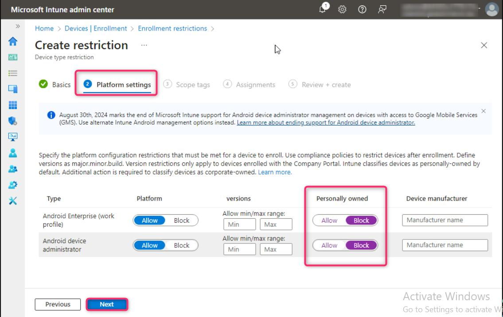

# Lab 7 - Manage Device Enrollment into Microsoft Intune

**Task 1: Enable Windows Automatic Enrollment into Microsoft Intune**

1.  In **LON-CL1 VM**, open a new tab in **Microsoft Edge**, and then in
    the address bar type `https://Endpoint.microsoft.com` and then
    press **Enter**. If prompted to sign in, provide the Credential of
    the **Office 365 Tenant Admin**.

2.  In the Microsoft Intune admin center, select **Devices**.

3.  Navigate and click on **Enrollment**. Ensure that **Windows** tab is
    select, then navigate to **Enrollment options** section and click on
    **Automatic Enrollment**.

4.  On the **MDM user scope** row, select **All** radio button and then
    select **Save**.

5.  Click on **Devices | Enrollment** link as shown in the below image.

**Note**: By performing this step, you enabled automatic enrollment into
Intune for any User that performs an Azure AD join with a Windows
device.

**Task 4: Configure Enrollment Restrictions**

1.  Navigate to **Devices onboarding** section and click on
    **Enrollment**. Then, click on **Android** tab as shown in the below
    image.

2.  Scroll down to **Enrollment options** section and click on **Device
    platform restriction**.

3.  Select **Android restrictions** tab, then select +**Create
    restriction**.

4.  On the **Create restriction** page, in the **Name** box,
    enter `Android Personal Device Restriction` Select **Next**.

5.  On the Platform settings page, under **Personally owned**,
    select **Block** for the following device types and click on the
    **Next** button:

    - Android Enterprise (work profile)

    - Android device administrator

6.  On the **Scope tags** page, select **Next**.

7.  On the **Assignments** page, under **Included groups**, select **Add
    groups**.

8.  In **Select groups to include** pane **Search bar**, type and select
    **U.S. Sales**, then click on the **Select** button.

9.  In the **Assignments** tab, click on the **Next** button.

10. On the **Review + create** page, select **Create**.

Notice the Android Personal Device Restriction assigned with a priority
of 1.

11. In the **Devices | Enrollment** page, in the **Windows** tab,
    navigate to **Enrollment options** section and click on the **Device
    limit restriction**.

Notice that there is a Default device limit restriction that is assigned
to All Users.

12. In the **Enrollment device limit restrictions**, select + **Create
    restriction**.

13. On the Create restriction page, in the **Name** box, enter `Sales
    Device Enrollment Limit` Select **Next**.

14. On the **Device limit** page, select **10**, and then
    select **Next**.

15. On the **Scope tags** page, select **Next**.

16. On the **Assignments** page, under **Included groups**, select **Add
    groups**.

17. In the **Select groups to include** page search box type and select
    **US Sales** and then click on **Select** button.

18. Click on the **Next** button.

19. On the **Review + create** page, select **Create**.

20. Reload the page. Notice the Sales Device Enrollment Limit,
    configured with a Device limit of 10 and assigned with a priority of
    1.

**Task 5: Configure a Device enrollment manager**

1.  In the **Microsoft Intune admin center**, select **Devices**.

2.  Navigate to **Device onboarding** section and click on
    **Enrollment**, then click on **Device enrolment managers** tab.

3.  On the **Enroll devices** pane, select **Device enrollment
    managers**.

Notice that, by default, there are no Device enrollment managers
configured.

4.  On the **Enroll devices|Device enrollment managers** page,
    select **Add**.

5.  In the **Add user** page, under User name, enter the email address
    of Allan [DeYoung
     `AllanD@`
     (substitute the tenant name) and then
    select **Add**.

**Allan is now allowed to enroll up to 1000 devices.**

6.  In the Microsoft Intune admin center, in the navigation pane,
    select **Home**.

7.  Close Microsoft Edge.

**Results**: After completing this exercise, you will have successfully
reviewed and assigned licenses, configured Windows automatic enrollment,
enabled and assigned enrollment restrictions, and configured a Device
enrollment manager.
