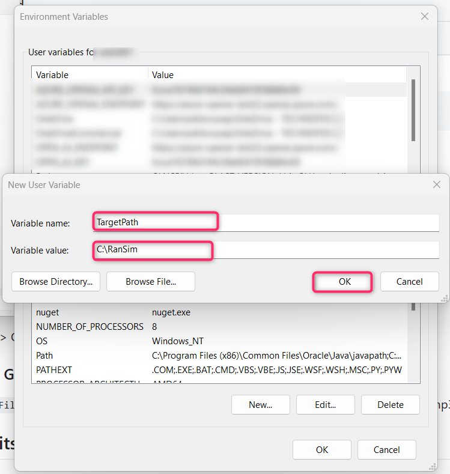
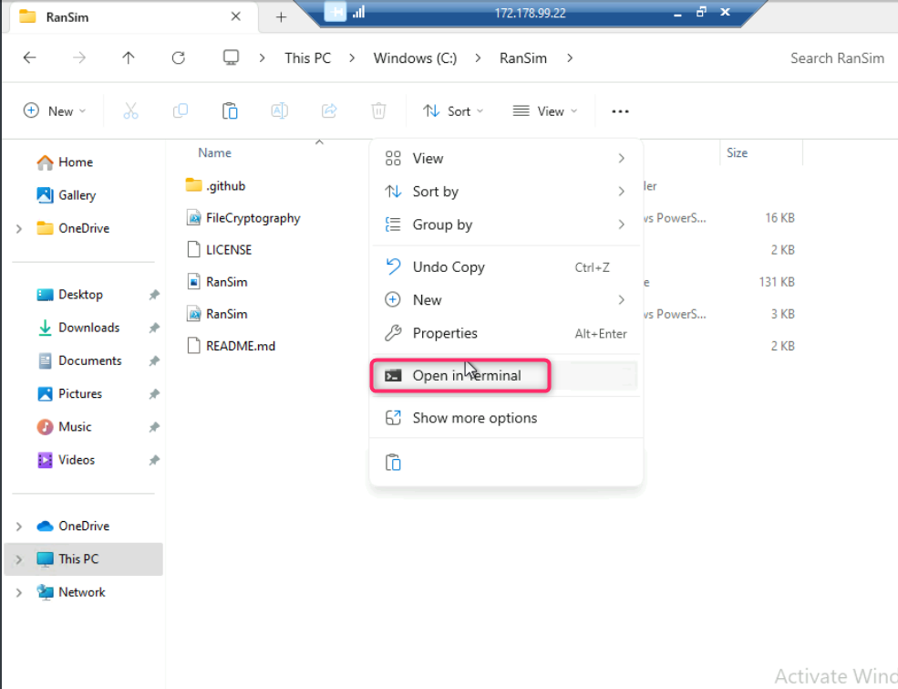

# Lab 8: Endpoint Security and Attack Detection using Defender for Endpoint

**Introduction**

Endpoint detection and response capabilities in Defender for Endpoint
provide advanced attack detections that are near real-time and
actionable. Security analysts can prioritize alerts effectively, gain
visibility into the full scope of a breach, and take response actions to
remediate threats.

When a threat is detected, alerts are created in the system for an
analyst to investigate. Alerts with the same attack techniques or
attributed to the same attacker are aggregated into an entity called an
incident. Aggregating alerts in this manner makes it easy for analysts
to collectively investigate and respond to threats.

In this lab, you’ll be creating a multi-stage incident in Microsoft
Defender by executing malicious documents and scripts in testvm1.

**Objectives**

- To install Git and download repositories having malware payloads on
  testvm1 in Azure.

- To perform a ransomware attack using RanSim.

- To run malicious documents and scripts.

- To check protection action and recommendations from Windows Security.

## **Task 1: Install git and download the payloads on testvm1**

 1. In the Azure portal search bar, type virtual machine, then
 navigate and click on **Virtual machines** under **Services**.

2. In the **Virtual machines** page, navigate and click on **testvm1**.
On **testvm1** Virtual machine page, click on the **Start** button.

3.  Wait for few minutes for the virtual machine to start, then navigate
    and click on **Connect** on the left side navigation menu, scroll
    down to **Native RDP** tile, and click on the **Download RDP file**.

4.  On **testvm1.rdp could harm your device. Do you want to keep it
    anyway?** dialog box, click on **Keep** button.

 

5.  On **testvm1.rdp** file, click on **Open file** link.

 

6.  On **The publisher of this remote connection can’t be identified. Do
    you want to connect anyway?** dialog box, click on **Connect**
    button.

 

7.  On **Enter your credentials** dialog box, enter the password (here,
    `Administrator5801@` and click on the **OK** button.

8.  On **The identity of the remote computer cannot be verified. Do you
    want to connect anyway?** dialog box, click on **Yes** button.

9.  Open the Edge browser, navigate to the address bar and enter the
    following link: **https://git-scm.com/downloads**

10. On **git** window, navigate to **Downloads** section and click on
    **Windows** as shown in the below image.

11. On **Download for Windows** page, navigate to **Standalone
    Installer** and click on **64-bit Git for Windows Setup**.

12. Click on the **Git.exe** file.

13. On **Git Setup** - **Information** dialog box, click on the **Next**
    button.

14. On **Select Destination Location** dialog box, click on the **Next**
    button.

15. On **Select Components** dialog box, click on the **Next** button.

16. On **Select Start Menu Folder** dialog box, click on the **Next**
    button.

17. On **Choosing the default editor used by Git** dialog box, click on
    the **Next** button.

18. Leave **Adjusting the name of the initial branch in new
    repositories** dialog box in default state and click on the **Next**
    button.

19. Leave **Adjusting your PATH environment** dialog box in default
    state and click on the **Next** button.

20. Leave **Choosing the SSH executable** dialog box in default state
    and click on the **Next** button.

21. Leave **Choosing HTTPS transport backend** dialog box in default
    state and click on the **Next** button.

22. Leave **Configuring the line ending conversions** dialog box in
    default state and click on the **Next** button.

23. Leave **Configuring the terminal emulator to use with Git Bash**
    dialog box in default state and click on the **Next** button.

24. Leave **Choose the default behavior of ‘git pull’** dialog box in
    default state and click on the **Next** button.

25. Leave **Choose a credential helper** dialog box in default state and
    click on the **Next** button.

26. Leave **Configuring extra options** dialog box in default state and
    click on the **Next** button.

27. Leave **Configuring experimental options** dialog box in default
    state and click on the **Next** button.

28. Wait for few minutes for the installation to complete.

29. Select **Launch Git Bash** checkbox and then click on the **Finish**
    button.

## **Task 2: Performing a ransomware attack using RanSim**

RanSim is a ransomware simulation script written in PowerShell. It
recursively encrypts files in the target directory using 256-bit AES
encryption. RanSim has no self-spreading capabilities and will only run
on the system you execute it on.

1.  Download the RanSim folder in testvm1 using the following script:

Code Copy

**git clone https://github.com/lawndoc/RanSim.git**

2.  In the **testVM1,** navigate to **C:UsersAdmin5802 folder**, you
    see the **RanSim** folder is successfully downloaded.

3.  Now, in testvm1 search bar, type `environment variables`,
    then navigate and click on **Edit environment variables for your
    account** as shown in the below image.

4.  In the **System Properties** dialog box, navigate and click on
    **Environment Variables** button.

5.  In the **Environment Variables** dialog box, click on the **New**
    button.

6.  Set the following Parameters:

[TABLE]

7. On the **New User Variable** dialog box, in the **Variable name**
field, enter `TargetPath`, and in the **Variable value** field,
enter `C:RanSim`, then press the **OK** button.

8. **TargetPath** variable is successfully added. Now, click on the
**New** button as shown in the below image.

8. On the **New User Variable** dialog box, in the **Variable name**
field, enter `Extension`, and in the **Variable value** field,
enter `.encrypted`. Then, click on the **OK** button.

9. **Extension** variable is successfully added. Now, click on the
**New** button as shown in the below image.

10. On the **New User Variable** dialog box, in the **Variable name**
field, enter `Key`, and in the **Variable value** field, enter
` **Q5KyUru6wn82hlY9k8xUjJOPIC9da41jgRkpt21jo2L=`. Then, click on
the **OK** button.

11. **Key** variable is successfully added. Now, click on the **New**
button as shown in the below image.

12. On the **New User Variable** dialog box, in the **Variable name**
field, enter ` **TargetFiles`, and in the **Variable value**
field, enter ` **.pdf .xls* .ppt* .doc* .accd* .rtf .txt .csv .jpg
.jpeg .png .gif .avi .midi .mov mp3 .mp4 .mpeg .mpeg2 .mpeg3 .mpg .ogg**
`. Then, click on the **OK** button.

13. **TargetFiles** variable is successfully added. Close the
**Environment Variables** dialog box.

7.  Copy the **RanSim** folder and paste the folder in **C:** as shown
    in the below images.

8.  Open **RanSim** folder. Click anywhere inside the folder, then right
    click and select **Open in terminal**.

**,**

9.  In the command prompt, execute the following command to initiate a
    ransomware attack.

**Copy code**

**.RanSim.ps1 -Mode encrypt**

**Note**: The script may be successfully executed or it might be blocked
by Microsoft Antivirus. In both the scenarios, continue with the next
task, as our goal is to record the alerts generated during the attack.

## **Task 3: Executing Malicious Documents and Scripts**

1.  In **Git Bash**, execute the following command to download
    **examples** folder containing various malware files and scripts.

Copy code

**git clone https://github.com/directorcia/examples**

2.  Navigate to **C:UsersAdmin5802**, then click on **examples**
    folder as shown in the below image.

3.  You will see various malwares files and script.

4.  Right click on **RS4_WinATP-Intro-Invoice** and open the file in
    word.

5.  You will be prompted to enter the password, provide the password as
    `WDATP!diy#` and click on the **OK** button.

6.  The file will open with a **SECURITY WARNING**, click on the
    **Enable content** button as shown in the below image.

7.  You’ll be prompted about a demo attack, click on the **OK** button.

8.  A new file **WinATP-Intro-Backdoor.exe**, which represents the
    backdoor, is created onto the Desktop by a PowerShell script
    launched from the word document.

9.  The script goes on to create a scheduled task to launch the backdoor
    at a predefined time. This mechanism of indirect process launch is
    sometimes used for stealth, as it is harder to trace back to the
    document. After the attack scenario completed, close the command
    prompt.

**Note**: When the backdoor is launched, it creates an auto-start entry
under the registry Run key, allowing it to stay persistent by starting
automatically with Windows. A Command Prompt window opens, indicating
that the simulated backdoor is running. Close the Command Prompt window
to end the **WinATP-Intro-Backdoor.exe** process. In case, you did not
see the Command Prompt window, then move on to the next step.

10. Now, navigate and open
    **TestFile_Block_Office_applications_from_creating_executable** in
    word as shown in the below image.

11. Click on **Enable content**, it will execute another ransomware
    attack in **testvm1**.

In case, **Microsoft Word Security Notice** dialog box appears, click on
the **OK** button.

12. Now, open **TestFile+OfficeChildProcess** file in word.

13. Click on **Enable Content**. If you see an error, the action was
    blocked. If you see cmd.exe launch, it was not blocked.

**Running Malicious Script**

**Note**: There are some malicious script that you need to execute to
get the alerts in Microsoft Defender portal. As these scripts are
malicious, the output of the command will not be the same. Sometimes the
script execute, sometimes it will be blocked and you may encounter an
error.

14. Right click inside the folder, then navigate and click on **Open in
    Terminal**.

15. Type `ls` to get the list of the scripts in the folder.
    Then, execute the following script:

`./SQLDumper.exe`

16. Run the following command:

`.wdtestfile.exe`

17. After the command successfully executed, press the **Enter** button.

**Note**: Alerts generated will be started within 15-30 minutes in
Microsoft Defender Portal.

**Task 4: Checking protection action and recommendations from Windows
Security**

1.  In **testvm1** click on the search icon, in the search bar type
    `virus and threat protection`, then navigate and click on
    **Virus & threat protection** under **Best match** as shown in the
    below image.

2.  In **Virus & threat protection** page, under **Current threats**
    section, navigate and click on **Protection history**.

3.  You can see the protection action and recommendations from Windows
    Security.

4.  Click on **Threat quarantined** to view the details.

5.  Similarly, click on **Threat blocked** to view the details.

**Summary**

In this lab, you've installed and configured Git on testvm1. You've
simulated a ransomware attack using RanSim. Then, you've executed
malicious documents and scripts. Finally, you've checked the protection
actions and recommendations from Windows Security, examining details of
quarantined and blocked threats. All these activities will create a
multi-stage incident in Microsoft Defender portal.
