# Lab 8 - Manage Device Enrollment into Microsoft Intune

**Summary**

In this lab, you prepare for device management using Microsoft Intune by
reviewing and assigning licenses, configuring Windows automatic
enrollment, and configuring enrollment restrictions.

**Prerequisites**

To following lab(s) must be completed before this lab:

- Lab \#1-Managing Identities in Microsoft Entra ID

- Lab \#2-Synchronizing Identities by using Microsoft Entra Connect

**Note**: You will also need a mobile phone that can receive text
messages used to secure Windows Hello sign in authentication to Entra
ID.

**Scenario**

You need to prepare for device management using Microsoft Intune. First
of all, you need to ensure that users are assigned appropriate licenses
for device management. As a verification test, you will assign Aaron
Nicholls the required licenses. You also need to ensure that any Windows
device that is joined or registered to Microsoft Entra ID will
automatically be enrolled into Intune. You have also been asked to
ensure that members of the Sales group are restricted from enrolling
personal Android and iOS devices into Intune and that the Enrollment
Device Limit is increased to 10 devices. Finally, you need to configure
Allan Deyoung as a Device enrollment manager to allow him to enroll 1000
devices.

**Task 1: Review and assign licenses for device management**

1.  On [<u>SEA-SVR1</u>](https://labclient.labondemand.com/Instructions/e7cc4ae1-e3d9-4c55-accc-696f537e1e17?rc=10),
    navigate to **Microsoft Entra admin center** window, navigate and
    click on **Identity**.

2.  Navigate and select **Billing**, then click on **Licenses**.

3.  In the **Licenses \| Overview** page, navigate and click on **All
    products**. Take note of the licenses that are available in the
    tenant.

4.  Select and click on **Enterprise Mobility + Security E5**. Notice
    all the users that have been assigned this license. You can assign
    and remove licenses from this location.

5.  Under **General**, select **Service plan details**. Take note of the
    services included in the Enterprise Mobility + Security E5 license.
    Microsoft Intune is one of the supported services for this license.

6.  In the **Microsoft Entra admin center** navigation pane,
    select **Users**.

7.  Search and select !!**Cindy White**!!

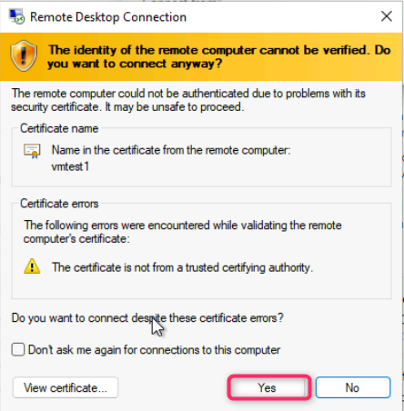

8.  On **Cindy White user** page, click on **Edit properties**.

9.  Click on **Settings** tab.
    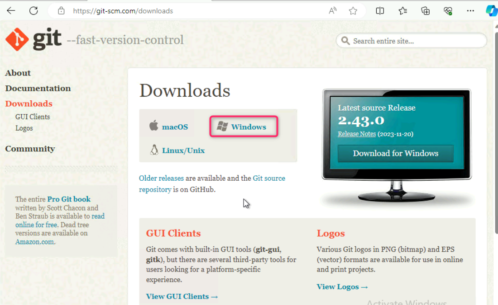

10. Under **Settings**, in the **Usage location** field, select **United
    States** and then select **Save**.

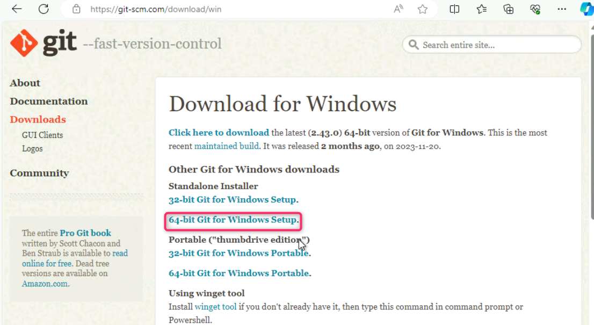

***Note**: Before you can assign a license to a user,
the user must have a usage location set.*

11. In the Cindy White user navigation pane, select **Licenses**, then
    click on **+Assignments.**

12. In the **Update license assignments** page, select both **Enterprise
    Mobility + Security E5** and **Office 365 E5**, and then
    select **Save**.

**Task 2: Setting Password of the user utilizing PowerShell**

1.  In [**<u>SEA-SVR1</u>**](urn:gd:lg:a:select-vm), right-click on
    **Start button**, and then select **Windows PowerShell (Admin)**.

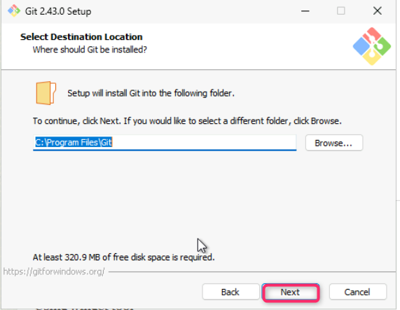

2.  On **User Account Control** dialog box, select **Yes**.

3.  In the **Windows PowerShell** window, type the following command,
    and then press **Enter**:

!!**Connect-MsolService**!!

4.  In the **Sign in to your account** dialog box, sign in using the
    Office 365 Tenant credentials from the Home tab.

**Note – If you had been prompted to change the
Tenant admin credentials password, ensure to provide the updated
password.**

5.  In the **Windows PowerShell** window, type the following command to
    reset the passwords of the **Cindy White**

!!**Get-MsolUser \| Where-Object DisplayName -EQ "Cindy White" \|
Set-MsolUserPassword -NewPassword P@55w.rd1234 -ForceChangePassword
\$false**!!

**Task 3: Enable Windows Automatic Enrollment into Microsoft Intune**

1.  In **SEA-SVR1**, open a new tab in **Microsoft Edge**, and then in
    the address bar type !!**https://Endpoint.microsoft.com**!! and then
    press **Enter**. If prompted to sign in, provide the Credential of
    the **Office 365 Tenant Admin**.

2.  In the Microsoft Intune admin center, select **Devices**.

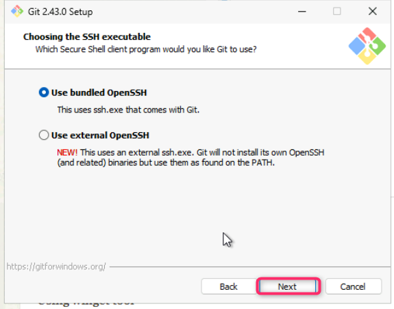

3.  Navigate and click on **Enrollment**. Ensure that **Windows** tab is
    select, then navigate to **Enrollment options** section and click on
    **Automatic Enrollment**.

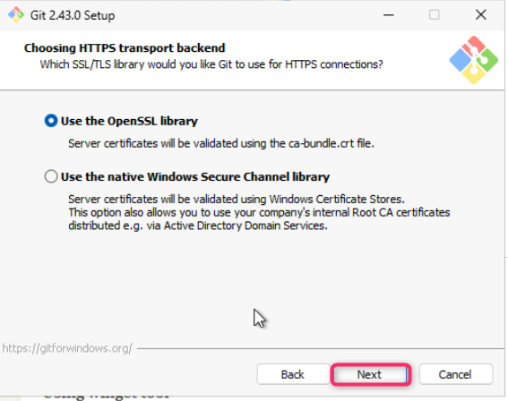

4.  On the **MDM user scope** row, select **All** radio button and then
    select **Save**.

5.  Click on **Devices \| Enrollment** link as shown in the below image.

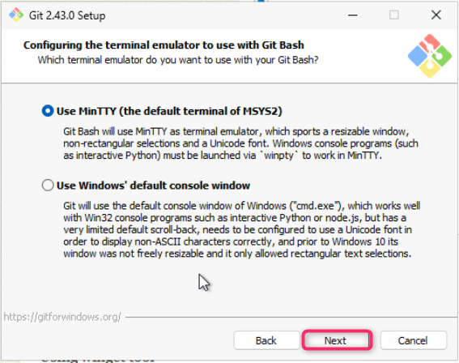

**Note**: By performing this step, you enabled
automatic enrollment into Intune for any User that performs an Azure AD
join with a Windows device.

**Task 4: Configure Enrollment Restrictions**

1.  Navigate to **Devices onboarding** section and click on
    **Enrollment**. Then, click on **Android** tab as shown in the below
    image.

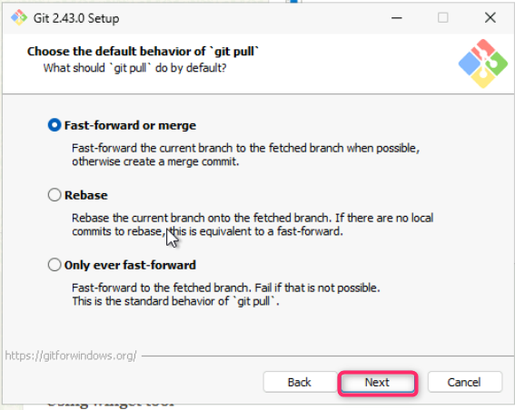

2.  Scroll down to **Enrollment options** section and click on **Device
    platform restriction**.

3.  Select **Android restrictions** tab, then select +**Create
    restriction**.

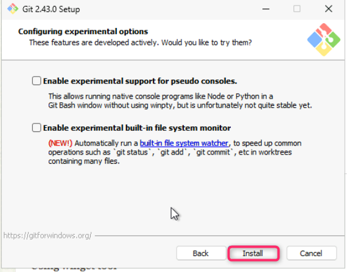

4.  On the **Create restriction** page, in the **Name** box,
    enter !!**Android Personal Device Restriction**!! Select **Next**.

5.  On the Platform settings page, under **Personally owned**,
    select **Block** for the following device types and click on the
    **Next** button:

    - Android Enterprise (work profile)

    - Android device administrator

6.  On the **Scope tags** page, select **Next**.

7.  On the **Assignments** page, under **Included groups**, select **Add
    groups**.

8.  In **Select groups to include** pane **Search bar**, type and select
    **Sales**, then click on the **Select** button.

9.  In the **Assignments** tab, click on the **Next** button.

10. On the **Review + create** page, select **Create**.

Notice the Android Personal Device Restriction
assigned with a priority of 1.

11. In the **Devices \| Enrollment** page, in the **Windows** tab,
    navigate to **Enrollment options** section and click on the **Device
    limit restriction**.

Notice that there is a Default device limit
restriction that is assigned to All Users. This default restriction sets
a device enrollment limit to 5 devices per user.

12. In the **Enrollment device limit restrictions**, select + **Create
    restriction**.

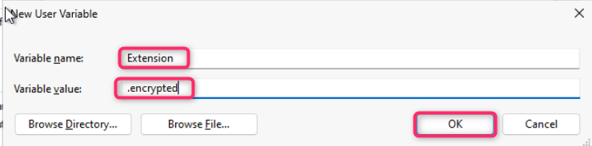

13. On the Create restriction page, in the **Name** box, enter !!**Sales
    Device Enrollment Limit**!! Select **Next**.

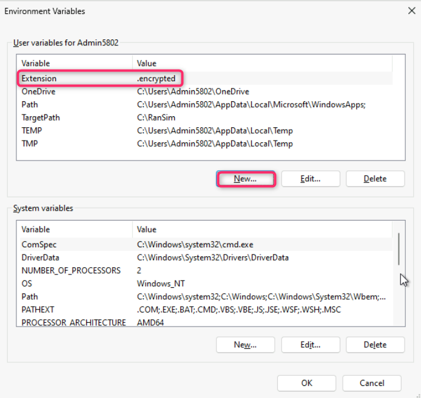

14. On the **Device limit** page, select **10**, and then
    select **Next**.

15. On the **Scope tags** page, select **Next**.

16. On the **Assignments** page, under **Included groups**, select **Add
    groups**.

17. In the **Select groups to include** page search box type and select
    **Sales** and then click on **Select** button.

18. Click on the **Next** button.

19. On the **Review + create** page, select **Create**.

20. Reload the page. Notice the Sales Device Enrollment Limit,
    configured with a Device limit of 10 and assigned with a priority of
    1.

**Task 5: Configure a Device enrollment manager**

1.  In the **Microsoft Intune admin center**, select **Devices**.

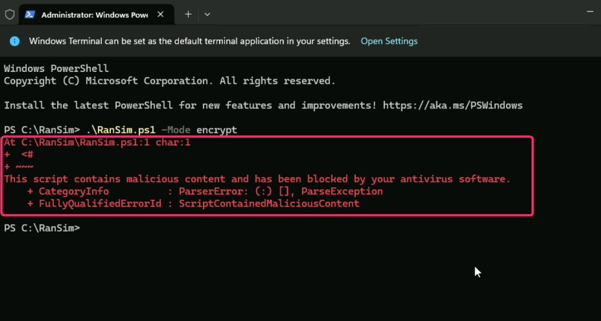

2.  Navigate to **Device onboarding** section and click on
    **Enrollment**, then click on **Device enrolment managers** tab.

3.  On the **Enroll devices** pane, select **Device enrollment
    managers**.

Notice that, by default, there are no Device
enrollment managers configured.

4.  On the **Enroll devices\|Device enrollment managers** page,
    select **Add**.

5.  In the **Add user** page, under User name, enter the email address
    of Allan [DeYoung
     !!**AllanD@M365xXXXXXXX.onmicrosoft.com**](mailto:DeYoung !!AllanD@M365xXXXXXXX.onmicrosoft.com)!!
     (substitute **XXXXXX** with your tenant name) and then
    select **Add**.

**Allan is now allowed to enroll up to 1000
devices.**

6.  In the Microsoft Intune admin center, in the navigation pane,
    select **Home**.

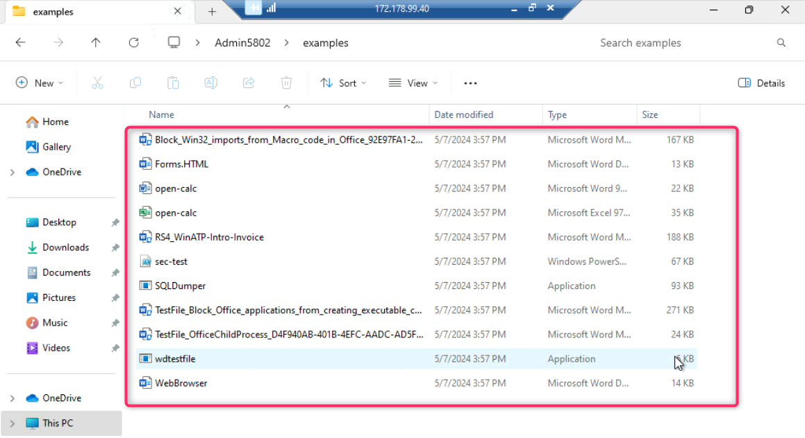

7.  Close Microsoft Edge.

**Results**: After completing this exercise, you will have successfully
reviewed and assigned licenses, configured Windows automatic enrollment,
enabled and assigned enrollment restrictions, and configured a Device
enrollment manager.
