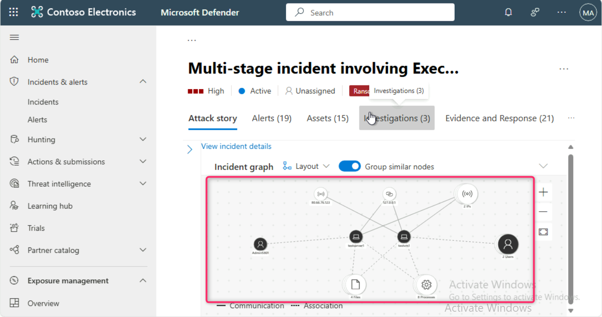
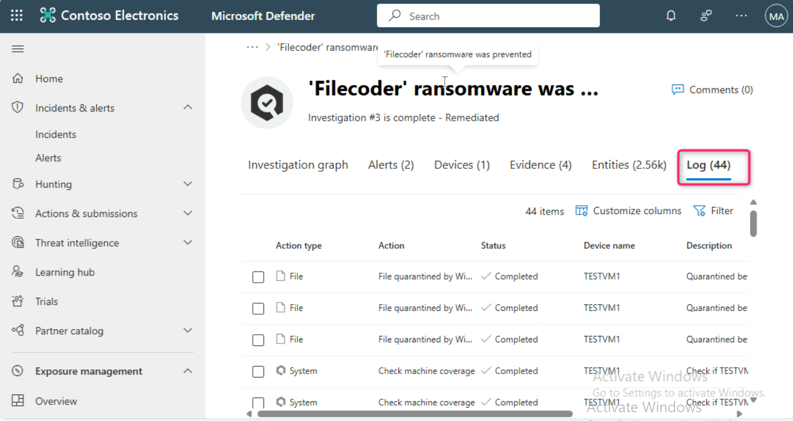

# Lab 9 - Microsoft Defender for Endpoint Incidents Management and Analysis

**Objective**

- To manage and analyze incidents and alerts generated by Defender for
  Endpoint.

**Exercise 1: Incident Management and Analysis**

1.  In **Microsoft Defender** page, navigate and click on **Incidents &
    alerts**, then click on **Incidents**.

2.  On the **Incidents** page, select the **Multi-stage incident
    involving initial access…** then click on **Customize columns** in
    the command bar.

3.  In the **Customize columns** pane that appears on the right side,
    select **Incident name**, **Investigation state**, **Service
    sources** check boxes, then click on the **Apply** button.

4.  Review the **Investigation state** and **service sources** of the
    Incident.

5.  Click on the **Multi-stage incident involving Execution & Discovery
    on multiple endpoints** Incident row. The incident details were
    appear on the right pane, carefully review it. Then, click on the
    **Close** button.

6.  In the **Attack story** tab, review the **Incident graph**.

7.  Click on the **Layout** dropdown and select **Align by entities
    types**.

8.  All the entities align in their respective layers.

9.  Then, click on the **Alerts** tab and review the generated alerts.

10. Now, click on the **Assets** tab and check all the assets that are
    affected by the incident.

11. Click on the **Investigations** tab and review the status of all the
    Investigations. Open any triggered alerts to review it. Here, we are
    opening **‘Filecoder’ ransomware was prevented**

12. Carefully review the **Investigation graph**.

13. Click on the **Alerts** tab and review them.

14. Click on the **Devices** tab to know about the comprised devices.

15. Click on the **Evidence** tab. Review all the suspicious entities,
    click on any entity to get further evidence (here, we clicked on
    **lockysample.exe**). Review the entity carefully and then close the
    pane.

16. Click on **Entities** tab.

17. Navigate to **Evidence summary** section and click on Files, then
    carefully review the **Verdict** and **File name**.

18. Click on the **Processes** and review the **Verdict** and **Process
    name.**

19. Click on **Services** and carefully review the **Verdict** and
    **Service Name**.

20. Click on **Drivers**, then review the **Name** of the driver and
    associated **Verdict**.

21. Click on **IP Addresses** and check whether there is any threat
    associated with any specific IP address.

22. Click on **Persistence Methods** and review it carefully.

23. Click on the Log tab and review the **Action** and **Status**.

24. Now, click on **Incidents** in the left-sided navigation menu, then
    click on **Multi-state incident involving Execution & Credential…**

25. Click on the **Summary** tab. In case, you did not see the
    **Summary** tab, then click on the horizontal ellipsis and select
    **Summary** as shown in the below image.

26. Carefully review the entire Summary of the multi-stage incident
    attack.

**Summary**

In this lab, you’ve learned how to effectively manage and analyze
security incidents and alerts. You’ve interpreted the Attack story by
examining the incident graph and aligning entities by types. Then, you
reviewed generated alerts, identified affected assets, and checked the
status of ongoing investigations. By investigating a specific ransomware
alert, you’ve understood how to analyze the investigation graph and
scrutinize the evidence linked to suspicious entities. You’ve explored
various tabs to review files, processes, services, drivers, IP
addresses, and persistence methods, gaining insights into identifying
and evaluating potential threats. Then, you’ve carefully reviewed the
summary of a multi-stage incident for better security management.
