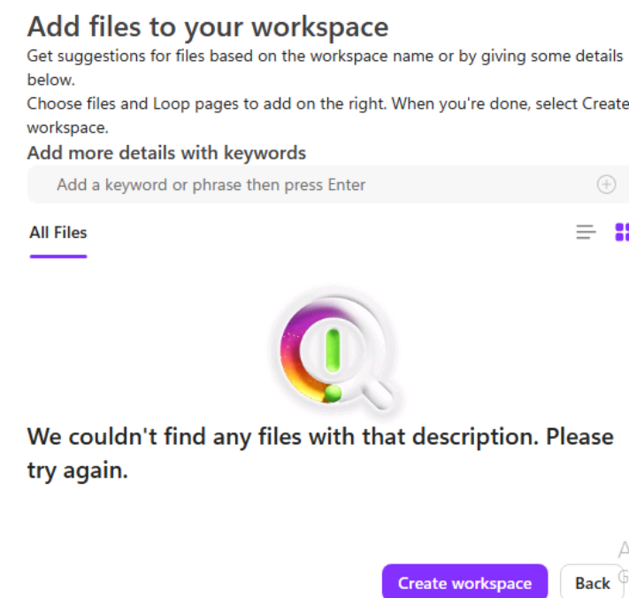
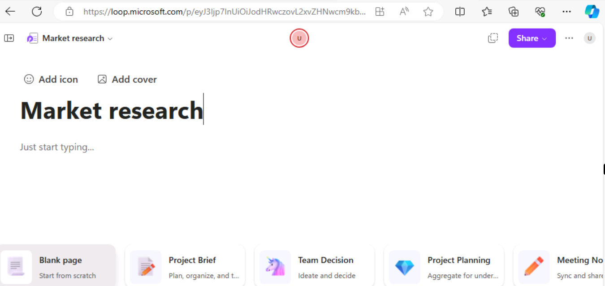
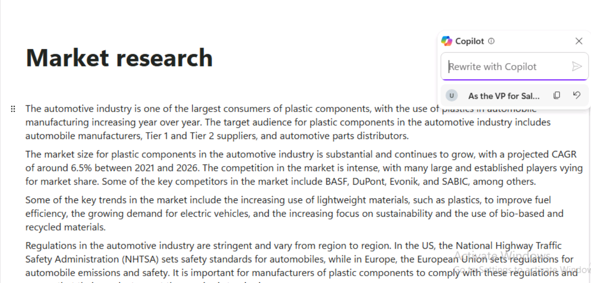
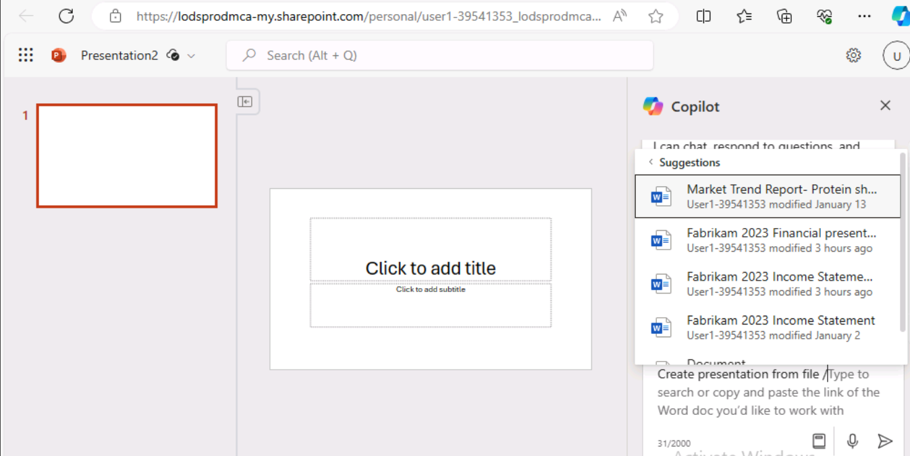
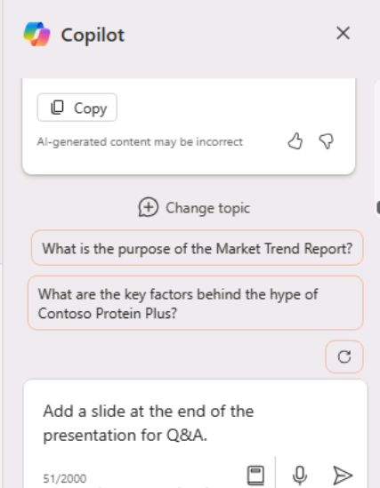

**Lab 01: Empower your workforce – Copilot - Executives**

In this lab, you will

- Use Copilot in Word to create a speech you plan to deliver to company
  shareholders.

- Use Copilot in PowerPoint to create a PowerPoint presentation based on
  the speech you created.

Exercise 1

**Complete setting up Microsoft 365 subscription and access Copilot for
Microsoft 365**

1.  If you have a Microsoft 365 tab open in your Edge browser, then
    select it now; otherwise, open a new tab and enter the following
    URL: **[<u>https://portal.office.com</u>](https://portal.office.com/).**

2.  Use the **Microsoft 365 Credentials** provided under Azure Portal
    section in the **Resources tab** on the right (see screenshot) to
    sign-in.

>  style="width:6.26806in;height:2.60347in" />
>
>  style="width:6.26806in;height:6.12153in" />
>
> You will now be able to access all the Microsoft 365 applications and
> will have access to Copilot for Microsoft 365.

**Access and launch Microsoft 365 applications**

You can access and launch the productivity applications from:

- **Apps icon** (in the navigation pane on the left)

- **View more Apps** link (in the navigation pane on the left)

- **App Launcher** (available in the top left just above the left
  navigation pane)

1.  To launch an application from **Apps** icon:

> In the navigation pane on the lower left, select **Apps** icon to
> select and open the office applications you need to work with.
>
>  style="width:6.26806in;height:3.54722in" />

2.  To launch an application from **View more Apps:**:

> In the navigation pane on the lower left, select **View more
> Apps** (ellipsis **…** icon) to select and open the office
> applications you need to work with.
>
>  style="width:6.26806in;height:4.30764in" />

3.  To launch an application from **App launcher**:

> The Microsoft 365 app launcher is a menu of apps and services that you
> are licensed for, and opens when you select the app launcher icon on
> Microsoft365 page. The App launcher makes opening and switching
> between your apps easy by highlighting your recently used apps, and
> providing quick access to your recent online Office documents.
>
>  style="width:6.26806in;height:3.78125in" />
>
> **Note**: If you do not find an application in the pop-up, then
> select **More apps** icon to select the same.

**Upload lab assets to OneDrive**

The lab assets (Reference documents) that you will be using in this
hands-on lab session are available in **C:\LabFiles.**

**Note**: When you need to reference a file (a Word document, an Excel
file, etc) into a Copilot prompt, the file MUST be saved in a OneDrive
account. You can't link to a locally stored file on your PC.

1.  On the Microsoft 365 navigation pane, select OneDrive to open it.

2.  Browse to the **C:\LabFiles** folder to select and upload a copy of
    the document(s) to OneDrive.

> **Note**: You can either choose to upload a copy of all the documents
> or the document(s) related to the particular lab.
>
>  style="width:6.26806in;height:5.48056in" />
>
> 
>
>  style="width:6.26806in;height:3.94236in" />
>
> Now you will have the document(s) in **OneDrive** to work
> with **Copilot for Microsoft 365** labs.

**Exercise \#2: Create a speech using Copilot in Word**

In this exercise, you direct Copilot in Word to write a speech for you
based on your company's Income Statement, which is stored as a Word
document. This exercise walks you through a series of prompts that you
can use to have Copilot in Word generate your speech and then update it
based on your suggested changes.

**Note**: When you need to reference a file (such as your company's
Income Statement) into a Copilot prompt, the file MUST be saved in a
OneDrive account. You can't link to a locally stored file on your PC.

You can reference/link a file into the Copilot prompt using one of the
following methods:

- Select the file from the Most Recently Used (MRU) file list.

- Open the file and copy its path using the **Share** option, then paste
  the path into the prompt following the forward slash (/).

- Copy the file's path from File Explorer and paste it into the prompt
  following the forward slash (/).

In this exercise, you select the company's Income Statement from the MRU
file list.

You will perform the following steps to have Copilot in Word create a
speech for you based on your company's Income Statement:

1.  If you have a Microsoft 365 tab open in your Edge browser, then
    select it now; otherwise, open a new tab and enter the following
    URL:[<u>https://www.office.com</u>](https://www.office.com/) to go
    to the **Microsoft 365** home page.

> **Note**: You need to sign-in (if prompted) using the **Microsoft 365
> Credentials** provided under the **Resources** tab on the right.

2.  On the **Microsoft 365** navigation pane, select **OneDrive** to
    open it.

>  style="width:6.26806in;height:5.48056in" />

3.  Browse to the **C:\LabFiles** folder to select and upload a copy
    of **Fabrikam 2023 Income Statement document to
    OneDrive**. 

> **Note**: If you have already uploaded all the lab assets to OneDrive
> as suggested in **Preparing for the lab execution (Lab 0)** you can
> skip this step.

4.  Open and close the file **Fabrikam 2023 Income Statement
    document** (which you uploaded to OneDrive) to get it in your Most
    Recently Used (MRU) file list.

5.  In Microsoft 365, open **Microsoft Word**, and then open a new blank
    document.

>  style="width:6.26806in;height:2.80694in" />

6.  In the **Draft with Copilot** window that appears at the top of the
    blank document, enter the following prompt:

> **Write a speech for the Fabrikam stakeholders that summarizes the
> results of the company's 2023 income statement found in the attached
> file**.

7.  In the **Draft with Copilot** window, select the **Reference your
    content** button. In the pop-up window that appears, select the
    file.

> If, for some reasons the file is not displayed, click **Browse files
> from cloud** in the pop-up window.
>
>  style="width:6.26806in;height:2.84583in" />

8.  In the **Pick a file** window that appears, under
    the **Recent** file list, select the **Fabrikam 2023 Income
    Statement.docx** file and then select the **Attach** button.

>  style="width:6.26806in;height:2.93472in" />

9.  Note how the file is displayed in the prompt. Select **Generate**.

>  style="width:6.26806in;height:2.25764in" />
>
> **Note**: If, for some reasons, you keep getting **Something went
> wrong** error when clicking the **Generate** button after attaching
> the referenced document dismiss the error and proceed with the next
> step
>
>  style="width:6.26806in;height:2.0625in" />
>
> Open the file in a browser and copy its path using the Share option,
> then paste the path into the prompt following the forward slash (/).
>
>  style="width:6.26806in;height:3.30486in" />
>
>  style="width:6.26806in;height:1.98958in" />
>
> **Important**: Even after trying with the alternate option, if you see
> the same “something went wrong” exception, then instead of using the
> web client of Word try using the desktop version of Word.
>
> If it works when using the desktop version of Word, please follow the
> same in the upcoming labs when you see the “something went wrong”
> exception while clicking **Generate** button.

10. At this point, Copilot extracts the financial results from the
    Income Statement and drafts a speech.

>  style="width:6.26806in;height:3.47292in" />

11. After reviewing the speech, you decide that it's a good starting
    point, although there are a few areas that you want to modify. In
    the Copilot window at the end of the speech, select the **Keep
    it** button.

12. You want to begin by reviewing any changes suggested by the Copilot
    Editor. Select the **Editor** icon that appears in the menu bar at
    the top of the page.

> **Note**: You will be able to see the **Editor** icon, in the Classic
> Ribbon and not in the Single line ribbon.
>
>  style="width:6.26806in;height:3.08194in" />

13. In the **Editor** pane that appears, note the categories that appear
    under the **Corrections** or **Refinements** sections that display a
    number (indicating the number of issues for that category). These
    issues are often linked to the tone of the writing style used in the
    document.

> Below the **Editor Score** is a field that allows you to select the
> tone used when writing the speech. It currently displays **Formal
> writing**, which is the default tone that Copilot used when writing
> this speech. When you don't indicate what writing style to use in your
> prompt, **Formal writing** is the default tone that Copilot uses.
> Select this field to see your options. You prefer a professional
> sounding tone, so select **Professional** from the drop-down menu.
> Note whether the **Editor Score** changes.

14. In the categories that appear under
    the **Corrections** or **Refinements** sections, you can review the
    changes that occurred in the categories based on changing the
    writing style from Formal to Professional. Select each category that
    displays a number (indicating the number of issues for that
    category). Doing so enables you to review the suggestions throughout
    the document for that category. For each suggestion, select either
    the suggested change or select **Ignore**. Repeat this process until
    all categories display a check mark.

> Change the writing style to **Casual** and check whether the **Editor
> Score** changes. If any categories display a number, review the
> category and see what the Editor has flagged. You want to keep the
> writing style as Professional, so select **Ignore** any suggested
> changes. Review all the suggested changes to see the differences that
> were flagged between Professional and Casual styles.
>
>  style="width:6.26806in;height:3.10069in" />

15. Save the file to your OneDrive account with the following file
    name: **Fabrikam 2023 Financial presentation.docx**. The next
    exercise uses this document.

>  style="width:6.26806in;height:3.24375in" />
>
> **Important**: Ensure that you save the file to your OneDrive rather
> than your local PC. In the next exercise, you use Copilot in
> PowerPoint to create a slide presentation based on this document. The
> document must be in OneDrive for Copilot to access it.

16. Close the tab containing this document in your Microsoft Edge
    browser.

**Exercise \#3: Create a slide presentation using Copilot in
PowerPoint**

In this exercise, you will use Copilot in PowerPoint to create a slide
presentation based on your speech (to the shareholders based on the
Income Statement) that you created using Copilot in Word to write your
speech.

In the prior exercise, you accessed the company's Income Statement in
Copilot by accessing the file from the Most Recently Used (MRU) file
list. In this exercise, you're going to gain experience accessing a file
using a different process. Instead of using the MRU list, you plan to
access the speech by copying the link to the **Fabrikam 2023 Financial
presentation.docx** file that you created in the prior exercise.

You will perform the following steps to have Copilot in PowerPoint
create a draft of your presentation:

1.  If you have a Microsoft 365 tab open in your Edge browser, then
    select it now; otherwise, open a new tab and enter the following
    URL: [**<u>https://www.office.com</u>**](https://www.office.com/) to
    go to **Microsoft 365** home page.

> **Note**: You need to sign-in (if prompted) using the **Microsoft 365
> Credentials** provided under the **Resources** tab on the right.

2.  On the **Microsoft 365** navigation pane, select **Word** to open
    Word.

3.  On the file page in **Word**, scroll down to the list of recent
    files and select **Fabrikam 2023 Financial presentation.docx** to
    open it in a new tab in your Microsoft Edge browser.

>  alt="Image description" />

4.  Copy the URL of the document by selecting the **Share** button in
    the upper-right corner, above the ribbon and selecting **Copy
    Link** from the drop-down menu that appears.

>  alt="Image description" />
>
> **Note**: You may occasionally come across trouble using the URL from
> your address bar. Copy the link from the Share tray for best results

5.  Close the **Link copied** dialog box that appears in Word.

>  alt="Image description" />

6.  Close this document tab in your Microsoft Edge browser. This return
    you to the **Word \| Microsoft 365** tab.

7.  On the Word file page, select the **PowerPoint** icon in the
    navigation pane on the left.

>  alt="Image description" />

8.  In **PowerPoint**, open a new blank presentation.

9.  Select the **Copilot** option on the right side of the ribbon.

10. In the **Copilot** pane that appears, several predefined prompts are
    available for you to choose from.

11. Select the **Create presentation from file** prompt.

> **Note**: In the prior exercise, you linked a file into a prompt by
> selecting the file from the MRU list. In this exercise, you will gain
> experience linking a file into a prompt using another method.

12. Above the prompt field at the bottom of the **Copilot** pane,
    a **Suggestions** window appears that contains the three most
    recently used files. Normally, you would select your desired file if
    it appeared in this window. However, in this training exercise, even
    if the **Fabrikam 2023 Financial presentation.docx** appears in the
    MRU list, let's assume that it didn't. As such, you must paste the
    link to the file into the prompt field.

>  alt="Image description" />

13. In the prompt field, Copilot automatically types in **Create
    presentation from file /**. Place your cursor after the forward
    slash and enter **Ctrl+V** to paste the link to this document into
    the prompt.

>  alt="Image description" />

14. Select the **Send** icon.

15. This prompt triggers Copilot to create a slide presentation based on
    the document. In doing so, it displays the outline of the
    presentation and a list of features included in the presentation.
    These features may include speaker notes, images, layouts to
    organize slides, and a General sensitivity label.

>  alt="Image description" />

16. You're now free to review the slides and make any necessary updates.
    You can use the **Designer** tool to adjust the layouts.

>  alt="Image description" />

17. As you review the slides, be on the lookout for references to "the
    speaker" or any other items that you may need to change.

>  alt="Image description" />
>
> Warning: Look out for the reference to "The speaker" along with the
> second sentence that begins with "The presentation will summarize...".
> that may be created by Copilot.
>
> **Example**: The speaker introduces a presentation on Fabrikam's 2023
> income statement highlights, reporting strong performance and growth
> despite challenges from the global pandemic and competitive market.
> The presentation will summarize the main results and explain how they
> align with the company's strategic vision and goals.
>
> You should remove these types of references as they're more applicable
> as speaker notes rather than text intended for audiences.

18. Review the speaker notes that Copilot added to the presentation.
    Verify they call out the points that you want to make during the
    presentation.

>  alt="Image description" />

19. Try using Copilot to update the presentation. For example, enter the
    following prompt:

> **Add a new slide after slide 1. This slide should have an image of a
> mountain peak in the Alps. Towards the bottom of the slide, add a text
> box that says: Fabrikam's company motto - "We overcome every
> obstacle." Add speaker notes to this new slide that talk about how
> Fabrikam works diligently to solve every customer's request, never
> letting any obstacle stand in its way of success**.
>
> Review the new slide that was created. While the remaining lab
> exercises don't use this presentation, you can either discard it or
> save it if you want for future reference.

**Summary**

In this lab, you have

- Utilized Microsoft Copilot's capabilities in Word to draft a
  comprehensive speech that includes generating content that effectively
  communicates key messages and company updates.

- Leveraged Microsoft Copilot in PowerPoint to transform the speech
  created in Word into a visually engaging and informative presentation,
  creating slides that highlight the main points of the speech, using
  Copilot to ensure  
  consistency and clarity in the presentation format.
