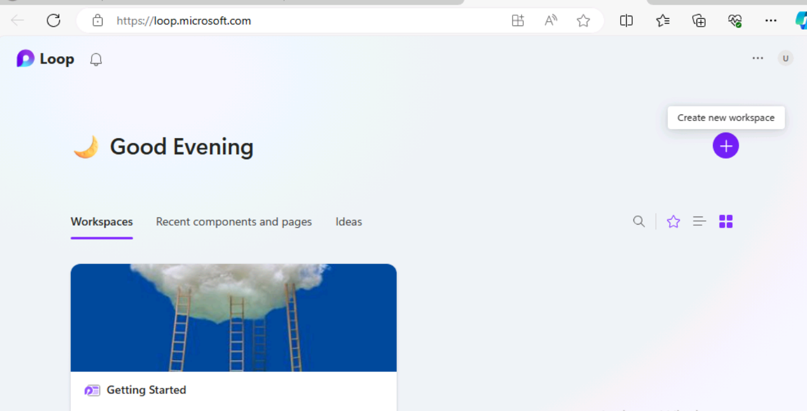
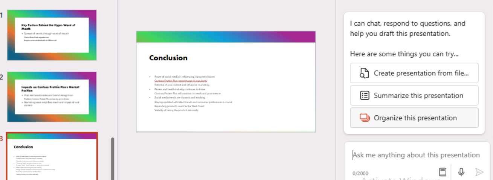

# **Lab 11: Empower your workforce – Copilot - Sales**

Copilot for Microsoft 365 serves as an AI-powered writing assistant. It
understands context, suggests phrases, and helps generate content, all
of which can enhance the quality of your work. In this lab, you will

- Use Copilot in Loop to create a market research report.

- Use Copilot in PowerPoint to create and customize a sales
  presentation.

- Use Copilot in Word to compare three supplier agreements, identify the
  differences, and provide recommended actions.

## Exercise 1: Create a market research report using Copilot in Loop**

You're the VP of Sales for VanArsdel Ltd, an OEM of plastic components,
whose primary market is the agriculture equipment industry. However,
senior leadership is interested in possibly moving into the automotive
market. Given the heavy competition from existing plastic manufacturers
who already monopolize this sector, you need to determine if there's a
space available for your company to become a viable player.

In this exercise, you will use Copilot in Loop to

- Research a potential new sales market for your company's products and
  create a market research report that outlines its findings.

- Change the format of the report by placing the content in a table.

- Make a final recommendation as to whether your company should move
  into that market.

1.  In **Microsoft 365**, select **Loop** if it appears in the left-hand
    navigation pane. If it doesn't appear there, then select **App
    Launcher** on the top left just above the **Mocrosoft
    365** navigation pane,

 

2.  In the **Apps** page, scroll down to locate **Loop** and then select
    it.

 **Note**: If you don't see **Loop** listed in the Apps paf=ge,
 select **More apps**.

 

3.  If you see the **Sign-in** button, sign-in using the credentials
    provided under **Microsoft 365 Credentials** in
    the **Resources** tab.

 

 **Note**: After signing in, close the Loop browser window and once
 again open Loop from the Apps page.

4.  In **Microsoft Loop**, the **Workspaces** tab is displayed by
    default. You want to create a new workspace for this project,
    select **+** next to **Getting started**, and then select **+New
    workspace** button.

 

5.  In the **Create a new workspace** window, enter **VanArsdel
    research** for your workspace name, and then select either
    the **Continue** or **Create** button that appears (depending on
    your Loop version).

 

6.  In the **Add files to your workspace** window (depending on your
    version of Loop, this window may say **Workspace Switcher**),
    select **Create workspace**.

 

7.  You're now on the first page for your new workspace. The name of the
    page is currently **Untitled**. Note the page (Untitled) also
    appears in the left-hand navigation pane. In the main body of the
    page, select in the **Untitled** field and change the name of the
    page to **Market research**. Note how the page name is automatically
    updated in the navigation pane.

 

8.  In the **Just start typing...** field, enter a forward
    slash **(/)**.

 

9.  In the drop-down menu that appears, under the **Copilot** section at
    the top of the menu, select **Draft page content**.

10. In the **Copilot** window that appears, note the row of buttons that
    appears below the prompt field. Select each button. When doing so,
    note how it prefills the prompt field with an example of the type of
    task that Copilot can assist with.

11. You're now going to enter your own prompt. In the prompt field,
    enter the following prompt and select the **Submit** icon:

 **As the VP for Sales for an OEM in the plastics manufacturing
 industry, please research the market for plastic components in the
 automotive industry. Provide information on target audience, market
 size, competition, trends, regulations, and distribution channels**.

 

12. If you receive an error saying that something went wrong, copy and
    paste in the prior prompt and submit it again.

 

13. Review the generated report. Rather than having all the information
    in paragraph form, you prefer to summarize it in a table. In
    the **Copilot** pane that appears, enter the following prompt in
    the **Rewrite with Copilot** field and select the **Submit** icon:

 **Rewrite the report by placing the information in a table**.

 

14. Note how Copilot changed the formatting of the report. You now want
    Copilot to make a final recommendation as to whether moving into
    this market is a viable option for VanArsdel. Enter the following
    prompt:

 **Add a recommendation to the end of the report as to whether we
 should move into the market**.

 

15. Scroll to the bottom of the report and review Copilot's
    recommendation.

 

## Exercise 2: Create a sales presentation using Copilot in PowerPoint

With Copilot in PowerPoint, Sales professionals can focus on the content
of their presentations, while the tool takes care of the design and
formatting. It can

- Transform existing written documents into presentation decks complete
  with speaker notes and sources

- Start a new presentation from a simple prompt or outline.

- Help summarize presentations, providing a bulleted summary of the key
  points to quickly understand the content of a presentation or share
  the main ideas with the team.

As the Sales and Marketing Director at Contoso, Ltd., you need to make a
presentation to your Sales team regarding the company's hottest selling
product, Contoso Protein Plus shake. The presentation should analyze the
market trend report that your Marketing team created for the product.

In this exercise you will use Copilot in PowerPoint to create your slide
presentation based on the information in the **Market Trend Report -
Protein Shake.docx** file, which you download using the provided link.

**Note**: If the market trend note mentioned is not present then please choose the report of other market trends given in the lab files.

1.  If you have a Microsoft 365 tab open in your Microsoft Edge browser,
    then select it now; otherwise, open a new tab and enter the
    following
    URL:[***https://www.office.com***](https://www.office.com/) to go to
    the Microsoft 365 home page.

 **Note**: You need to sign-in (if prompted) using the **Microsoft 365
 Credentials** provided under the **Resources** tab on the right.

2.  Browse to the **C:LabFiles** folder to select and upload a copy
    of **Market Trend Report - Protein Shake** to **OneDrive**

 **Note**: If you have already uploaded all the lab assets
 to **OneDrive** as instructed in **Preparing for the lab
 execution** section (**Lab 0**), you can skip this step.

3.  Open and close the file **Market Trend Report - Protein
    Shake.docx** (which you uploaded to OneDrive) to get it in your Most
    Recently Used (MRU) file list

4.  On the **Microsoft 365** navigation pane, select **PowerPoint**. In
    PowerPoint, open a new blank presentation.

5.  Select the **Copilot** icon on the right end of the ribbon. In
    the **Copilot** pane that appears, several predefined prompts are
    available for you to choose from. Select the **Create presentation
    from file** prompt.

 

 Above the prompt field at the bottom of the **Copilot** pane,
 a **Suggestions** window appears that contains the three most recently
 used files. If the **Market Trend Report - Protein Shake.docx** file
 appears in the MRU list, then select it.

6.  Otherwise, open the file in **Word**, select the **Share** button
    above the ribbon, select the **Copy Link** option from the drop-down
    menu, and then in this prompt field in the **Copilot** pane
    in **PowerPoint**, paste in the link following the forward slash
    (**Create presentation from file /**). Select the **Send** icon.

 

7.  This prompt triggered Copilot to create a slide presentation based
    on the document. In doing so, it first displayed the outline of the
    presentation. Then it displayed a separate window showing a bulleted
    list of some of the changes that it made to the presentation based
    on the document.

 

8.  Review the slides once Copilot finished creating the presentation.
    To review the speaker notes, select the **View** tab and then select
    the **Notes** button if it isn't selected already. If it's already
    selected and you can't see the notes, then drag the bottom of the
    slide window up to show the notes. Verify the speaker notes include
    the key points that you want to make during the presentation.

 

9.  Select the **Home** tab and then select the **Designer** button,
    which appears to the left of the **Copilot** button.
    The **Designer** pane offers samples of different designs for the
    current slide being displayed. Change to a different slide in the
    presentation and note how the **Designer** pane generates different
    design options for that slide.

 

10. Select one of the design options to have PowerPoint replace the
    current slide with the new design. This feature isn't
    Copilot-related. It's available in PowerPoint when you have a
    Microsoft 365 subscription.

 

11. Now let's see what else Copilot can do. Select
    the **Copilot** button to open the **Copilot** pane. In
    the **Copilot** pane, note the section that says **Here are some
    things you can try**. Copilot displays several tasks that it can
    perform on the presentation. Select the **Organize this
    presentation** button.

 

12. Review what Copilot did in organizing the presentation. For example,
    it may have grouped the slides into sections and then added some new
    section title slides. If so, locate the new slides that it created
    and review them.

 

13. Above the prompt field, Copilot displays questions related to the
    presentation. The purpose of these questions is two-fold. You can

    - Select a question and have Copilot generate an answer, which you
      can then copy and paste into the speaker notes for an applicable
      slide.

    - Create a Question and Answer (Q&A) slide and copy and paste in the
      answers to all these questions in the speaker notes.

 In doing so, you can use these questions and answers to prepare for
 the Q&A portion of the presentation. For example, it may have a button
 that asks something like: **What caused the rise in demand for Contoso
 Protein Plus**? Or it may ask something like: **What are the key
 factors behind the hype of Contoso Protein Plus**? Review the
 questions that you see, and select one of them to see what happens.

 

14. When you select any of these questions, Copilot generates an answer
    to the question and provides a **Copy** option at the bottom of the
    answer window. In doing so, you can select the **Copy** option and
    then paste this answer in the speaker notes for any slide in which
    this text would make an appropriate note. Try it now. Select a
    question, copy the answer, then go to an appropriate slide and in
    the speaker notes, enter **Ctrl+V** to paste in the note.

 

 

15. Note the **Refresh** button that appears between the suggested
    questions and the prompt field. Select this **Refresh** button.

 

 In doing so, note how Copilot generated a new set of questions. You
 can continue to refresh the questions by selecting
 the **Refresh** button until you see a question that you want to
 address in the presentation. You can then select the question, copy
 the Copilot-generated answer, and paste it into the speaker notes of
 the slide of your choosing. Once Copilot can't think of any new
 questions to offer, it starts repeating the list of questions from the
 start.

16. You now want Copilot to create a slide at the end of the
    presentation for a Q&A session. Enter the following prompt and
    select the **Send** icon:

 **Add a slide at the end of the presentation for Q&A**.

 

 **Note**: Copilot may display some exception (remember that Copilot is
 still a work in progress) like the one below.

 

 Please try rephrasing the prompt or use the suggested prompts like the
 one below:

 

17. Select the command **Add a slide about** and append the following
    Q&A at the very end of the presentation (as shown in the
    screenshot).

 

18. Click **Send** to check what happens.

 

 Copilot has added a Q&A slide as instructed. Review the Q&A slide that
 Copilot created.

19. Review the Q&A slide that Copilot created. Now try one final thing.
    You decide to compile a list of potential questions that you can
    prepare for during the Q&A session. Enter the following prompt to
    see if Copilot can add all of its suggested questions to the speaker
    notes on the Q&A slide:

 **In the speaker notes of the Q&A slide that you just created, add a
 list of possible questions that may be asked regarding this
 presentation**.

20. If Copilot returns a message indicating that it was unable to
    generate the slide, try entering the prompt again. Sometimes when
    Copilot can't complete a task, a good practice is to repeat the
    request.

 

 

 If Copilot is unable to complete this task, then it just shows it may
 not be able to complete everything that you want at this point in
 time. This scenario is another example of the best practice that you
 need to be aware of: Understand Copilot's limitations.

21. Now try this workaround. Enter the following prompt that asks it to
    generate a list of questions:

 **What kind of questions do you think participants may ask during the
 Q&A session**?

 

22. Review the questions that Copilot created. Select
    the **Copy** button at the bottom of the window, and then paste them
    (**Ctrl+V**) into the speaker notes of the Q&A slide.

 

 **Note**: Copilot may display some exception. Please try using the
 suggested prompts as in **step #16**

 While the remaining training exercises in this module don't use this
 presentation, you can either discard it or save it if you to retain a
 copy for future reference.

## Exercise 3: Compare supplier agreements using Copilot in Word

Salespeople need right information at the right time to build strong
relationships with their customers, take actions based on insights, and
close deals faster. Copilot in Word can help them bring in specific
information from other documents into their content, generate summaries,
ask questions about their document, provide ideas about specific topics,
and transform text into tables, or provide suggestions for ways to
rewrite content.

You're the new Sales Manager for Northwind Traders, a supplier of
various grocery and beverage products. You're concerned about the
supplier agreements that are currently in place with several of
Northwind's top customers. Your predecessor negotiated these agreements,
so you aren't familiar with the terms and conditions that were
previously agreed upon with these customers.

In this exercise, you will

- Provide Copilot in Word with three supplier agreement documents.

- Ask it to create a report that compares the terms and conditions
  negotiated with each customer.

- Ask Copilot to provide recommendations for renegotiating each
  agreement.

1.  If you have a Microsoft 365 tab open in your Microsoft Edge browser,
    then select it now; otherwise, open a new tab and enter the
    following
    URL:+++[***https://www.office.com***](https://www.office.com/)+++ to
    go to the Microsoft 365 home page.

 **Note**: You need to sign-in (if prompted) using the **Microsoft 365
 Credentials** provided under the **Resources** tab on the right.

2.  Browse to the **C:LabFiles** folder to select and upload a copy of
    the following documents to OneDrive.

    - **Contoso Supplier Agreement**

    - **Tailwind Traders Supplier Agreement**

    - **Wide World Importers Supplier Agreement**

 **Note**: You can skip this step, if you have already uploaded a copy
 of all the documents (that you will be using in this hands-on lab
 session from **C:LabFiles** as instructed in **Lab 0**).

3.  In this exercise, you access the documents from the Most Recently
    Used file list. To get the files to appear in the MRU list, open
    each document and then close it. Open and close each of the three
    files in your OneDrive account.

 

4.  In **Microsoft 365**, open **Microsoft Word** and then open a new
    blank document.

5.  In the **Draft with Copilot** window that appears at the top of the
    blank document, enter the following prompt:

 **I'm the Sales Manager for Northwind Traders, a supplier of various
 grocery and beverage products. Please create a report that compares
 the supplier agreements for three of our customers**. **Provide a
 recommendation on contract renewals that can provide Northwind Traders
 with more favorable terms. The supplier agreements for these three
 customers are attached**. **Thank you**!

 

 You now must attach the three supplier agreements to the prompt. In
 the **Draft with Copilot** window, select the **Reference your
 content** button. In the drop-down menu that appears, if the **Contoso
 Supplier Agreement** appears in the list of files, select it.
 Otherwise, select **Browse files from cloud**, select the **Contoso
 Supplier Agreement** from the **Recent** file list, and then select
 the **Attach** button. Note how the file is displayed in the prompt.

 Repeat the prior step for both the **Tailwind Traders Supplier
 Agreement** and the **Wide World Importers Supplier Agreement**. At
 this point, links to all three files should be included in the prompt.

6.  Select **Generate**. At this point, Copilot extracts the pertinent
    information from the three supplier agreements drafts a report
    comparing them.

 

7.  After reviewing the comparison document, you aren't pleased with the
    results. You would like to see Copilot try again and generate a new
    version. In the Copilot window that appears at the end of the
    document, select the **Regenerate** button, which appears next to
    the **Keep it** button. You can repeat this step as many times as
    necessary until Copilot creates a version of this report that you
    approve. For this exercise, repeat this step several times to see
    the various formats that Copilot delivers. Also note how some
    information may be included in one version of the report that's not
    in others.

 Once you're satisfied with a version of the report, select the **Keep
 it** button.

8.  Once you're done with this document, save it to your **OneDrive**,
    so you can close this tab in your Microsoft Edge browser.

**Summary:**

In this lab, you explored the capabilities of Copilot for Microsoft 365
as an AI-powered writing assistant and

- Utilized Copilot in Loop to draft a detailed market research report
  that involved organizing data, generating insights, and creating a
  cohesive and informative report.

- Leveraged Copilot in PowerPoint to design a compelling sales
  presentation to generate slides, customize content, and ensure that
  the presentation effectively communicates key sales messages.

- Used Copilot in Word to analyze and compare three supplier agreements
  to identify differences between the agreements and provide recommended
  actions based on the comparison.
