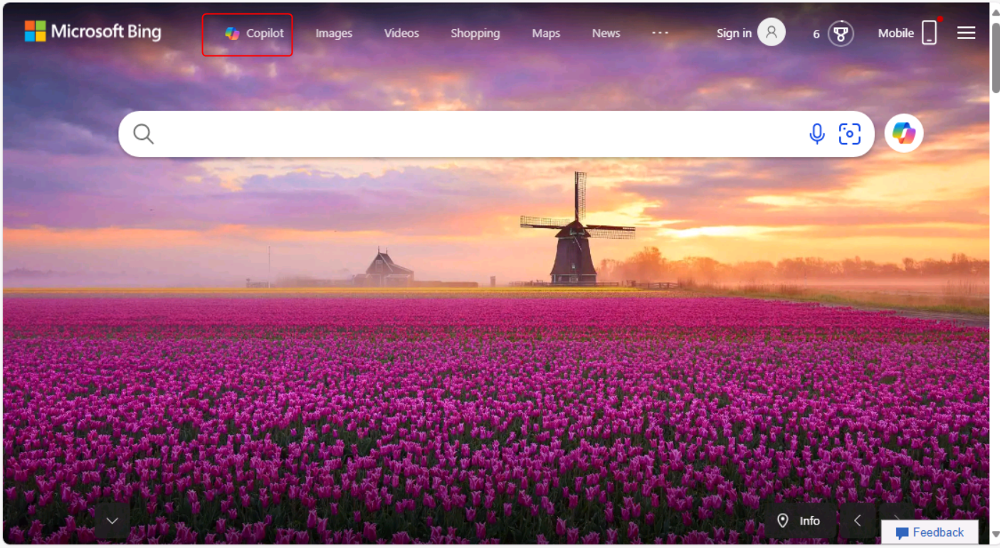
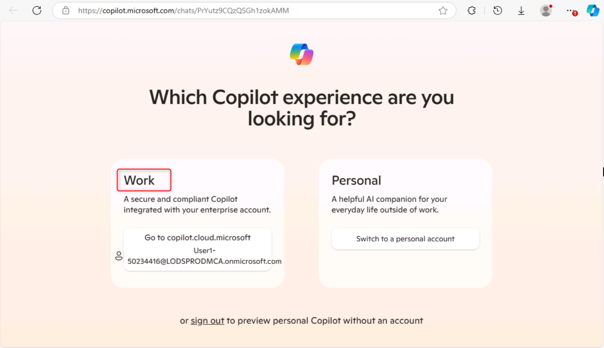
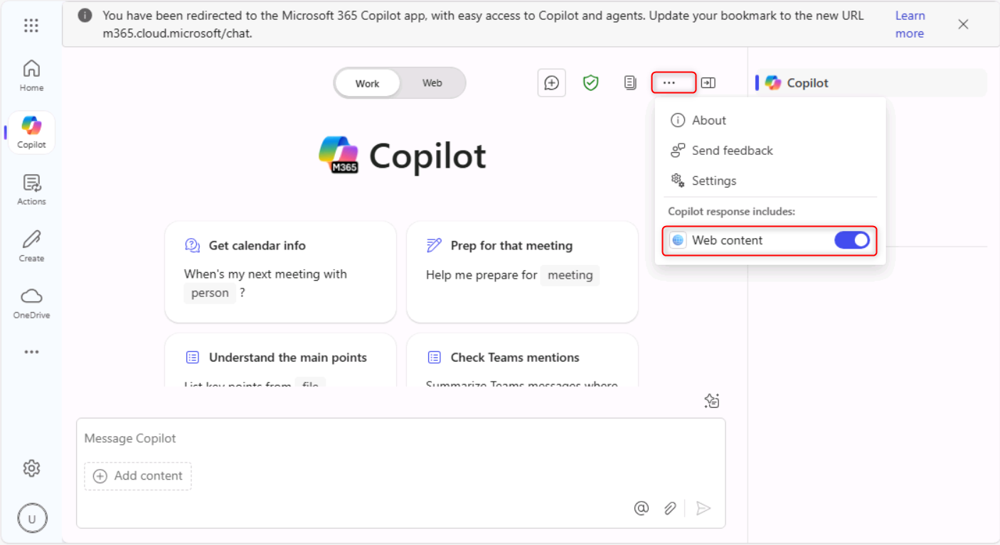
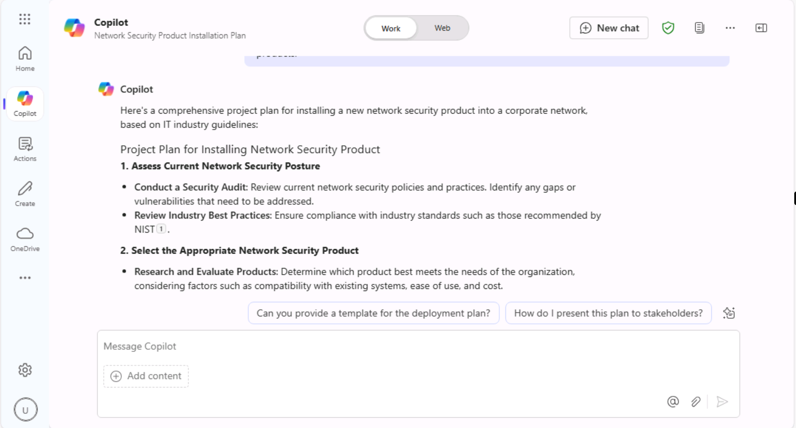
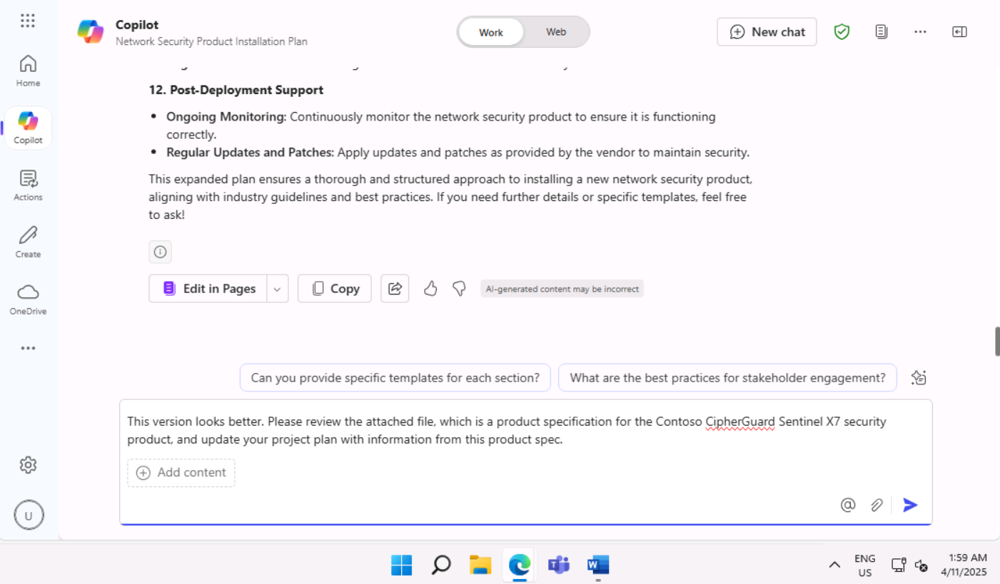
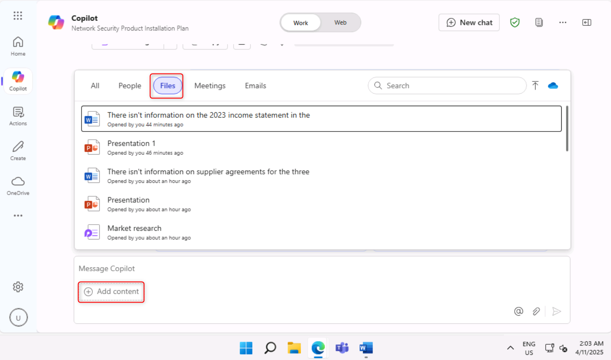
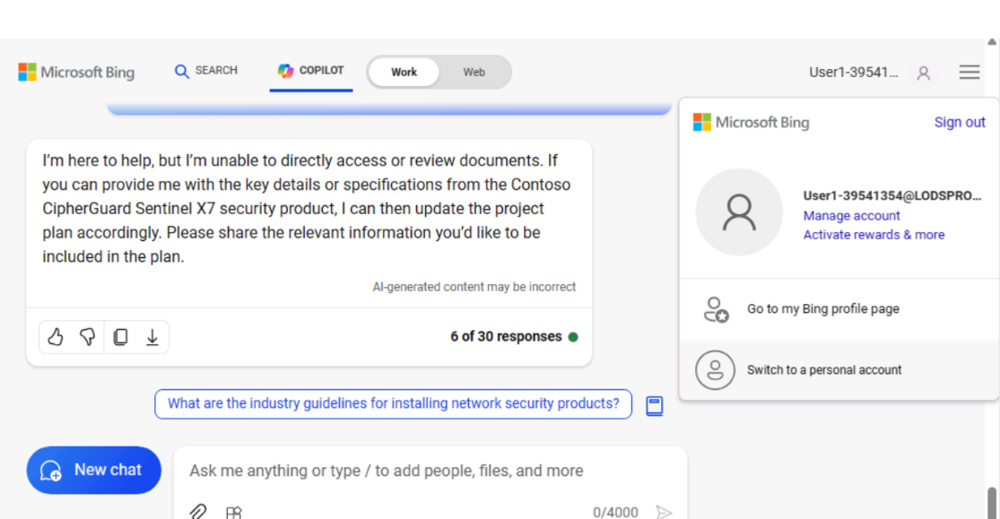
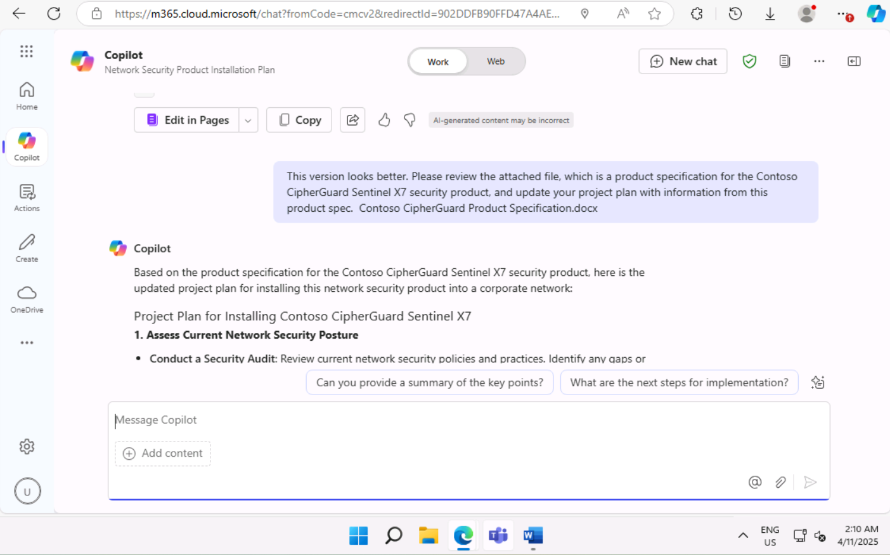
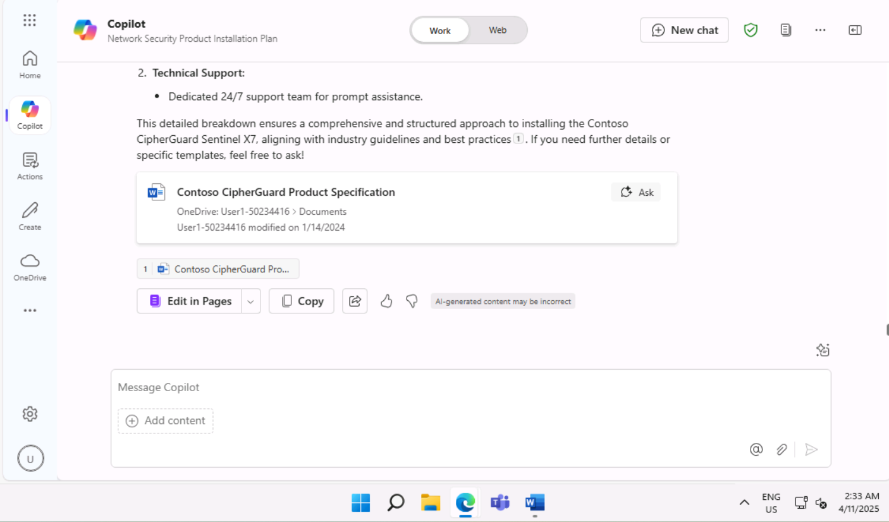

# Lab 12: Empower your workforce – Copilot-IT

## Objectives:

Copilot for Microsoft 365 serves as an AI-powered writing assistant
understands context, suggests phrases, and helps generate content, all
of which can enhance the quality of your work. In this lab, you will
use:

- Microsoft Copilot to summarize the information in a product spec and
  create a project plan to implement the product.

- Copilot in PowerPoint to create a presentation based on the project
  plan that you created.

- Copilot in Word to modify a technical specification report.

## Exercise 1: Create a project plan using Microsoft Copilot

With Microsoft Copilot seamlessly integrates into Microsoft 365 and
offers a robust platform for IT professionals to enhance teamwork, share
insights, and accelerate problem-solving within the IT ecosystem. It
enables IT professionals to connect instantly, share information, and
coordinate efforts efficiently.

As the Director of IT at Adatum Corporation, you've been reviewing a
product specification report for the Contoso CipherGuard Sentinel X7
network security product. You plan to install this product, which
provides advanced security protection that is far beyond anything Adatum
has today.

In this exercise you will use Microsoft Copilot in Bing

- Analyze a product specification report for a new network security
  product that you plan to install.

- Update the project plan with information from the product spec report.

**Note**: At the end of this exercise, you must save your project plan
to your OneDrive account. The next exercise uses this file.

1.  If you have a Microsoft 365 tab open in your Microsoft Edge browser, then select it now; otherwise, open a new tab and      enter the following URL: `https://www.office.com` to go to the **Microsoft 365** home page.
    
    **Note**: You need to sign-in (if prompted) using the **Microsoft 365 Credentials** provided under the **Resources**   
    tab on the right.

2.  On the **Microsoft 365** navigation pane, select **OneDrive** to open it.

    

3.  Browse to the **C:\LabFiles** folder to select and upload a copy of
    **Contoso CipherGuard Product Specification report** document to **OneDrive**.

    **Note**: If you have already uploaded all the lab assets to OneDrive as suggested in **Preparing for the lab
    execution** section you can skip this step.

4.  In this exercise, you access the document from the MRU file list. To
    get the file to appear in the MRU list, open the document and then
    close it.

    

5.  In **Microsoft Edge**, navigate to Microsoft Bing by entering the
    following URL: `https://bing.com`

    

6.  On the **Microsoft Bing home page**, in the list of tabs that appear
    across the top of the page, select **Copilot**. Doing so
    opens **Microsoft Copilot**.

    

7.  On the **Copilot** page, in the **Work/Web** toggle switch at the
    top of the page, select **Work**.

8. By default, the **Work** option limits Copilot's reach to your
    Microsoft 365 organizational data. However, since you also want
    Copilot to access the public web guidelines on installing a
    corporate network security product, you must enable the **Web
    content** plugin. To do so, in the prompt field at the bottom of the
    page, you should notice two icons - the paper clip icon, which is to
    attach files, and an icon of stacked blocks. This latter icon is the
    Plugins icon. Select this **Plugins** icon.

    >

    

9. You're now ready to use Copilot. Enter the following prompt, which
    directs Copilot to access public web data through the **Web
    content** plugin to Microsoft Copilot, and then select
    the **Submit** arrow in the bottom corner of the prompt field:

    **I'm the Director of IT at Adatum Corporation. Create a project plan
    for installing a new network security product into a corporate
    network. Base this plan on IT industry guidelines for installing
    network security products**.

    

10. Review the project plan that Copilot created.

    

11. You aren't satisfied that it encompasses all the areas that it
    should. Enter the following prompt to have it amend its plan by
    including areas of specific interest to you. If any of the areas
    included in this prompt are already in Copilot's previous response,
    then remove them from this prompt so that Copilot doesn't duplicate
    them:

    **While that was a good start, I feel like it's missing important
    areas. Please add the following items to the existing list: testing
    and QA, training, communication, document and reporting, stakeholder
    analysis, project timeline, and risk assessment and mitigation.**

    

    

12. Review the amended project plan. You're happy with the breadth of
    topics covered, so now you want Copilot to update the plan with
    information from the product spec for the Contoso CipherGuard
    Sentinel X7 security product. Enter the following prompt, but don't
    submit it yet as you must first link the file to the prompt in the
    next step:

    **This version looks better. Please review the attached file, which is
    a product specification for the Contoso CipherGuard Sentinel X7
    security product, and update your project plan with information from
    this product spec**.

    

13. In the prompt field, enter a space after the prompt and then type a
    forward slash (/). You must enter the space before the forward slash
    so that Copilot recognizes it as a request to attach something to
    the prompt. Your next step depends on whether Copilot opens a window
    for you to select the file:

    - If Copilot opens a window after you entered the forward slash (/),
      then select the **Files** tab. Doing so displays the list of MRU
      files. Select the **Contoso CipherGuard Product Specification** file
      and then select the **Submit** icon.

    - If Copilot didn't do anything after you entered the forward slash (/),
      then you'll have to copy and paste in the link to the **Contoso
      CipherGuard Product Specification** file. To do so, locate the file in
      your OneDrive account, open it in **Word**, select
      the **Share** button that appears above the Word ribbon, select **Copy
      link** in the drop-down menu that appears, and then back in this
      prompt field, paste in the link following the forward slash and select
      the **Submit** icon.

    
    
      **Note**: If Copilot is not able to directly access
      or review documents, Sign-out of the logged in user and sign-in once
      again.

    

14. Continue from **step 9** once again.

    

    **Note**: If you are unable to view and reference
    **Contoso CipherGuard Product Specification** document, then proceed
    to the next exercise. The project plan document is made available for
    you to proceed with the remaining lab activity

    

15. Review how Copilot inserted features from the product spec into the
    project plan.

    
16. While this looks good, you feel that the project plan is lacking in
    specific details. To address this issue, enter the following prompt:

    **We're almost there. Please break down each item on the report into
    multiple detailed steps**.

    

17. Review the results.

    

18. Now that the project plan is created, you MUST save it to a Word
    document. **You'll use this project plan document in the next
    exercise**. At the bottom of Copilot's final response, select the **Copy** button to copy and paste the response in a 
    **Word** document.

    

19. Save the file as **Contoso CipherGuard project plan.docx** in your OneDrive that contains the product 
    specification document that you used in this exercise. You'll use this file in the next exercise.

    

## Exercise 2: Create a project plan presentation using Copilot in PowerPoint

Copilot in PowerPoint serves as an intelligent collaborator, offering
real-time suggestions and enhancements as IT professionals craft their
presentations to:

  - Present their ideas or proposals to their team or management.
  
  - Train new employees or demonstrate new software or hardware to
    clients.
  
  - Explain complex technical concepts to nontechnical audiences, such as
    stakeholders or investors.
  
  - Showcase their work or promote their services to potential clients.

With Copilot in PowerPoint, you can create a presentation from an
existing Word document. When you provide Copilot in PowerPoint with the
link to your Word document, it can generate slides, apply layouts, and
choose a theme for you.

In this exercise, you use Copilot in PowerPoint to create a slide
presentation based on the project plan you created in the prior
exercise. You want to use this presentation to explain the project plan
to your IT staff, and ultimately to corporate management.

**Note**: If you completed the prior exercise and
created a **Contoso CipherGuard project plan.docx** file, then ensure
that you saved it to your OneDrive account and proceed to the next
step. However, if you were unable to create this project plan in the
prior exercise, then upload a copy of the document **Contoso CipherGuard project plan.docx** available in **C:\LabFiles**.

1.  If you have a Microsoft 365 tab open in your Edge browser, then select it now; otherwise, open a new tab and enter the following URL: `https://www.office.com` to go to Microsoft 365 home page.
    
    **Note**: If you already have a Microsoft 365 tab open in your Edge browser, then select it now.

2.  On the **Microsoft 365** navigation pane, select **OneDrive** to open it.

    

3.  Browse to the **C:\LabFiles** folder to select and upload a copy of
    **Contoso CipherGuard Product Specification report** document to **OneDrive**.

    **Note**: If you have already uploaded all the lab assets to OneDrive as suggested in **Preparing for the lab
    execution** section you can skip this step.
    
4.  Open and close the file Contoso CipherGuard project plan.docx (which you saved to OneDrive) to get it in your
    Most Recently Used (MRU) file list.
    
5.  On the **Microsoft 365** navigation pane, select **PowerPoint**. In
    PowerPoint, open a new blank presentation.

6.  Select the **Copilot** option on the right side of the ribbon. In
    the **Copilot** pane that appears, several predefined prompts are
    available for you to choose from.

    

7.  Select the **Create presentation from file** prompt.

    

8.  In the prompt field at the bottom of the **Copilot** pane, Copilot
    automatically enters the text: **Create presentation from file /**.
    The forward slash is the universal Copilot indicator to enter a link
    to a file. In this case, it triggers Copilot to open
    a **Suggestions** window that displays three of the most recently
    used files.

    - If your file appears here, then select it now and proceed to the next
      step.
    
    - If the file isn't one of the three being displayed, select the right
      arrow (**\>**) in the upper right corner of the **Suggestions** window
      to see an expanded MRU file list. If the file appears here, then
      select it now and proceed to the next step.
    
    - If you don't see your file in the expanded MRU list, then you must
      copy the link to the report and paste it in the prompt field. To do
      so:

      1.  Select the **Microsoft 365** browser tab and select **Word** in
          the navigation pane.
    
      2.  In the **Word** home page, in the list of recent files, select the
          report to open it in Word.
    
      3.  In the report in Word, on the far-right above the ribbon, select
          the **Share** button. In the drop-down menu that appears,
          select **Copy Link**. Wait for the **Link copied** window to
          appear, which is your assurance that the link to the file is
          copied to your clipboard.
    
      4.  Switch to your **PowerPoint** tab, and at the bottom of
          the **Copilot** pane, the prompt field should still be
          displaying **Create presentation from file /**. Position your
          cursor after the forward slash (**/**) and then paste in
          (**Ctrl+V**) the link to the report.

9. Note how the file appears in the prompt field. Select
    the **Send** icon in the prompt field. This prompt triggered Copilot
    to create a slide presentation based on the document. In doing so,
    it first displayed the outline of the presentation. Then it
    displayed a separate window showing a bulleted list of some of the
    changes that it made to the presentation based on the document.

    

10. You're now free to review the slides and make any necessary updates.
    Pay special attention to the changes the Copilot made based on the
    document. You can use the **Designer** tool to adjust the layouts

    

11. You notice that there isn't a slide at the end for a Question and
    Answer (Q&A) session. To correct this oversight, enter the following
    prompt:

    **Add a Q&A slide at the very end of the presentation with an
    appropriate image**.

    

12. Review the new slide that was created. You don't like the image that
    Copilot used for this slide, so enter the following prompt asking
    Copilot to change the image:

    **I don't like the image you used on the Q&A slide. Please replace it with a different image**.

    

13. What response did you receive? Sometimes Copilot didn't replace the
    image and it returned the following message.

    

    **Note**: Copilot may display some exception (remember that Copilot is still a work in progress)   
    like the one above.

14. Please try rephrasing the prompt or use the suggested prompts like the one below:

    

15. Select the command **Add a slide about** and append the following **Q&A at the very end of the presentation** (as shown
    in the screenshot)

    

16. Click Send to check what happens. Copilot has added a Q&A slide as instructed.

17. Now try with another prompt:

    **Add a slide about** what the audience may ask about the presentation
    
18. Once you are done with final presentation you can save for future reference or discard this presentation
       
19. Regardless how the last few steps went in dealing with the Q&A
    slide, you decide to move forward and try one last thing. In
    reviewing the presentation, you decide that you want to change the
    theme of the presentation to something more appropriate due to the
    technical nature of the topic. Enter the following prompt:

    **Change the theme of this presentation to something more technical.** 

    

21. Note Copilot's response.

    

    This scenario is one of those situations to remember the prompting
    best practice: **Understand Copilot's limitations**. In this case, it
    isn't an understanding of a limitation as much as it's an
    understanding as to how Copilot works. In this case, Copilot points
    you to an existing PowerPoint feature rather than duplicating what
    that feature does.

22. While the remaining training exercises in this module don't use this
    presentation, you can either discard it or save it if you want it
    for future reference.

## Exercise 3: Update a technical report using Copilot in Word

Copilot in Word can help IT professionals save time and effort when
creating documents. It can help you generate content, rewrite text, and
provide helpful suggestions. With its AI-powered writing assistance,
Copilot can help you create documents more efficiently and effectively.

When you create a new document or work on an existing one, Copilot can
help you in different ways.

- In a new, blank document or when you want to add content to an
  existing document, you can tell Copilot what you want to write about,
  and it generates the content accordingly.

- In a document with existing content, Copilot can help you transform
  the content. It can rewrite selected content, or even transform
  selected content into a table.

In this exercise, you will use Copilot in Word to update an existing
document. You direct Copilot to add new text, rewrite existing text, and
transform text into a table.

1.  If you have a Microsoft 365 tab open in your Microsoft Edge browser, then select it now; otherwise, open a new tab and      enter the following URL: `https://www.office.com` to go to the Microsoft 365 home page.
    
    **Note**: You need to sign-in (if prompted) using the **Microsoft 365 Credentials** provided under the **Resources**        tab on the right.

2.  On the **Microsoft 365** navigation pane, select **OneDrive** to open it.

    

3.  Browse to the **C:\LabFiles** folder to select and upload a copy of
    **Trey Research - VPN Technical Overview** document to **OneDrive**.

    **Note**: If you have already uploaded all the lab assets to **OneDrive** as suggested in **Preparing for the lab
    execution** section you can skip this step.

4.  Open and close the file **Trey Research - VPN Technical Overview.docx** (which you uploaded to OneDrive) to get it in       your Most Recently Used (MRU) file list
  
5.  On the **Microsoft 365** navigation pane, select **Microsoft Word** to open it.

6.  Open the **Trey Research - VPN Technical Overview.docx** file.

    

7.  On the **Word** ribbon, select the **Copilot** button to open the
    Copilot pane.

    

8.  In the **Copilot** pane, enter the following prompt and then select
    the arrow (**Send**) icon:

    **Write a new section for this document about the types of VPNs. Discuss
    the pros and cons of each type. This content is for a technical
    audience, so please provide specific details.**

    

9. Copilot doesn't add new content directly into a document. It
    displays the content in a response window in the Copilot pane.
    However, it does provide a **Copy** button at the bottom of each
    response window, so select the **Copy** button to copy its contents
    to your clipboard. In looking at the document, you decide to paste
    the contents below the opening paragraph. Paste the contents in now.

    > **Tip**: When you select the **Copy** button for a response window, it
    > copies ALL the content, including Copilot's comments that are intended
    > for you. These types of comments are typically at the start and end of
    > the response. Make sure you remove these comments once you paste the
    > response into your document. Chances are, the font and font size of
    > the new content won't match the existing font and size used throughout
    > the document. As such, you must change them to match.

10. Upon further review, you notice that there's no mention of security
    policies related to VPN usage. This topic is a key area that you
    want included, so enter the following prompt:

    **Please write a new section for this document about security policies
    related to VPN usage. This content is for a technical audience, so
    please provide specific details.**

    

11. Copy and paste the content from this response into the document.
    Place it just before the **Risks and mitigations** section, and then
    edit the content as needed. If necessary, add a heading for this
    section titled **Security policies related to VPN usage**.

    

12. When you reviewed the report, you also identified one area of
    content that you felt needed to be rewritten. In the section
    on **Risks and mitigations**, the first bullet covers both home and
    enterprise VPNs. You want it to only address enterprise VPNs.
    However, given the way in which the content is written, it doesn't
    appear to be an easy fix. You decide to have Copilot rewrite the
    content for you.

    **Tip**: To have Copilot rewrite content, you must first highlight the
    content that you want Copilot to rewrite.

13. Highlight the content in the first bullet of the **Risks and
    mitigation** section, and then enter the following prompt:

    **The highlighted content discusses the risks of using VPNs in both
    home and enterprise networks. Remove the content related to home
    networks and focus solely on the risks of VPNs in enterprise
    networks.**
    
    

14. Check Copilot's response. Sometimes this rewrite functionality
    didn't work. When it didn't work, Copilot returned the following
    response. If this situation occurs, copy and paste in your prompt
    and try it again (remember, iterate, iterate, iterate).

    

15. After you make a final review of the document, you decide that the
    sections on the Pros and Cons of implementing VPNs would look better
    in a table rather than as bulleted lists. Since you highlighted a
    section to be rewritten, you decide to highlight these two sections.
    Highlight both sections and then enter the following prompt:

    **Please rewrite the highlighted content by placing it in a table**.

    

16. Note the Copilot response.

    

17. Reformatting content into a table is different than rewriting
    content. Instead of highlighting the content that you want placed in
    a table, you must describe in your prompt what sections of content
    you want included in the table. This time, enter the following
    prompt:

    **Place the content from the Pros and Cons of implementing VPNs into a table**
    
    

18. Note the Copilot response. Instead of rewriting or replacing the
    existing content in the document with a table, it displays the table
    in its response. It's up to you to replace the content by copying
    and pasting the table into the document. In the response, select
    the **Copy** button, and then in the document, highlight the Pros
    and Cons sections and paste in the table. Make sure you add a
    section heading before the table that says: **Pros and Cons of
    implementing VPNs.** Chances are, you'll also need to change the
    font and font size of the table content to match the existing font
    and size used throughout the document.

    

19. At this point, you feel the document is complete. However, to play
    it safe, you decide to ask Copilot if it feels the document should
    include any other information. Enter the following prompt:

    **Is there anything missing in this document that you would recommend adding?**

    

20. Note the Copilot response. In our testing, it told us that nothing
    was missing. Try again to see if Copilot provides a different
    response.

    

21. If Copilot recommended that you add more content to your document,
    create a prompt that asks it to do so. You can then copy and paste
    the new content into your document.

## Summary:

In this lab, you explored how Copilot for Microsoft 365 enhances the
quality of your work by

- Using Microsoft Copilot to distil the key information from a product
  specification document and develop a comprehensive project plan for
  implementing the product.

- Leveraging Copilot in PowerPoint to design a presentation based on the
  project plan you created, ensuring it is visually appealing and
  effectively communicates the plan's details.

- Utilizing Copilot in Word to revise and enhance a technical
  specification report, improving clarity, coherence, and overall
  quality.
