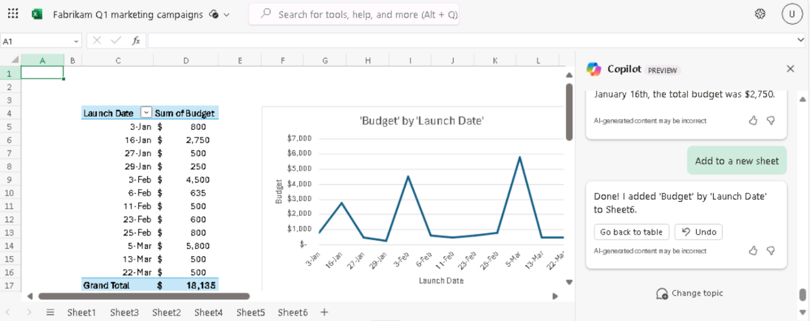

# Lab 15: Empower your workforce – Copilot – Finance

## Objective:

By using Copilot for Microsoft 365, Finance professionals can automate
repetitive financial tasks, gain insights into their financial data,
save time by automating manual tasks and collaborate more effectively

In this lab, as a finance professional you will use:

- Copilot in Outlook to create a new email to the company's insurance
  carrier to discuss the exorbitant increases in its medical insurance
  premiums.

- Copilot in Excel to analyze a spreadsheet containing projected revenue
  for Q1 marketing campaigns and then add new calculations and charts to
  visualize the data.

- Copilot in Word to create a marketing campaign report based on the
  company's Q1 marketing campaign spreadsheet.

- Copilot in Word to summarize a company's financial results for the
  past five years.

## Exercise \#1: Draft an email to your insurance company using Copilot in Outlook

With Copilot, you can quickly generate email drafts that Copilot tailors
to your specific needs, without having to spend hours writing and
editing them. In this exercise, you use Copilot in Outlook to draft a
new email based on a series of user-supplied prompts.

> **Note**: Copilot scenarios in Outlook are only available on a user’s
> primary mailbox. They aren't available on a user’s archive mailbox,
> group mailboxes, or shared and delegate mailboxes that the user has
> access to.
>
> - Microsoft only supports Copilot in Outlook on mailboxes hosted on
>   Exchange Online.
>
> - Copilot in Outlook is only supported in Microsoft 365 work or school
>   accounts and Microsoft accounts with specific email domains.
>
> - It's supported both through Copilot for Microsoft 365 with your
>   Microsoft Entra ID account, and Copilot Pro with your MSA account.

As the CFO for Northwind Traders, you want to use Copilot in Outlook to
draft an email to the company's health insurance carrier, Humongous
Insurance. You were recently notified by your insurance agent that
Northwind's health insurance premiums would be increasing across the
board - more than 9% for individual policies and more than 15% for
family policies. This rate of increase is considerably higher than
industry averages.

The purpose of this email is twofold:

- To express your concern over the level of increases.

- To request a meeting with the insurance carrier’s team to discuss the
  matter and explore alternative options.

1.  In **Microsoft 365**, open **Outlook**.

2.  Open a **New** email.

3.  On the **Message** tab that opens, select **Copilot** in the ribbon.
    In the drop-down menu that appears, select **Draft with Copilot**.

    

4.  In the body of the message, a **Draft with Copilot** window appears.
    The prompt field contains the message: **What do you want this email
    to say**? At the bottom of the field is a **Generation
    options** icon. Select this icon to see the options that Copilot
    provides when creating an email.

    

5.  In the drop-down menu that appears, you see that you can change the
    Tone and Length of the email. You decide to start out by setting
    the **Tone** to **Formal** and the **Length** to **Long**. Select
    these options now.

    

6.  Enter the following prompt in the **What do you want this email to
    say**? field and then select the **Generate** button:

    **I'm the CFO for Northwind Traders. Draft an email to our insurance
    carrier, Humongous Insurance, expressing my concern for the level of
    increases in our company's health insurance premiums for the coming
    year. Request a meeting with the insurance carrier’s team to discuss
    the proposed increases and explore alternative options.**

    

7.  Scroll through the draft to review it. At the top of the message,
    Copilot displays the start of the prompt that you just entered (that
    is "**I'm the CFO for Northwind Traders...**"). Select this section
    of the prompt to see what happens.

    

8.  Copilot displays a **Rewrite with Copilot** window that allows you
    to edit the prior prompt and regenerate an entirely new message. At
    this point, you're happy with the message, but you want to see how
    it would change when using a different tone and length. Select
    the **Generation options** icon that appears below the prompt.
    Change the **Tone** to **Direct** and the **Length** to **Medium**,
    and then select the **Generate** button.

    

    

9.  Review the revised draft. At the top of the **Rewrite with
    Copilot** window, note the "**I'm the CFO for Northwind
    Traders...**" link. Also note how Copilot indicates this draft is
    "**2 of 2**", meaning you're looking at the second of two Copilot
    drafts. You can select the back arrow (\<) to go back to the
    previous Copilot draft, which in this case is the first draft that
    has a **Formal** tone and a **Long** length.

    

    

    If you generate multiple Copilot drafts, as you'll do in this
    exercise, you can use these arrows to go back and forth between drafts
    to find one that you like. If you find a draft that you want, you can
    select one of the available buttons to either **Keep
    it** or **Regenerate** a new draft with the same tone and length. Note
    the salutation and complementary close, the overall tone of the
    message for this Direct draft, and the change in Length. While you
    want to get straight to the point, you feel the **Direct** tone is far
    too impersonal, so you want to generate a new draft with a different
    tone.

10. Select the linked prompt at the top of the window ("**I'm the CFO
    for Northwind Traders...**") to return back to the **Rewrite with
    Copilot** window. Select the **Generation options** icon, and this
    time change the **Tone** to **Casual** and the **Length** back
    to **Long**. Select **Generate**.

    

    

11. Review the new draft. At this point, you realize that you don't like
    the **Direct** tone and the **Medium** length in draft number two.
    However, you're sure that you prefer the longer length, but you
    can't decide whether you prefer the **Formal** or **Casual** tone.

    - Since the **Casual** draft is currently displayed, you note that
      the salutation is a bit informal, such as "Hi there" or just
      "Hello."

    - You can't remember the exact salutation when you used
      the **Formal** tone, but it was something along the lines of "Dear
      so and so."

    - You also can't remember the phrasing of the complementary close in
      the first draft that used the **Formal** tone (for example,
      Sincerely/Best regards/Thank you, etc.).

12. If you can't remember how the two messages appeared beyond the
    salutations, follow the previous instructions to select the back
    arrow to return to the first draft, which had a **Formal** tone. If
    you can't decide which draft you prefer, use the forward and
    backward arrows to compare the first draft (Formal) and the third
    draft (Casual). Proceed to the next step once you decide which draft
    you want to use.

    

    

13. At this point, your preferred draft should appear in the Copilot
    window. Beyond the changes to the tone and length that you
    previously made; it strikes you that the email message seems a bit
    sparse. You notice that it doesn't provide any detailed information
    about the rate increases, at least not broken down by individual and
    family plans. In the **Anything you'd like to change**? field, enter
    the following prompt and then select the arrow icon at the end of
    the field:

    **Please compare the level of premium increases being proposed for
    Northwind Traders in comparison to industry-wide premium increases.
    Our individual policy premiums increased over 9%, and family policies
    increased over 15%. Mention how our increases far exceed the industry
    averages of 6% and 10% increases, respectively**.

14. What just happened when you tried to update the email based on this
    latest prompt? Chances are you received an error message indicating
    "**Sorry, something went wrong. Copilot is working on it**." The
    reason you received this error is that when you submit a change
    request to a draft, Copilot currently accepts only one change at a
    time per prompt. In this case, you asked for two changes - **compare
    the plan increases to industry averages** and **specify the specific
    rate increases**.

    Here's the current rule of thumb involving prompts when working in
    Copilot for Outlook:

    - When you submit your initial prompt, you can include multiple
      requests. For example, you could tell Copilot to include information
      about A, B, and C. In that case, it would generate a draft with all
      three items.
    
    - However, any subsequent prompts to amend a draft AFTER that initial
      prompt can only include one change request per prompt.

15. Given this requirement, you decide to break your previous request
    into two parts. This time, enter the following prompt, which is part
    one:

    **Please mention that our individual policy premiums increased by over
    9%, and family policies increased over 15**%.

16. Review the updated draft. Now enter the following prompt regarding
    industry averages, which is part two:

    **Please mention that average industry premium increases are 6% for
    individual policies and 10% for family policies**.

17. This draft looks better. However, you decide to add one last note
    regarding a possible change to high deductible/low premium plans.
    Enter the following prompt:

    **Please mention that we should discuss converting to high-deductible,
    low premium policies**.

18. After reviewing this latest iteration, you're satisfied with the
    draft, so select the **Keep it** button.

19. Note how the message appears in the body of the email without the
    Copilot window. In a real-world scenario, you would either send the
    email as is, or make any final changes manually. Once you **keep** a
    Copilot draft, you must manually make any further changes yourself.
    You can't go back into Copilot draft mode with that message.

20. Since you won't send this email, select the trash can (**Discard**)
    icon in the upper right corner of the email screen and then confirm
    that you want to discard the message.

## Exercise #2: Analyze a financial spreadsheet using Copilot in Excel

For Finance professionals, Copilot in Excel offers the ability to ask
questions about your data set in natural language rather than just
formulas. The tool can reveal correlations, suggest what-if scenarios,
and create powerful visualizations based on your queries.

As Fabrikam's Director of Finance, you want to analyze how effective the
company's Q1 marketing campaigns were. Your Director of Marketing
provided you with a spreadsheet that identifies each of the marketing
campaigns the company engaged in during the first quarter. The
spreadsheet provides basic budget and revenue figures and the number of
targeted and engaged users.

In this exercise, you'll use Copilot in Excel to analyze the market
trend that's already in an Excel spreadsheet **Fabrikam Q1 marketing
campaigns.xlsx**. You will examine many of Copilot's pre-built functions
and prompts.

1.  If you have a Microsoft 365 tab open in your Microsoft Edge browser, then select it now; otherwise, open a new tab and      enter the following URL: **<https://www.office.com>**.
    
    **Note**: You need to sign-in (if prompted) using the **Microsoft 365 Credentials** provided under the **Resources**        tab on the right.

2.  On the **Microsoft 365** navigation pane, select **OneDrive** to open it.

    

3.  Browse to the **C:\LabFiles** folder to select and upload a copy of
    **Fabrikam Q1 marketing campaigns.xlsx** spreadsheet to **OneDrive**

    **Tip**: Open and close the file to get it in your Most Recently Used (MRU)
    file list.

    

    **Note**: If you have already uploaded all the lab assets to OneDrive as suggested in **Preparing for the lab
    execution** section you can skip this step.

4.  On the **Microsoft 365** home page, select the **Excel** icon in the
    navigation pane on the left.

5.  In **Excel**, on the **File** page, select **Fabrikam Q1 marketing
    campaigns** from the file list.

6.  Select the **Copilot** option on the right side of the ribbon.

    

7. In the **Copilot** pane that appears, note the predefined prompts
    that are displayed above the prompt field. Before you select any of
    these predefined prompts to improve your analysis, you first want
    Copilot to make some specific changes to the spreadsheet. To begin
    with, you want Copilot to identify which campaign types are most
    profitable. To do so, enter the following prompt:

    **Create a pivot table to analyze the total revenue generated by each
    campaign type**.
    
    

8. Review the results of this prompt. Copilot displayed two response
    windows. The first response included a pivot table that summarized
    the total revenue by campaign type. The second response included an
    explanation for what it did in the first response. In the first
    response containing this table, select the **+Add to a new
    sheet** button. Doing so adds this table to **Sheet 2** of this
    spreadsheet, which Copilot then opened for you.

    

    **Note**: If **Add to new sheet** button is not
    visible, you need to test with zoom in/out to see the button (A zoom
    level of 115% seems to display the details)

9. In looking at **Sheet 2**, you notice that Copilot didn't create a
    chart to accompany the pivot table. In looking at the prompt you
    submitted, you realize that you just asked it to create a pivot
    table - you never mentioned anything about a chart. You would like
    to see a visualization of this data, so you want to enter a prompt
    asking Copilot to generate a chart to go along with the pivot table
    in **Sheet 2**. However, notice that while you're in **Sheet 2**,
    the prompt field is disabled.

    

    **Note**: The prompting field is only enabled in the sheet that has
    the Excel table. For this spreadsheet, that's **Sheet 1**. As you
    continue through this exercise, each time Copilot adds data to a new
    sheet, you must return to **Sheet 1** to request more changes.

10. Select **Sheet 1**, and then enter the following prompt:

    **In Sheet 2, you created a pivot table to analyze the total revenue
    generated by each campaign type. Create a chart in Sheet 2 to
    visualize this data**.
    
    

11. Review the result. If Copilot created a chart showing the revenue by
    campaign type, then proceed to the next step. However, if Copilot
    displayed a message indicating that you can't ask it to work on a
    sheet other than the original sheet that has the Excel table, then
    you must simplify your previous prompt. In this case, enter the
    following prompt:

    **Calculate the total revenue generated by each campaign type**.
    
    
    
    **Note**: Even after simplifying the prompt like
    the following Calculate the total revenue generated by each campaign
    type, if Copilot fails to generate the total revenue, keep trying
    again and again (In our testing only at the fourth attempt, it
    generated the Pivot chart along with the option to insert the chat to
    a sheet)

12. Review the chart that Copilot created showing the revenue by
    campaign type. This result is what you wanted, so select the **+Add
    to a new sheet** button at the bottom of the window. Doing so adds
    this chart to **Sheet 3** of this spreadsheet.

    

    

13. In looking at **Sheet 3**, you note how Copilot included the pivot
    table along with the chart. You realize that **Sheet 2** has the
    same pivot table, while **Sheet 3** has the table and chart. Since
    you want **Sheet 3** that has both the table and chart, you decide
    to remove **Sheet 2** to avoid any future confusion. To
    delete **Sheet 2**, right-click on it, select **Delete** from the
    menu that appears, and then select **OK** to confirm the deletion.
    Doing so leaves you with Sheets 1 and 3.

    

    

14. Since you want to make more changes, select **Sheet 1** to return
    back to your sheet with the pivot table.

15. You now want to identify which campaigns were the most effective. To
    do so, you want Copilot to calculate the Return on Investment (ROI)
    for each campaign. To calculate the ROI, enter the following prompt:

    **Calculate the ROI for each campaign**.
    
    

16. Review the results of this prompt. Copilot shows you the
    calculation, and you can select the **Explain formula** option for
    an explanation of the ROI calculation.
    
    

    

17. You want Copilot to add the ROI to your spreadsheet, so select
    the **+Insert column** button that appears at the bottom of the
    window.

    

18. Note the results. Copilot added a new column containing the ROI for
    each individual campaign. While that's fine, you want it to
    determine the ROI for each campaign type. You realized your mistake
    when you reviewed your prior prompt. You asked Copilot to calculate
    the ROI for each campaign, when in fact, you wanted to calculate the
    ROI for each campaign type. Enter the following prompt to calculate
    the ROI for each campaign type:

    **That change looks good. However, I would like you to also calculate
    the ROI for each campaign type**.
    
    

19. Review the results. Copilot created a graph showing the ROI by
    campaign type. Select the option at the bottom of the window
    to **+Add to a new sheet**. Doing so adds this table to a
    new **Sheet 2** of this spreadsheet. In addition to the clustered
    bar chart that it created (hover your cursor over the chart to see
    the chart type), it also created a pivot table containing the ROI by
    campaign type. After you finish reviewing this data, select **Sheet 1**.

    

    

20. You now want Copilot to determine which campaigns were most
    effective at engaging users. You feel the best way to visualize this
    data is to have Copilot create a chart that shows the relationship
    between total users targeted and total users engaged. To do so,
    enter the following prompt:

    **Create a chart that shows which campaign was most effective at
    engaging users**.

    

21. Review the results. Copilot created an **Engaged Users by Campaign
    Name** bar chart.

    

22. However, if Copilot just summarized the total engaged users by
    campaign, that's not exactly what you wanted. To correct this
    result, enter the following prompt:

    **That type of chart isn't what I was looking for. Please create a
    chart that shows the relationship between total users targeted and
    total users engaged**.
    
    

23. Review the results. In our testing, Copilot indicated that it
    couldn't create a scatter chart with this data.

    

24. However, it did explain the pivot table that it created. You feel
    that result is good enough for now, so select the **+Add to a new
    sheet** button at the bottom of the pivot table window. Doing so
    adds this table to **Sheet 4** of this spreadsheet. When you're done
    reviewing this data, select **Sheet 1**.

    

    

25. You have one final piece of data that you want Copilot to provide.
    You would like Copilot to identify the top-performing campaigns
    based on revenue generated. You can then use this information to
    identify which campaigns are most profitable. Enter the following
    prompt:

    **Identify the top-performing campaigns based on revenue generated**.
    
    

26. Review the results. Copilot created a graph showing the Revenue by
    campaign name. Select the option at the bottom of the window
    to **+Add to a new sheet**. Doing so adds this table to **Sheet
    5** of this spreadsheet. In addition to the clustered bar chart that
    it created, it also created a pivot table displaying the total
    revenue by campaign. When you're done reviewing this data,
    select **Sheet 1**.

    
    
    

27. That completes the data that you wanted Copilot to analyze for you.
    However, you're curious as to what other suggestions Copilot may
    have to further analyze your campaign data. In the list of
    predefined prompts that appear above the prompt field, look for a
    suggestion titled **Show suggestions for formula columns**. If you
    see this suggestion, then select it now. However, if you don't see
    this suggestion, then enter it manually in the prompt field.

    

28. Review the column suggestion. If you want to add it to your
    spreadsheet, select the **+Insert column** button.

    
    
    
    
    If a predefined prompt appears that says **Give me another
    suggestion**, then select it now. However, if this predefined prompt
    doesn't appear, then enter it manually in the prompt field (in our
    testing, this predefined prompt sometimes appeared before inserting
    the column, but then disappeared after the column was inserted).

29. Repeat the previous step a few times to have Copilot suggest
    different calculations. Insert the ones you like and skip the ones
    you don't.

30. You now want Copilot to show you some more charts that visualize
    various types of data. In the list of predefined prompts, select
    the **Show data insights** button.

    

31. Review the results. If this chart is of interest to you, select
    the **+Add to a new sheet** button and then return to **Sheet 1**.

    

    

32. Then select the **Can I see another insight**? button. Again, if
    this chart is of interest to you, select the **+Add to a new
    sheet** button and then return to **Sheet 1**.

    
    
    
    
    

33. After seeing these first two charts, you realize that you like the
    various charts that Copilot provides. Instead of looking through
    more charts one by one, you want Copilot to add to your spreadsheet
    all the insights that it can create based on your data. In the
    predefined prompts, select the **Add all insights to grid** prompt.

    

34. Review the results. Copilot created multiple charts in the final
    sheet, along with several pivot tables.

    

35. You determine that your analysis is complete given all the data that
    Copilot in Excel has provided. Since Excel automatically saved your
    file, close your Microsoft Edge browser tab.

## Exercise #3: Create a financial analysis report using Copilot in Word

If you're a financial analyst and need to write a report on the
performance of a company, you can use Copilot in Word to draft the
report and ask Copilot Chat questions to research, ideate, or iterate on
for possible content to add.

In this exercise, you instruct Copilot in Word to write a new report
based on the data from the Fabrikam Q1 Marketing Campaign spreadsheet
that you analyzed and updated in the previous exercise. However, instead
of using the Excel spreadsheet, you'll use a Word document that contains
all the spreadsheet data.

**Note**: Copilot in Word can create a report based
on a spreadsheet. However, you can't directly reference an Excel file
from within Word. Instead, you must copy and paste the data from the
Excel file into a Word document.

As Fabrikam's Director of Finance, you used Copilot in Excel to analyze
the effectiveness of the company's Q1 marketing campaigns in the
previous exercise. In this exercise, you will use Copilot in Word to
generate a report that summarizes the analysis of that data. The
spreadsheet was copied and pasted for you into a Word document
**Fabrikam Q1 marketing campaign data.docx**, which you’ll download in
the first step.

1.  If you have a Microsoft 365 tab open in your Microsoft Edge browser, then select it now; otherwise, open a new tab and      enter the following URL: **<https://www.office.com>** to go to the Microsoft 365 home page.
    
    **Note**: You need to sign-in (if prompted) using the **Microsoft 365 Credentials** provided under the **Resources**        tab on the right.

2.  On the **Microsoft 365** navigation pane, select **OneDrive** to open it.
  
3.  Browse to the **C:\LabFiles** folder to select and upload a copy of **Fabrikam Q1 marketing
    campaign data.docx** document to **OneDrive**.
    **Tip**: Open and close the file to get it in your Most Recently Used (MRU) file list.

    

    **Note**: If you have already uploaded all the lab assets to OneDrive as suggested in **Preparing for the lab
    execution** sectionyou can skip this step.

4.  In **Microsoft 365**, open **Microsoft Word** and then open a blank
    document.

5.  In the **Draft with Copilot** window that appears at the top of the
    blank document, enter the following prompt, but don't select
    the **Generate** button until after you link the file to the prompt
    in the next step:

    **I'm the Director of Finance for Fabrikam. Please create a Q1
    Marketing Campaign Analysis report based on the attached file, which
    provides data on our Q1 marketing campaigns. Include the following
    sections in the report: Executive Summary, Data Analysis, and
    Recommendations**.

6.  You now must attach to the prompt the **Fabrikam Q1 marketing
    campaign data.docx** file that you downloaded. In the **Draft with
    Copilot** window, select the **Reference your content** button.

    

7.  In the drop-down menu that appears, if the **Fabrikam Q1 marketing
    campaigns data.docx** file appears in the list of files, select it.
    Otherwise, select **Browse files from cloud.**

    

8.  Select the file from the **Recent** file list, and then select
    the **Attach** button. If the file doesn't appear in the **Recent
    file** list, select **My files** at the top of the navigation pane
    in the **Pick a file** window, navigate to the folder where you
    stored the file, select the file and then select **Attach**. Note
    how the file is displayed in the prompt.

    

9.  Select **Generate**. Upon doing so, Copilot extracts the pertinent
    information from the file and drafts a report that analyzes the
    data.

    

10. Review the results. If the data in the **Executive Summary** section
    is presented in a bulleted list, then enter following prompt and
    replace **{table or bulleted list}** with **table**.

    

11. If the **Executive Summary** data isn't in a bulleted list format,
    then enter following prompt and replace **{table or bulleted
    list}** with **bulleted list**:

    **Please convert the information in the Executive Summary section into
    a {table or bulleted list} format**.

12. If the **Executive Summary** data is in a bulleted list format, but
    you want that in table format then enter following prompt and
    replace **{table or bulleted list}** with **table.**

    **Please convert the information in the Executive Summary section into
    a {table or bulleted list} format**.

    

    

13. If the **Data Analysis** section is already in a table format, then
    proceed to the next step.

    

    **Note**: It is in bulleted list format. Enter the
    following prompt to place the data into a table so that it's easier to
    read:
    
    **Please convert the information in the Data Analysis section into a
    table format**.
    
    

14. Examine the table of data in the **Data Analysis** section.

    

15. Let's see if Copilot can remove a column of data from a table. Enter
    the following prompt and replace {heading} with the name of a column
    that you want to remove:

    **In the table of data in the Data Analysis section, please remove the
    {heading} column**.
    
    

16. You like the **Recommendations**, but you feel they would be more
    valuable if Copilot displayed the data in order of importance. Enter
    the following prompt to have Copilot make this change:

    **In the Recommendations section, display the items in order of
    importance, starting with the most important item**.

    

    

17. After reviewing this latest draft, you're satisfied with the report
    and you're ready to save it. In the Copilot window at the bottom of
    the document, select the **Keep it** button to convert it from a
    Copilot draft to a Word document.

    

18. Review the document. Once you're satisfied with it, you can either
    discard the document or save it to your OneDrive for future
    reference.

19. Close this tab in your Microsoft Edge browser.

## Exercise #4: Summarize financial results using Copilot in Word

In the previous exercise, you used Copilot in Word (based on a file you
attached in the promptto analyze) a table of data and then create a
report that summarized the information in that file. In this exercise,
you open a file containing a table with five years of financial results
for a company, and you ask Copilot in Word (within the Copilot pane of
the file) to summarize the financial results that appear in the table.

1.  If you have a Microsoft 365 tab open in your Microsoft Edge browser, then select it now; otherwise, open a new tab and      enter the following URL: **<https://www.office.com>** to go to the **Microsoft 365** home page.
    
    **Note**: You need to sign-in (if prompted) using the **Microsoft 365 Credentials** provided under the **Resources**        tab on the right.

2.  On the **Microsoft 365** navigation pane, select **OneDrive** to open it.
   
3.  Browse to the **C:\LabFiles** folder to select and upload a copy of
    **Adatum 5 Year Financial Results.docx** to your **OneDrive**.

    **Tip**: Open and close the file to get it in your Most Recently Used (MRU) file list.

    

    **Note**: If you have already uploaded all the lab assets to OneDrive as suggested in **Preparing for the lab
    execution** section you can skip this step.

4.  On the **Microsoft 365** navigation pane, select **Microsoft Word**. Open the **Adatum 5 Year Financial
    Results.docx** file that you uploaded to your **OneDrive**.

5.  On the **Microsoft Word** ribbon, select **Copilot**.

6.  In the **Copilot** pane that appears, several predefined tasks
    appear towards the top. You want Copilot to summarize the contents
    of the Adatum 5 Year Financial Results document, so select
    the **Summarize this doc** tile.

    

    

6.  Review the results. In doing so, you would like to see Word add more
    details to support the summation that it provides for each area. You
    can either request that it do so in a prompt, or you can take
    advantage of the predefined tasks that Word displays above the
    prompt field. If an **Include more details in the summary** prompt
    appears, then select it now. Otherwise, select the **Refresh** icon
    that appears above the prompt field. Keep selecting
    the **Refresh** icon until you either see this prompt or something
    similar, and then select it. However, if the predefined prompts
    recycle through and start repeating themselves and this **Include
    more details in the summary** prompt doesn't appear, then enter this
    request in the prompt field.

    

7.  Once Copilot finishes regenerating a new summary with more details,
    review the results. Compare the previous summary to the current one.
    Notice how Copilot displayed specific financial metrics from the
    report to support its summation in each area.

    

8.  Try out different predefined prompts to see what else Copilot can do
    to improve its summation.

9.  While you're satisfied with the summary, you want to see a
    definitive statement on how the company has been performing over the
    past five years. Enter the following prompt and select
    the **Send** icon:

    **Based on the information in this document, how would you rate
    Adatum's financial performance over the past five years? Is it getting
    better or worse**?

    

    

10. Review the results. You now want to see if there are any poorly
    performing areas that need attention. Enter the following prompt and
    select the **Send** icon:

    **Is there any area that's performing poorly that should be
    addressed?**

    

11. Review the results. You used Copilot to analyze the company's prior
    five years of financial results. You also identified the areas of
    your operation that you must focus on to improve the company's
    profitability.

12. You want to retain this summation into the current document that’s
    open in Word. In the Copilot pane, scroll up to the window showing
    the complete summation that contains the detailed metrics. At the
    bottom of the window, select the **Copy** button. Place your cursor
    below the table in the document and paste in the contents of the
    clipboard (**Ctrl+V**).

    

13. Repeat the previous step for both the window that indicates whether
    the company is doing better or worse, and the window that shows the
    area that needs improvement. You have now captured all the
    information in the document for future reference.

14. Close the tab in your Microsoft Edge browser containing this Word
    document.

## Summary:

In this lab you:

- Drafted a professional email to vendor using Copilot in Outlook.

- Analyzed marketing data and created charts to visualize the data using
  Copilot in Excel

- Developed a comprehensive marketing campaign report using Copilot in
  Word

- Summarized financial results of a company to provide clear and concise
  overview for stakeholders.
