# **Lab 15: Empower your workforce – Copilot – Operations**

## Objectives

Operations Managers can use Copilot for Microsoft 365 to streamline
their workflow and enhance their productivity.

In this lab you will use:

- Copilot in Whiteboard to brainstorm project plan ideas for installing
  a new boiler system.

- Copilot in Word to create a report that analyzes boiler versus furnace
  heating systems, while also comparing the types of output that Copilot
  can generate.

- Copilot in PowerPoint to create a presentation based on the report you
  created that analyzes boiler and furnace heating systems.

## Exercise 1: Brainstorm project plan ideas using Copilot in Whiteboard

Microsoft Whiteboard is a digital canvas that allows users to
collaborate in real-time, brainstorm ideas, and create content with
ease. Whiteboard’s features include free-form drawing, sticky notes, and
templates that you can customize to suit your needs. It also provides a
space that you can use for projects, brainstorming, workshops,
retrospectives, designing, strategic planning, and for solving problems
that may have moving pieces or need more visuals.

Whiteboard can help increase

- Collaboration by allowing multiple users to work simultaneously in a
  digital space, making it easy to share visuals and ideas.

- Productivity by providing a space to doodle, share prototype sketches,
  or compile a list of product name ideas.

As the Operations Manager at Adatum Corporation, you're planning to
install a new boiler into your building's heating system. However,
before you begin the installation process, you want to use Copilot in
Whiteboard to suggest potential steps that companies typically complete
when updating their heating system.

In this exercise, you will use Copilot in Whiteboard to suggest the
steps needed to complete such an installation. Think of this exercise as
basically an AI-assisted sticky-note exercise.

1.  In your Microsoft Edge browser, open a new tab and enter the
    following URL to go to the Microsoft 365 home
    page: `https://www.office.com`

2.  On the **Microsoft 365** home page, if a **Whiteboard** icon appears
    in the left-hand navigation pane, then select it now and proceed to
    the next step. Otherwise, select **Explore all your Apps**, and on
    the **Apps** page, scroll down to the **Explore by
    category** section, and in the **Productivity** tab (which should
    display by default), select **Whiteboard**.

3.  Sign into **Microsoft Whiteboard**.

4.  On the **Whiteboard** home page, select **New Whiteboard**.

    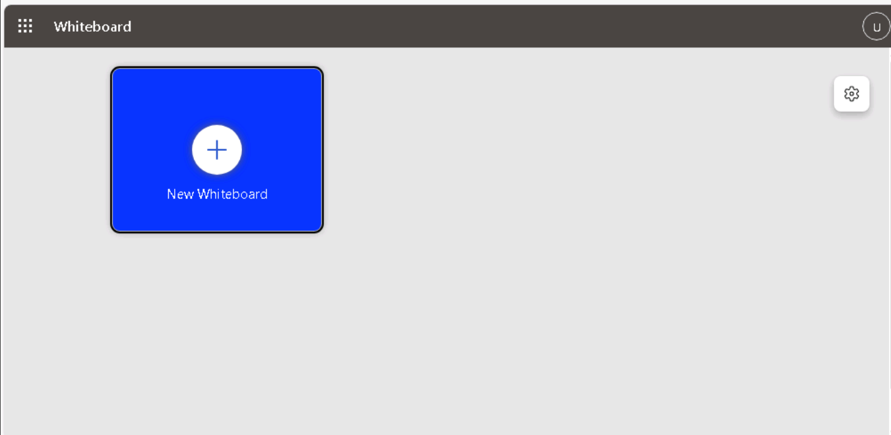

5.  On the ribbon at the top of the page, select
    the **Whiteboard** drop-down arrow. In the **Board name** field,
    enter **Boiler installation project plan** and then select the
    checkmark icon.

    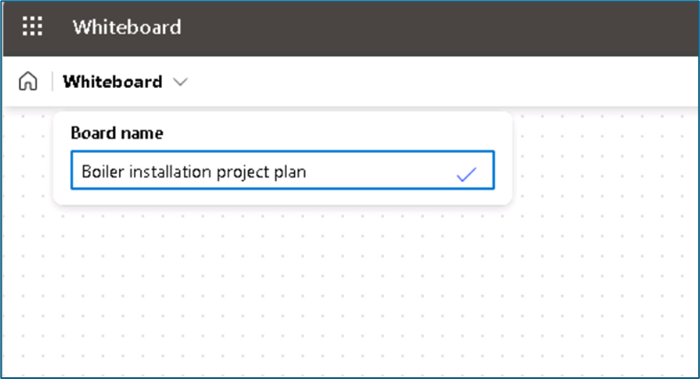

6.  If a **Suggest content with Copilot** window appears, then proceed
    to the next step. Otherwise, in the tray of icons that appears above
    the taskbar at the bottom of the page, select the **Copilot** icon.
    In the menu that appears, select **Suggest**.

  

7.  In the **Suggest content with Copilot** window, enter the following
    prompt:

**I'm the Operations Manager for Adatum Corporation. We're installing
a new boiler in our heating system. Please suggest the steps we should
follow to install the new boiler**.

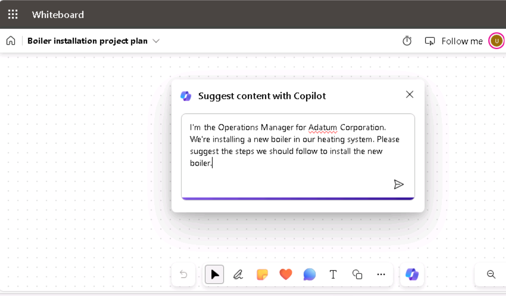

8.  If a **Suggest content with Copilot** window appears, then proceed
    to the next step. However, if you receive a message indicating that
    "**Something went wrong. Please try again.**" or "**Copilot couldn't
    process this prompt. Please rephrase it.**" then select
    the **Generate suggestions** arrow in the bottom corner of the
    Copilot window.

  

Sometimes Copilot completes the process it's working on but stumbles a
bit before displaying the results. When you select the **Generate
suggestions** arrow again, it usually displays the results without
much delay. However, if you receive a similar message a second time,
then select the **Generate suggestion**s arrow a few more times. If
you keep receiving this error after three or four attempts, then
simplify the prompt by entering the following text:

**Please suggest the steps we should follow to install a new boiler in
our building's heating system**.

9.  By default, Copilot generates ideas in groups of six. In
    the **Suggest content with Copilot** window that appears, note the
    first six ideas that it generated. Copilot gives you two options
    here - you can either attach the ideas to your whiteboard if you're
    satisfied with the suggestions, or you can have Copilot generate
    more suggestions. Notice how the **Insert (6)** button indicates the
    number of ideas that Copilot generated - in this case, 6.

    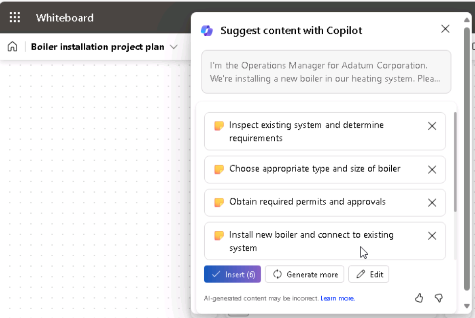

10. While six suggestions are a good starting point, you want to dig
    deeper into the tasks needed to install the security product, so
    select the **Generate more** button.

    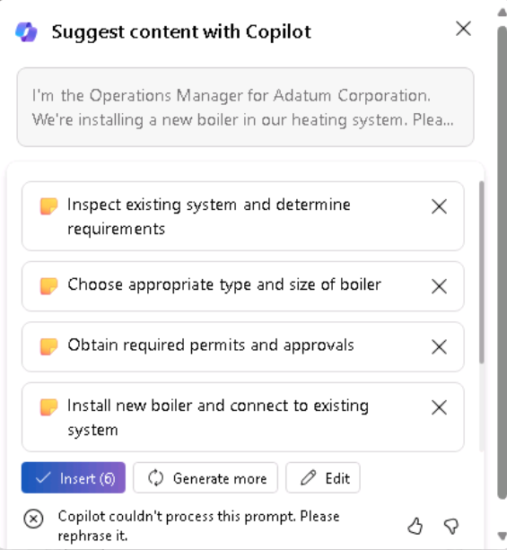

> **Note**: If Copilot displays an error message of any kind, then
> select the \*\*Generate more\*\* button again. Do this any time you
> receive an error message.

11. Note how Copilot generated another six ideas, so the **Insert
    (12)** button now displays **12**. While you can keep generating
    more ideas, for the sake of time, let's insert the 12 ideas
    currently presented. Select the **Insert (12)** button.

    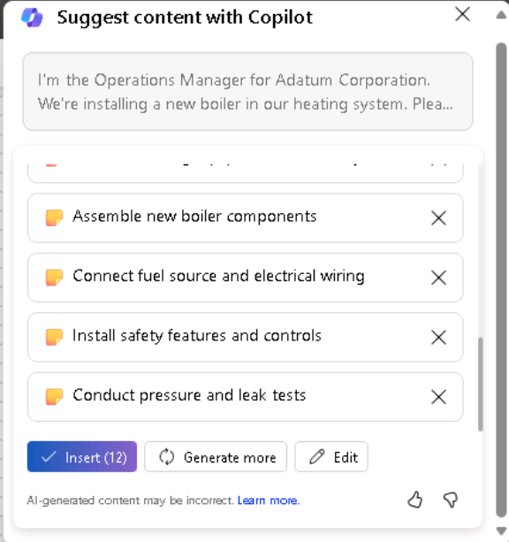

12. When you select the **Insert** button, Copilot attaches the
    suggested ideas to your whiteboard in the form of yellow sticky
    notes.

    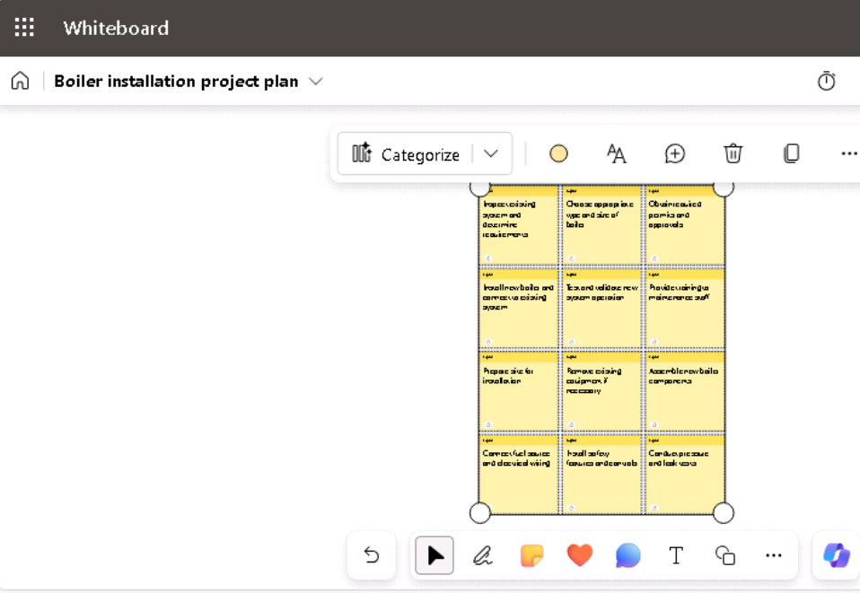

13. As with a real-world brainstorming session involving actual sticky
    notes, you can edit a particular note, delete it, lock it from
    future removal, and so on. In Microsoft Whiteboard, these activities
    are supported through standard whiteboarding functionality.

> If you've never used Whiteboard before, try selecting (double-click) a
> specific note, and then in the menu bar that appears above it, you can
> select the **Edit text** (pencil) icon or any of the other options.
> Selecting the ellipsis icon at the end of the menu bar displays a menu
> of more options, such as deleting the note. Again, the idea behind
> Microsoft Whiteboard is to mimic real-world sticky-note exercises.
> Feel free to edit a note as you wish.

    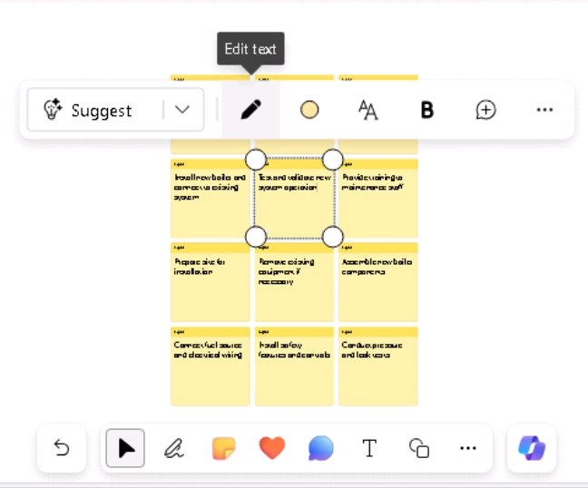

14. In looking at the suggested ideas, you feel they don't cover risk
    mitigation adequately. Select the **Copilot** icon at the bottom of
    the page and then select **Suggest** from the menu.

15. In the **Suggest content with Copilot** window that appears, enter
    the following prompt to generate more ideas about risk mitigation:

> **Suggest ways to mitigate the risks of installing a new boiler into
> the building's heating system**.

    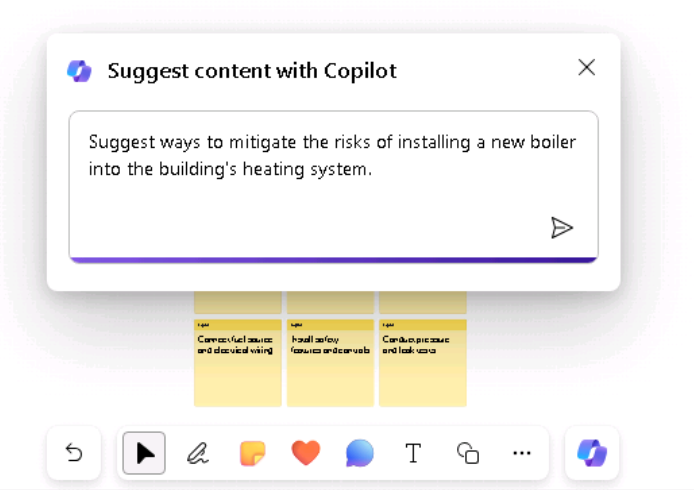

16. Review the six ideas that Copilot suggested. You would like Copilot
    to include more details, so select the **Generate more** button.

17. You're satisfied with the 12 risk mitigation ideas, so select
    the **Insert (12)** button.

    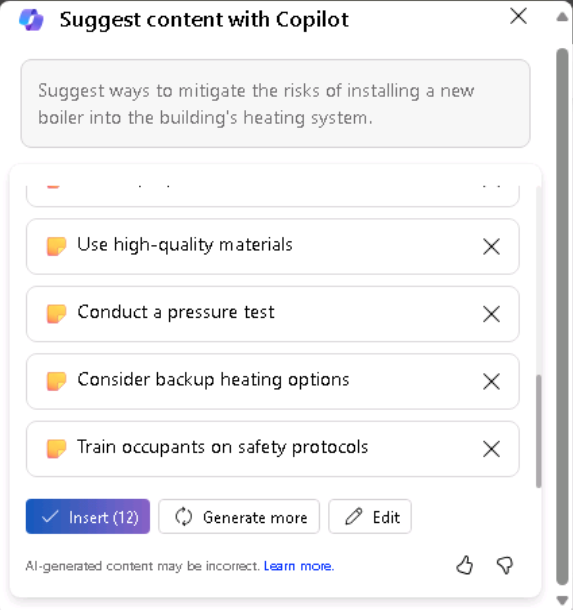

18. Note how the block of 12 risk mitigation ideas is selected (see the
    outside border).

    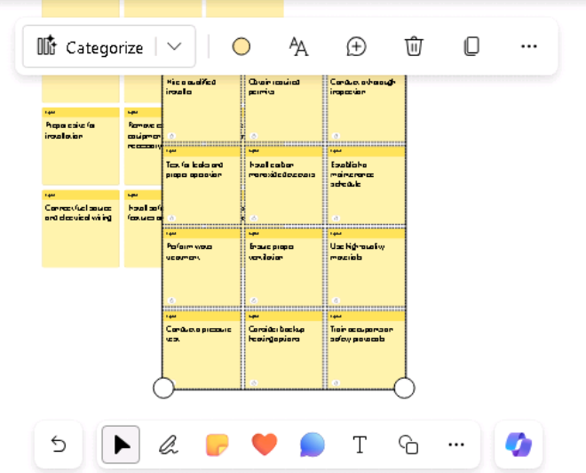

19. Copilot overlays the 12 risk mitigation ideas partially over top of
    the original 12 project plan ideas, you can select on this block of
    ideas and move it across the screen so that it no longer overlays
    the original 12 ideas. Don't worry about lining the two blocks up.
    Once you organize the notes into categories in a later step, they'll
    look nice and pretty. For now, just arrange each block so that you
    can see all the ideas. Doing so provides the visibility needed to
    see what areas Copilot proposed so that you can edit any of them if
    you wish.

    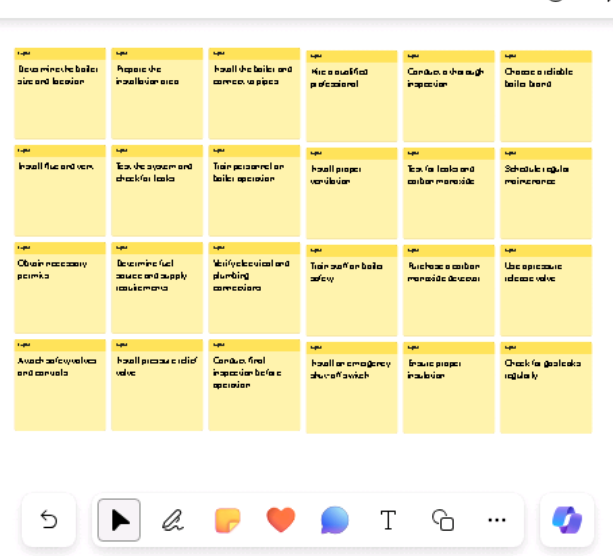

20. You're now satisfied with the suggestions that Copilot created, and
    you've completed all the edits that you want done to the notes. You
    now want Copilot to organize the notes by category. Copilot
    determines the names of the categories and automatically organizes
    the notes accordingly. Select the **Copilot** icon at the bottom of
    the page and then select **Categorize** from the menu.

    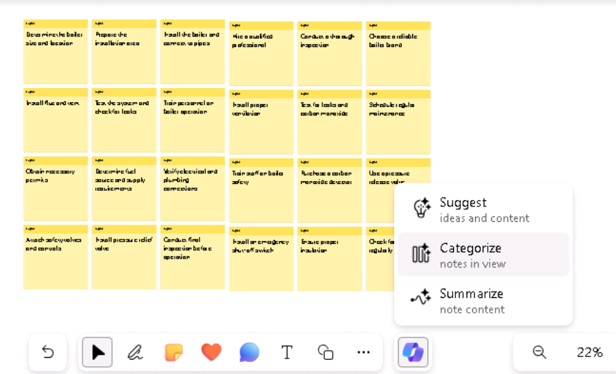

21. Note what happened. Copilot generated a set of categories and
    reorganized the notes accordingly. Each category of notes was
    assigned a different color to help identify the differences between
    categories. If the rectangle containing the notes isn't as large as
    it can be and still fit your screen, select the **Fit to
    Screen** icon on the bottom-right corner of the page. Doing so
    increases the size of the image until it can no longer increase it
    anymore without it exceeding the screen size.

    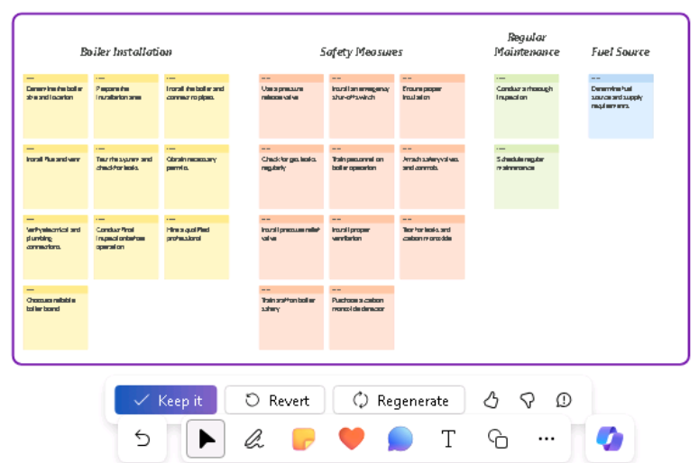

22. Note the icon tray that appears below the organized group of notes.
    If you're not satisfied with the categories, select
    the **Regenerate** button on the icon tray that appears.

> **Note**: You can select the **Regenerate** button as many times as
> needed until you're satisfied with the categories that Copilot
> provides. Select this button several times and note the changes that
> Copilot makes each time. Besides changing category names, Copilot may
> add or reduce the number of categories with each regeneration.

    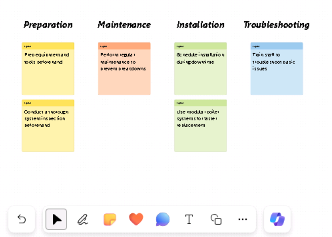

23. After regenerating the categories several times, you realize that
    you're missing detailed steps concerning minimization of system
    downtime. You want to ask Copilot to add more ideas to your
    whiteboard session concerning this issue. Plus, you identified a
    note that you want to remove. However, since you already organized
    your ideas, you must change your whiteboard session back into the
    editing mode that you were before you categorized the notes. To do
    so, select the **Revert** button.

24. Now that you're back into editing mode, select a note that you no
    longer want, and then in the icon tray that appears, select the
    ellipsis icon. Select **Delete** from the menu that appears.

25. To have Copilot generate more ideas, select the **Copilot** icon at
    the bottom of the page and then select **Suggest** from the menu.

26. In the **Suggest content with Copilot** window that appears, enter
    the following prompt to generate more ideas about minimizing system
    down-time:

> **Suggest ways to limit heating system downtime when installing a new
> boiler**.

27. Review the six ideas that Copilot suggested. You're satisfied with
    these ideas, so select the **Insert (6)** button.

28. Note how the block of six notes is highlighted with a line around
    the block. This block of notes is known as a note grid. You can move
    or resize a note grid just like any other element on your
    whiteboard. As you resize a note grid, the sizes of all the sticky
    notes inside it adjust accordingly. If the block of six notes
    overlays on top of one of the blocks of notes, select one of the
    outside lines around the note grid and drag the entire block of six
    notes to the side so that it doesn't overlay any of the previous
    notes. If you run out of space on the screen and part of the block
    falls off the screen, select the **Fit to Screen** icon on the
    bottom-right corner of the page.

29. You're ready to have Copilot organize the sticky notes, which
    include 18 notes - a block of 12 notes and a block of six notes.
    Select the **Copilot** icon at the bottom of the page and then
    select **Categorize** from the menu. In the **Categorize selected
    notes** window, select the **Categorize** button.

30. Sometimes, the rectangle containing the notes isn't sized as large
    as it can be, leaving open white space all around your canvas. In
    this situation, the text size of the notes is often small and
    difficult to read. If this sizing issue occurs, select the **Fit to
    Screen** icon on the bottom-right corner of the page. Doing so
    increases the size of the image. If you keep selecting this button,
    it eventually reaches a point where it can no longer increase the
    size of the rectangle without it exceeding the screen size. Any
    further selection of this icon has no effect on the rectangle.

31. Review the categories. In the Copilot icon tray that appears below
    the rectangle, you can select the **Regenerate** button to create a
    new set of categories. In fact, select the **Regenerate** button
    several times to see how the categories change. Once you’re
    satisfied with the results, select the **Keep it** button.

32. Note how each category of sticky notes is a different color. You
    realize that you would like a short summary of the brainstorming
    session added to your whiteboard content. To do so, select
    the **Copilot** icon at the bottom of the page and then
    select **Summarize** from the menu. Copilot generates a short
    summary of the main themes from this whiteboarding session. Scroll
    down to review the entire **Summary** window. You're happy with the
    results, so select **Keep it**.

    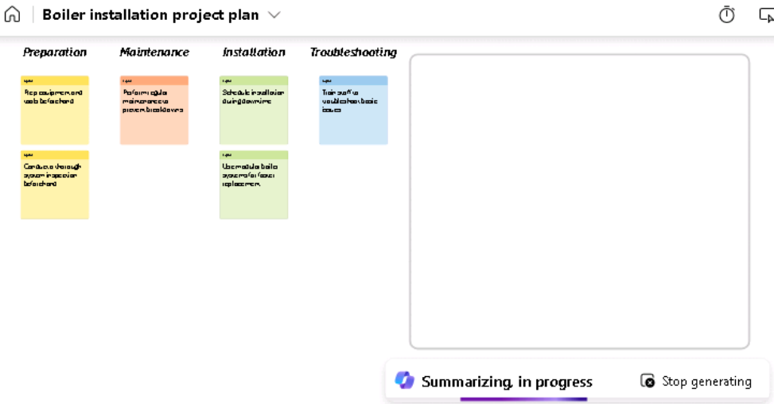

33. Select the **Fit to Screen** icon on the bottom-right corner of the
    page to fit all the sticky notes and the session summary onto the
    entire screen.

    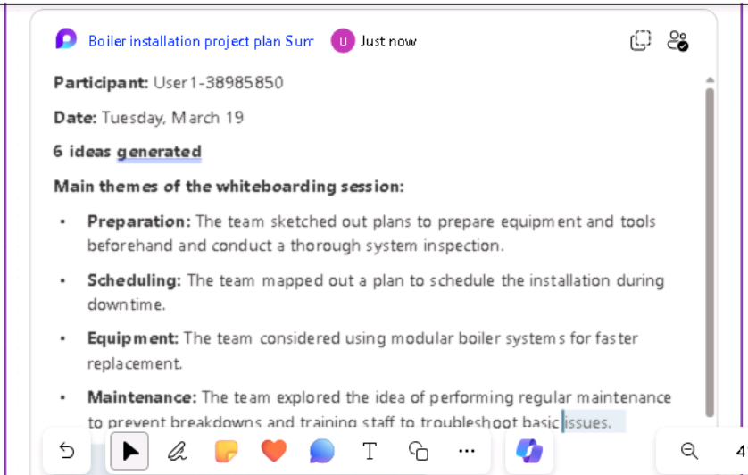

## Exercise 2: Compare reporting results using Copilot in Word

As the Operations Manager at Adatum Corporation, you discovered that the
current boiler system that heats the company's 50-year-old office
building needs significant repair, if not outright replacement. You feel
that this situation may be the opportune time to convert your heating
system from the existing boiler system to a more energy-efficient
furnace system. However, you're not familiar with the differences
between the two types of heating systems. You want to investigate the
situation with Copilot in Word and create a report that you can present
to management.

**Note**: You've heard that Copilot in Word can generate reports for
you, but you haven't used it yet. As such, you aren't sure what kind of
reporting it provides. You want to take this opportunity to not only
create your report, but also investigate Copilot's reporting features.
So, here's your plan:

- You previously identified several questions that you want Copilot to
  investigate regarding boiler versus furnace heating systems.

- You plan to have Copilot create one report that covers all those
  questions.

- You then plan to ask Copilot each of those questions individually so
  that you can see each response.

- You can then compare the report that Copilot creates versus the
  individual answers that it generates for each question. In the latter
  scenario, you could copy and paste each answer into a document to
  create your own report if you wish, or to supplement an existing
  document.

The purpose of this exercise is to show how Copilot in Word provides a
different level of response depending on which modality you use - either
in the Copilot pane or when creating a new document.

1.  If you have a Microsoft 365 tab open in the Edge browser, then
    select it now; otherwise, open a new tab and enter the following
    URL: `https://www.office.com`

> Note: You need to sign-in (if prompted) using the **Microsoft 365
> Credentials** provided under the **Resources** tab on the right.

2.  With your plan in mind, you decide to first use Copilot in Word to
    create a report that addresses all your questions. On
    the **Microsoft 365** navigation pane select **Microsoft Word**, and
    then open a blank document.

3.  In the **Draft with Copilot** window that appears at the top of the
    blank document, enter the following prompt and select
    the **Generate** button:

> **I'm the Operations Manager for Adatum Corporation. We're thinking
> about possibly replacing our building's current boiler system with a
> furnace system. Write a report describing what type of boiler systems
> are used in most commercial buildings, and include what considerations
> I need to take into account to change from an existing boiler system
> to a furnace system, the average cost of transitioning from a boiler
> system to a furnace system in a commercial two-story building built in
> the 1970s, whether changing from a boiler system to a furnace system
> will have any effect on our current air conditioning system, and the
> average defect rates for boiler systems versus furnace systems.**

  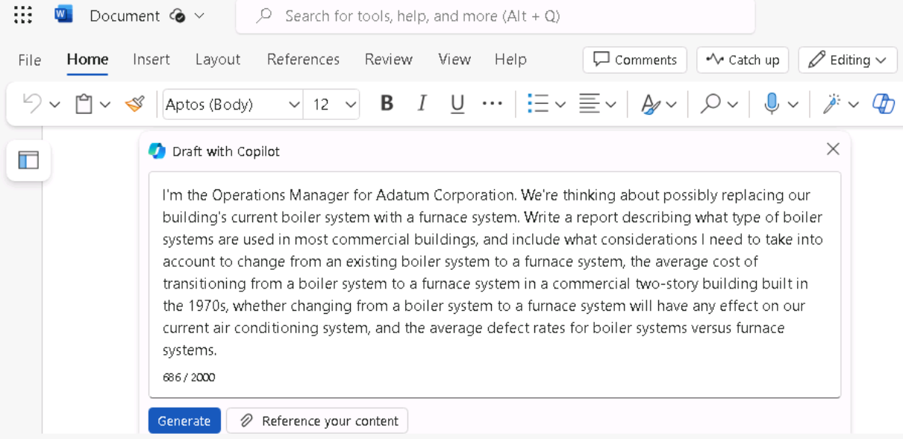

4.  Review the report that Copilot generated. Note the level of detail
    in each area of interest. Since you want to save this document for
    the next Use Case exercise, select the **Keep it** button on the
    Copilot tray and then save the document.

    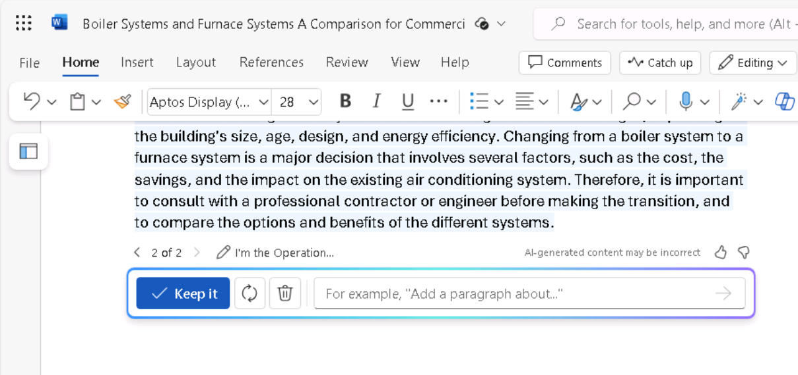

> **Note**: Make sure you save the report since you will be usingg it in
> the next exercise.

5.  The prompt you entered to create the report included five requests.
    You now want to ask Copilot each of those five questions
    individually. Select **Copilot** on the Word ribbon, which opens
    the **Copilot** pane.

6.  In the **Copilot** pane, in the prompt field at the bottom of the
    pane, enter the following question and then select
    the **Send** arrow:

> **What type of boilers do most buildings use as part of their heating
> systems**?

    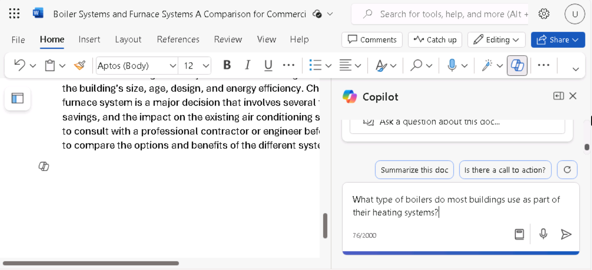

7.  Review the answer. While you can select the **Copy** option if you
    want to paste the response into the document, for this training
    you're just going to select more prompts to see the responses that
    you receive.

    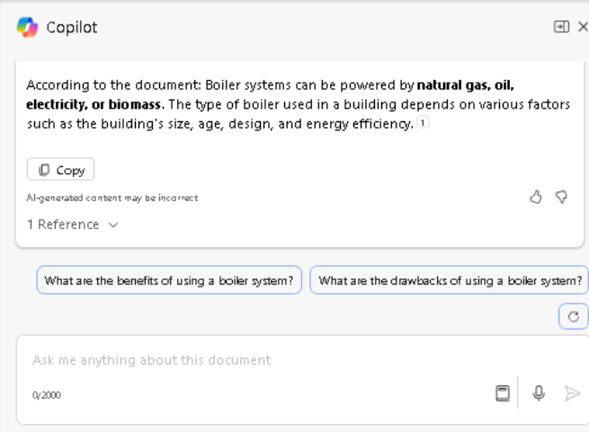

8.  Enter separate prompts for each of the remaining four questions:

    - **What considerations do I need to take into account to change
      from an existing boiler system to a furnace system in a commercial
      building?**

    - **What is an average cost for transitioning from a boiler system
      to a furnace system in a commercial two-story building built in
      the 1970s?**

    - **if we change from a boiler system to a furnace system, will it
      have any effect on our current air conditioning system?**

    - **What are the average defect rates for boiler systems versus
      furnace systems?**

    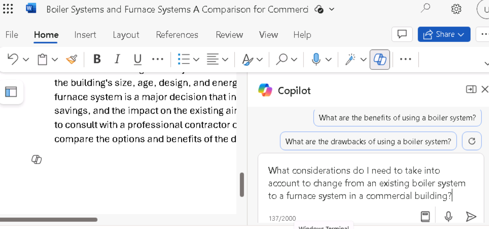

    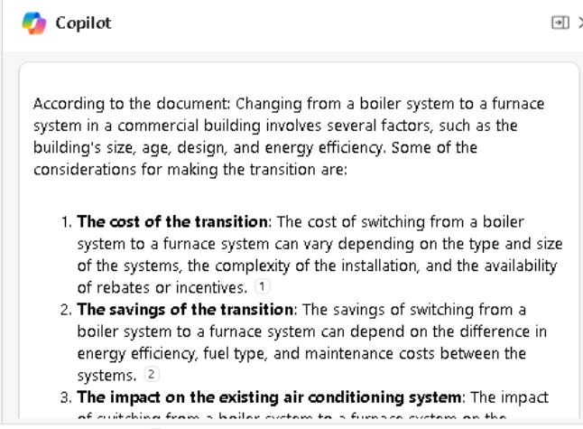

9.  Note how Copilot answered each of your questions, but it didn't
    insert any of the answers into the current document. While you can
    copy and paste each answer into the document, it seems apparent that
    just having Copilot create the report is more efficient.

10. Here are some pointers to reflect on the responses when you used
    Copilot in Word

    - How does the level of information for each reporting method
      compare to one another?

> Compare the level of information provided when Copilot in Word created
> a report versus the answers it provided when you asked the questions
> individually in the Copilot pane.

- What did you notice?

> When you ask Copilot to create a report, it usually provides richer
> responses that it organizes into an attractive looking report.
> Conversely, when you ask Copilot to answer questions individually in
> the Copilot pane, it doesn't return the level of detail as the report,
> although it does allow you to copy and paste the responses into a
> document. However, doing so may require you to reformat the inserted
> answers to clean up any formatting issues.

## Exercise #3: Create a presentation comparing heating systems using Copilot in PowerPoint

Proficiency in using Copilot in PowerPoint is a strategic skill for
professionals aiming to elevate the impact of their presentations.
Copilot in PowerPoint serves as an intelligent collaborator, offering
real-time suggestions and enhancements as Operation Managers craft their
presentations.

As the Operations Manager at Adatum Corporation, you discovered that the
current boiler system that heats the company's 50-year-old office
building is in need of significant repair, if not outright replacement.
You feel that this moment may be the opportune time to convert your
heating system from the existing boiler system to a more
energy-efficient furnace system.

In this exercise, you ask Copilot in PowerPoint to create a presentation
based on **Comparing boiler and furnace heating systems** report.Your
goal is to get Adatum's management team up to speed on the two types of
heating systems, including with the pros and cons of each, before you
contact a Heating, Ventilation, and Air Conditioning (HVAC) company and
formally start this project.

1.  If you have a **Microsoft 365** tab open in your Microsoft Edge
    browser, then select it now; otherwise, open a new tab and enter the
    following
    URL: `https://www.office.com` to go
    to the Microsoft 365 home page.

> **Note**: You need to sign-in (if prompted) using the **Microsoft 365
> Credentials** provided under the **Resources** tab on the right.

2.  On the **Microsoft 365** navigation pane, select **OneDrive** to
    open it.

3.  Browse to the **C:\LabFiles** folder to select and upload a copy
    of **Comparing boiler and furnace heating systems report** document
    to **OneDrive**.

> **Tip**: open and close the file to get it in your Most Recently Used
> (MRU) file list.

    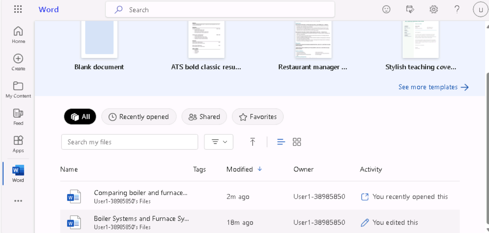

> **Note**: If you have already uploaded all the lab assets to OneDrive
> as suggested in **Preparing for the lab execution** section you can
> skip this step.

4.  On the **Microsoft 365** home page, select the **PowerPoint** icon
    in the navigation pane on the left.

5.  In **PowerPoint**, open a new blank presentation.

6.  On the right side of the PowerPoint ribbon, select
    the **Copilot** option.

    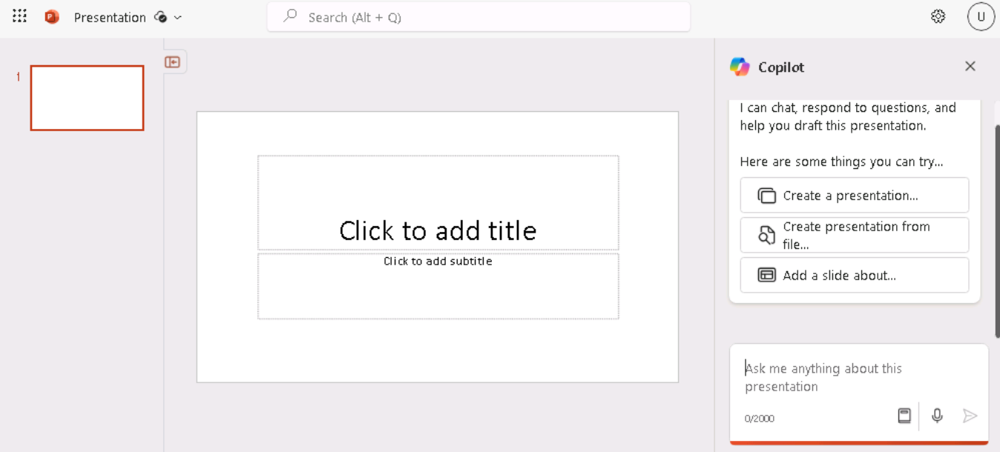

7.  In the **Copilot** pane that appears, several predefined prompts are
    available for you to choose from. Select the **Create presentation
    from file** prompt.

8.  In the prompt field at the bottom of the **Copilot** pane, Copilot
    automatically enters the text: **Create presentation from file /**.
    The forward slash is the universal Copilot indicator to enter a link
    to a file. In this case, it triggers Copilot to open
    a **Suggestions** window that displays three of the most recently
    used files.

    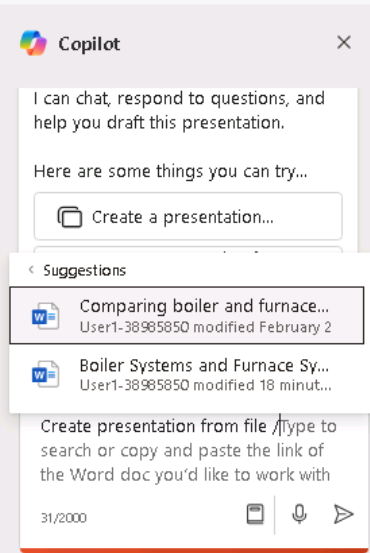

- If your file appears here, then select it now and proceed to the next
  step.

- If the file isn't one of the three being displayed, select the right
  arrow (**\>**) in the upper right corner of the **Suggestions** window
  to see an expanded MRU file list. If the file appears here, then
  select it now and proceed to the next step.

- If you don't see your file in the expanded MRU list, then you must
  copy the link to the report and paste it in the prompt field. To do
  so:

  1.  Select the **Microsoft 365** browser tab and select **Word** in
      the navigation pane.

  2.  In the **Word** home page, in the list of recent files, select the
      report to open it in Word.

  3.  In the report in Word, on the far-right above the ribbon, select
      the **Share** button. In the drop-down menu that appears,
      select **Copy Link**. Wait for the **Link copied** window to
      appear, which is your assurance that the link to the file was
      copied to your clipboard.

  4.  Switch to your **PowerPoint** tab, and at the bottom of
      the **Copilot** pane, the prompt field should still be
      displaying **Create presentation from file /**. Position your
      cursor after the forward slash (**/**) and then paste in
      (**Ctrl+V**) the link to the report.

5.  Note how the file appears in the prompt field. Select
    the **Send** icon in the prompt field.

6. This prompt triggered Copilot to create a slide presentation based
    on the document. In doing so, it first displayed the outline of the
    presentation in the Copilot pane. Then it displayed a separate
    window showing a bulleted list of some of the changes that it made
    to the presentation based on the document.

   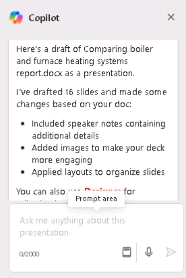

7. You're now free to review the slides and make any necessary updates.
    Pay special attention to the changes that Copilot made based on the
    document. You can use the **Designer** tool to adjust the layouts.

   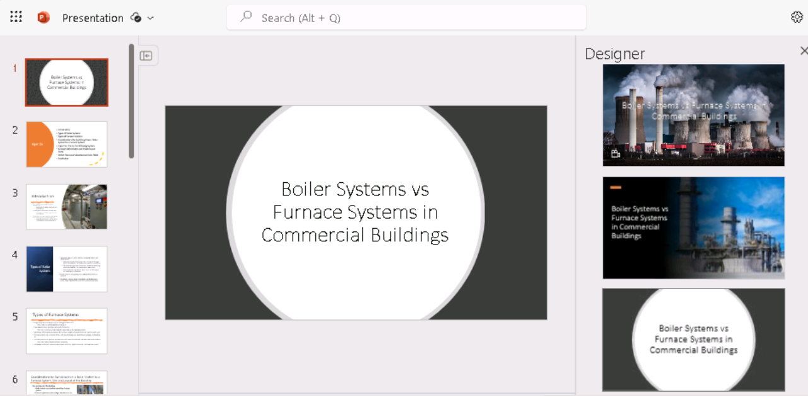

8. Review the speaker notes that Copilot added to each slide in the
    presentation. Verify they call out the points that you want to make
    during the presentation.

   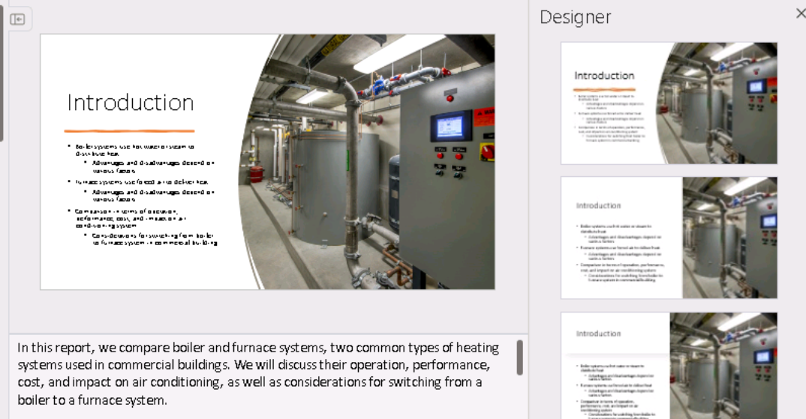

9. Try using Copilot to update the presentation. Let's begin by adding
    an image to a slide. Find a slide without an image and enter the
    following prompt (don't forget to replace \[enter slide number
    here\] with the number of the slide you picked):

> **Add an image to slide \[enter slide number here\]**. **The image
> should contain a picture related to the slide contents**.

   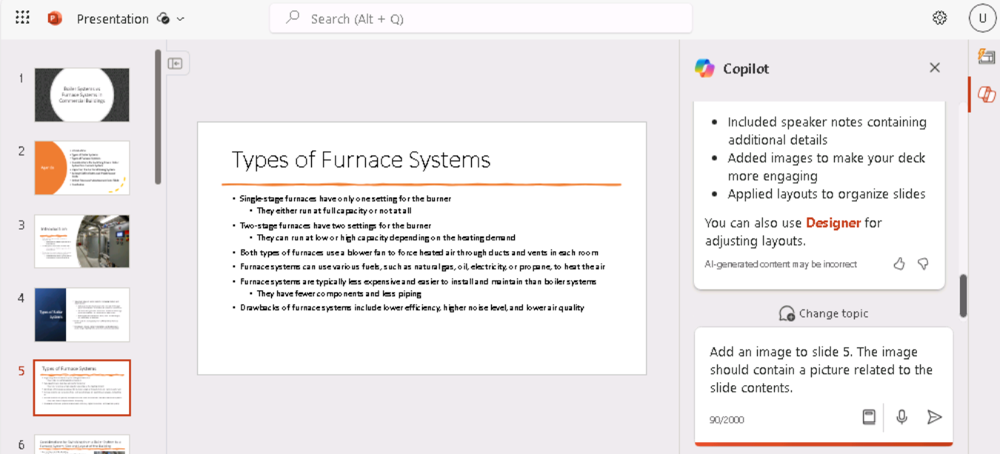

10. You also notice that there isn't any content in the presentation
    related to the expected lifespan for each type of heating system.
    You want Copilot to research this topic and then add it into the
    presentation. Enter the following prompt:

> **What is the average lifespan of a boiler heating system versus a
> furnace heating system**?

  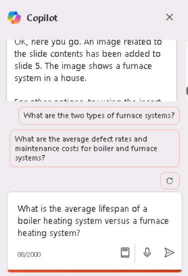

11. You now want Copilot to add this content to a slide. Select the
    slide towards the beginning of the presentation that lists the types
    of boiler systems. Then enter the following prompt (don't forget to
    replace \[enter slide number here\] with the number of the slide you
    picked):

> **Add this lifespan content to slide \[enter slide number here\]**.

  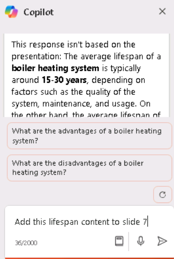

12. What did Copilot do? Did it do something like adding "**Lifespan
    content**" to the top of the slide, overlaying it on top of the
    existing content on the slide? Or did it do something similar?

13. The prompt didn't work as expected. Remove whatever was added to the
    slide.

  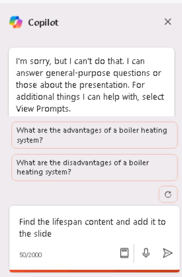

14. Now try it again, but this time ask Copilot to find the lifespan
    content and add it to the slide all in one prompt. This time, enter
    the following prompt:

> **Add content about the average lifespan of a boiler heating system
> versus a furnace heating system to slide \[enter slide number
> here\].**

  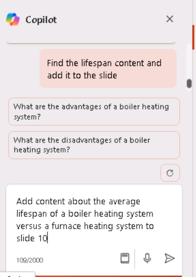

15. Did this work better? You just have to rework your prompts if
    Copilot doesn't do exactly what you wanted.

16. You notice that there isn't a slide at the end for a
    Question-and-Answer (Q&A) session. To correct this situation, enter
    the following prompt:

> **Add a Q&A slide at the very end of the presentation with an
> appropriate image.**

  

17. Review the new slide that was created. Upon seeing this slide, you
    would like Copilot to create a list of possible questions and add
    them to the speaker notes for the Q&A slide. Enter the following
    prompt:

> **Create a list of five questions that may be asked during the Q&A
> session and add them to the speaker notes in the Q&A slide.**

18. How did Copilot respond when you tried this prompt? Did it add five
    questions to the speaker notes for the Q&A slide? If so, then
    congratulations!

> **Note**: Copilot may display some exception (remember that Copilot is
> still a work in progress) like the one below.

  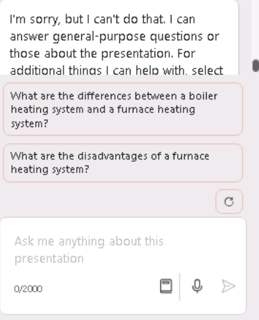

> Please try rephrasing the prompt or use the suggested prompts like the
> one below.

  

23. Select the command **Add a slide about** and append the
    following **Q&A at the very end of the presentation** (as shown in
    the screenshot)

    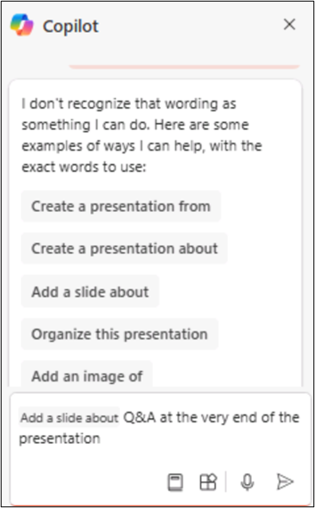

24. Click Send to check what happens.

    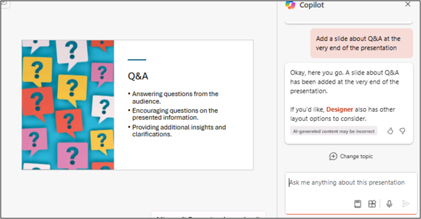

    Copilot has added a Q&A slide as instructed.

25. Now try with another prompt:

**Add a slide about** what the audience may ask about the presentation

26. Once you are done with final presentation you can save for future
    reference or discard this presentation.

**Summary:**

In this lab you used:

- Copilot in Whiteboard to generate and organize project plan ideas for
  the installation of a new boiler system, fostering collaborative and
  creative planning.

- Copilot in Word to create a detailed report and compared the types of
  output that Copilot can generate, showcasing its versatility in
  content creation.

- Leveraged Copilot in PowerPoint to transform a report into a visually
  engaging presentation, highlighting key findings and comparisons for
  effective communication.
